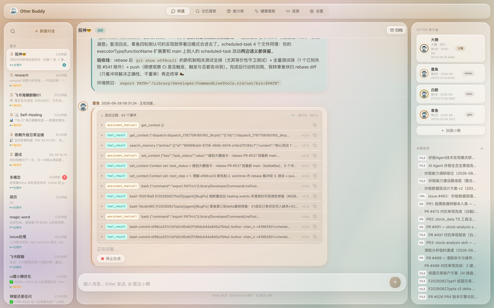
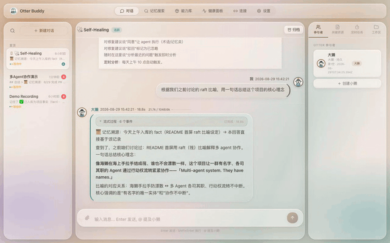
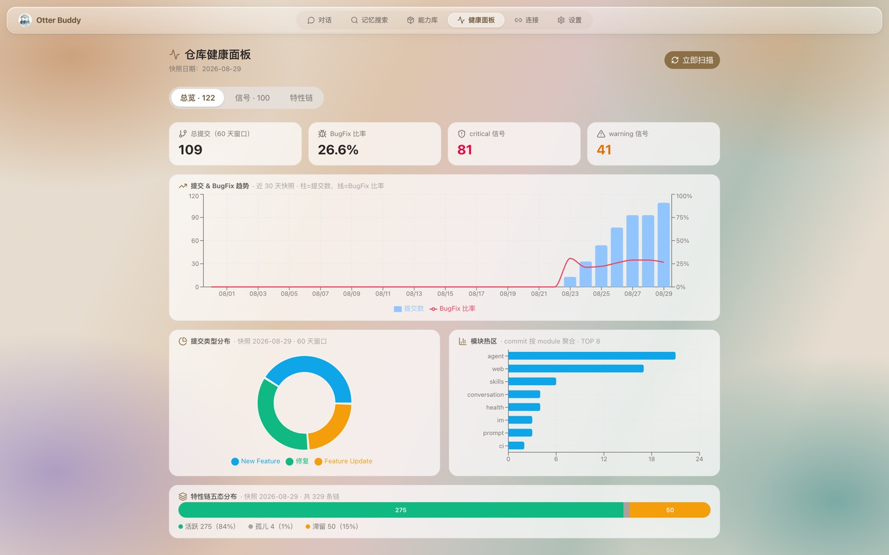
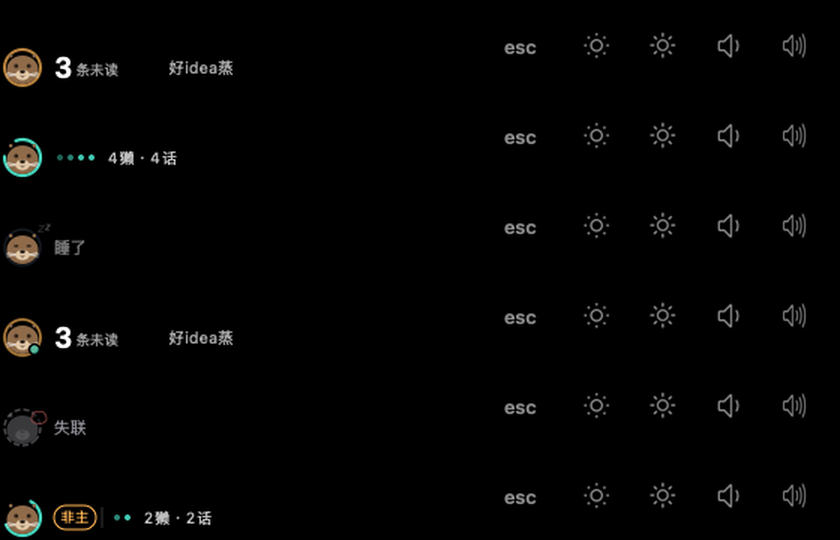

# Otter Buddy

[中文](./README.md) | English

---

> A group of sea otters is called a raft. They hold hands so they don't drift apart.
> This chat room does too.

**Multi-agent system. They have names.**

*Mustelidae, not a plush toy.*










*All four visuals are real data: a collaboration session, the multi-agent orchestration loop as a four-act GIF (dispatch → orchestrate → execute → trace & return), the system measuring its own health (computed hourly by the RHI scan worker), and an otter status badge on the MacBook Pro Touch Bar — a vector otter (breathing ring / blinking / heartbeat) showing live whether the team is waiting for you, working, or asleep. The renderer is self-built Swift code from this project (#721); the GIF is produced by the renderer's own offscreen mode — what you see is what production gets.*

## What is this

Otter Buddy is a multi-agent collaboration system — chat room format, memory at its core, 11 skills as its skeleton. The agents here aren't anonymous API calls. They're named team members: the Lead Otter orchestrates, each sub-otter has its own name and specialty, executing tasks by skill. The talking stone passes between participants, and whoever writes code doesn't review their own code.

## Why sea otters

Sea otters aren't primates, but they have tools, craft, and culture. AI can be this way too — it doesn't need to look human to have civilization.

### 🌊 The Raft

A group of sea otters is called a raft. Hundreds float on the same water surface, each foraging independently, holding hands and wrapping kelp to stay together.

Our chat room works the same way: multiple agents on the same conversational substrate, each with a role, the talking stone flowing between them without interruption. **Cross-entity review** is the core mechanism — the agent that writes code doesn't review its own code. Another otter performs adversarial review. This isn't "AI helps you look at code" — it's structural separation between the implementer and the reviewer.

### 🌿 The Kelp Forest

Sea otters are a keystone species — where they thrive, kelp forests flourish; where they disappear, sea urchins devour everything and the system collapses from forest to desert.

The memory system is the kelp forest. Every troubleshooting session, design decision, and code review conclusion is stored in structured form — with provenance (📜 memory tracing lines), relation chains (produced/supersedes/references), and anchors (F/R document IDs). Not "search and forget" like RAG — knowledge that grows.

> A sea otter mother wraps her pup in kelp before diving, anchoring it so it doesn't drift away. Our F/R anchors work the same way — sub-otters are anchored to context when they receive a task.

### 🪨 The Craft

Sea otters are one of the very few tool-using marine mammals. But what matters more is craft transmission: mothers spend months teaching pups to crack shells, and techniques differ by region.

Our 11 skills aren't exposed API calls — they're behavioral patterns packaged with know-how: prerequisites, execution steps, output standards, self-healing mechanisms. When a sub-otter is reborn, it carries a summary of its previous life and a handoff lineage (gen1→gen2). The terminology library preserves team-wide knowledge.

**Being able to use ≠ knowing how.**

## What this means for you

If you're tired of AI that starts from scratch every conversation, AI-generated code without real review, single-agent systems with single points of failure — Otter Buddy doesn't offer "a smarter AI." It offers a **non-primate way to organize intelligence.** Agents with memory, names, and collaborative discipline.

---

## Tech Stack

| Layer | Technology |
|-------|------------|
| Runtime | Node.js 22 (LTS) |
| Language | TypeScript |
| Backend Framework | Hono |
| Database | better-sqlite3 |
| Test Framework | Vitest |
| Lint | ESLint (flat config) |
| Package Manager | npm |

## Quick Start

### Prerequisites

- Node.js 22 (LTS)
- npm
- LLM API Key (OpenAI or Anthropic)

### Configure

```bash
cp config/config.yaml.example config/config.yaml
```

Edit `config/config.yaml` and set your LLM API Key:

```yaml
llm:
  models:
    - alias: default
      provider: openai      # openai / anthropic / kimi-coding
      model: gpt-4o
      apiKey: sk-...        # Your LLM API Key
```

> `config/config.yaml` is in `.gitignore` and will not be committed.

### Start

```bash
./scripts/otter-buddy.sh start
```

The startup script automatically: installs dependencies → builds backend → builds frontend → starts the server.

Open http://localhost:3000 to start chatting.

> Custom port: `./scripts/otter-buddy.sh start -p 3001`. `stop` / `restart` / `status` commands work the same way.

## Advanced Configuration

### Startup script

`scripts/otter-buddy.sh` provides service management commands, supporting multiple worktrees on different ports:

```bash
./scripts/otter-buddy.sh start [-p port]   # Build and start
./scripts/otter-buddy.sh stop [-p port]    # Stop
./scripts/otter-buddy.sh restart [-p port] # Restart
./scripts/otter-buddy.sh status            # Check status
```

Each worktree manages its own service independently. `stop`/`restart` only affects the current worktree. If the port is occupied by another worktree, the script shows the PID for you to decide.

### Migrating from .env

If you previously used `.env`, map your environment variables to `config/config.yaml`:

| Environment variable | config.yaml field |
|---------------------|-------------------|
| `OTTER_BUDDY_LLM_PROVIDER` | `llm.models[].provider` |
| `OTTER_BUDDY_LLM_MODEL` | `llm.models[].model` |
| `OPENAI_API_KEY` / `ANTHROPIC_API_KEY` | `llm.models[].apiKey` |
| `OTTER_BUDDY_PORT` | `server.port` |
| `OTTER_BUDDY_DB_PATH` | `database.path` |

### Model Input Capability Declaration (multimodal)

`llm.models[]` supports an optional `input` field to explicitly declare model input capabilities — **this is the single source of truth for image injection downgrade**:

```yaml
llm:
  models:
    - alias: glm
      provider: anthropic
      model: glm-5.3
      input: ["text"]        # This model can't see images — without declaration, template implicitly inherits ["text","image"], causing silent hallucination
    - alias: glm-flash
      input: ["text", "image"]  # Supports vision
```

Rule (confirmed by F20260827mmdu): **Models without vision must explicitly declare `input: ["text"]`** — the anthropic provider template defaults to `input: ["text","image"]`. Without declaration, SDK injects images into models that can't see them, producing hallucinations (glm-5.3 returns 200 but thinking says "can't see images"). With declaration, SDK's `downgradeUnsupportedImages` automatically downgrades to text placeholders.

### Verify git hooks

`npm install`'s `prepare` script points hooks at the repo's `.githooks/` (commit-msg / pre-commit / pre-push / pre-merge-commit). If this config gets overridden by external tools or environment, all hooks silently stop working (#476, F20260821kgts, #684). Verify after install:

```bash
npm run hooks:check
# Expected: core.hooksPath=.githooks ✓ (relative paths resolve against the repo root, works inside worktrees)
# Exits 1 when broken; run npm run prepare (or npm run hooks:fix) to self-heal
```

### Contributing

**Issues are welcome** — bug reports, ideas, and feature suggestions are all valuable contributions.
**Pull requests are not accepted for now.** This is a personal research project; the maintainer's bandwidth is limited. If you'd like to see a change, please open an issue describing it instead.

For internal development conventions, see [CONTRIBUTING.md](./CONTRIBUTING.md).

## System Architecture

```
┌─────────────────────────────────────────────────────┐
│  Web Frontend (React + Vite)                         │
│  web/ → http://localhost:5173 (dev) / :3000 (prod)   │
│  Pages: Chat · Memory · Skills · Settings            │
└──────────────────┬──────────────────────────────────┘
                   │ /api/* (REST + SSE)
┌──────────────────▼──────────────────────────────────┐
│  Backend (Hono + Node.js)                            │
│  src/main.ts → http://localhost:3000                  │
│  ┌──────────────┐ ┌──────────────┐ ┌──────────────┐ │
│  │ Controllers  │ │ Use Cases    │ │ Frameworks   │ │
│  │ (HTTP/REST)  │→│ (Business)   │→│ (DB/LLM/Emb) │ │
│  └──────────────┘ └──────────────┘ └──────────────┘ │
│  ┌──────────────┐                                    │
│  │ Agent Runtime│ (Pi Agent + Tools)                 │
│  └──────────────┘                                    │
└─────────────────────────────────────────────────────┘
                   │
        ┌──────────┴──────────┐
        │ SQLite (better-sqlite3) │
        │ Vectors (sqlite-vec)    │
        └─────────────────────┘
```

## Project Structure

```
otter-buddy/
├── api-contract/     # Shared TypeScript types (DTO + SSE events)
├── web/              # React frontend (Vite + Tailwind CSS)
│   ├── src/          # Frontend source (React components, API client)
│   ├── index.html    # Chat page entry
│   ├── memory.html   # Memory page entry
│   ├── skills.html   # Skills page entry
│   └── settings.html # Settings page entry
├── src/              # Backend source (Clean Architecture)
│   ├── frameworks/       # Framework layer (DB, LLM, Embedding, Config)
│   ├── usecases/         # Use case layer (business logic)
│   ├── interface-adapters/# Interface adapters (HTTP controllers, Agent Runtime)
│   └── main.ts           # Composition Root (dependency injection)
├── tests/            # Tests
├── .github/          # GitHub config (CI, issue templates, PR template, etc.)
├── .githooks/        # Git hooks (commit conventions, branch protection)
├── docs/             # Project documentation
├── package.json
├── tsconfig.json
├── eslint.config.mjs
└── vitest.config.ts
```

## License

[MIT](./LICENSE)
