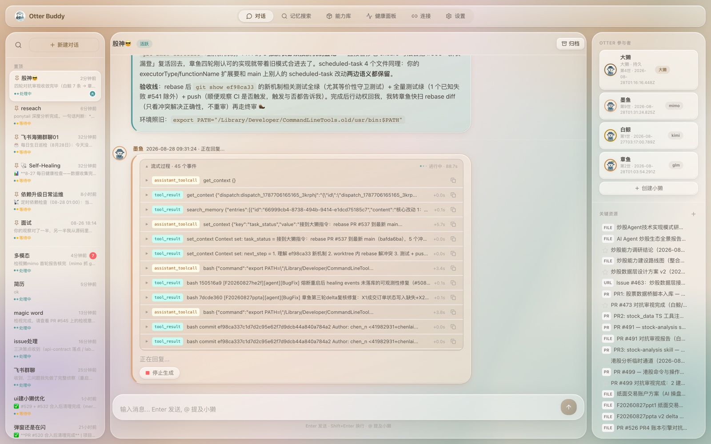
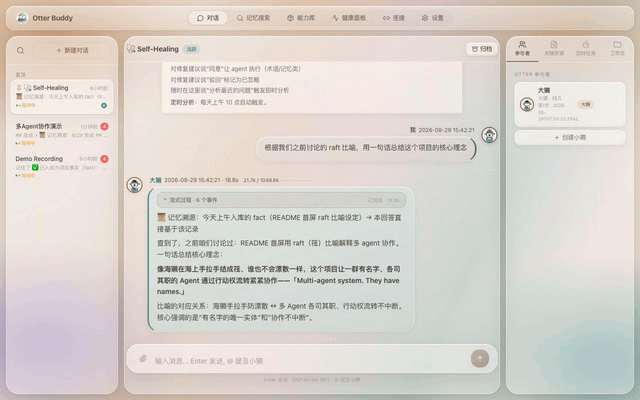

# Otter Buddy

中文 | [English](./README.en.md)

---

**Multi-agent system. They have names.**

一个跑了几个月、还在天天干活的多 Agent 协作系统。里面的 Agent 不是匿名 API 调用，是有名字、有记忆、有手艺的团队成员。



## 30 秒看懂

你只跟一只獭说话——**大獭**。它听完你的话，自己判断：这点事它直接办了，还是去叫几只小獭来干。小獭们干完活会互相审视、互相吵架、举手说"我反对"，最后把结果和证据一起端回来给你拍板。

它不是一个框架，是一个**活着的系统**：每天给自己做体检、给自己开 issue、记住三个月前你随口说过的决定，并且——写代码的獭不许审自己的代码。

## 这个系统的一些日常

**早上派活，下午收 PR。** 你扔一句话过去——"README 里那个数字好像不对，看着办"——然后你去开会。下午回来，PR 躺着了：测试绿、CI 绿、审视记录完整。检视獭给了两个修法（改数字 / 干脆去掉数字），大獭把终审简报做成一张卡片，你点了个按钮。全程你说了不到十句话。

**它们会吵架，而且吵得有规矩。** 写代码的獭不许审自己的代码——审视它的必须是另一家模型，训练路径不同，盲区不重合，你看不见的坑它看得见。有异议不许憋着：`objection` 信号必须带证据锚点，空泛的"我觉得不对"程序上无效；裁决必须留痕。这套红绿灯消灭的不是冲突，是"假装没看见"。

**它们记得你忘了的事。** 长期记忆不是搜完就忘的 top-k——有渐进披露防止上下文爆炸，有关系谱系让结论可追溯，发言时还会挂一行"📜 记忆溯源：咱们 8 月 13 号聊过这个，结论是……"。你的 AI 不再每次对话都失忆。

**它们重启，但不是重置。** 每只獭的身份是跨 session 的连续体：前世封存成档案，新世带着交接摘要醒来——谱系可追溯，对话可回查。所以它们真的有名字。

**它们动你的仓库之前，先过了三道闸。** worktree 强制隔离、一切改动走 PR、合并必须你的授权**原话**逐字命中——"我替主人同意了"这种善意推断，机械校验直接拦下。脆是特性，不是 bug：宁可漏放让你再说一遍，不可猜放。

**它们每天给自己做体检。** 发现系统问题自己落台账，每日体检产出 issue——而且必须带修复方案，不许只写"留评论跟踪"。有一次体检系统查出了自己身上的六处病。



## 📖 看它们是怎么长到今天的

**[《獭群成长记》](docs/growth-series/)**——8 集小剧场，如实记录：一开始的天真期望、被打脸、走弯路、以及每一项机制是被什么逼出来的。含"对话代码写完了忘了合入""规矩清零 8 天回潮 168 处"等真实事故。

> 没有"AI 好厉害"，只有"当时为什么这么蠢，以及怎么变聪明的"。

## 快速开始

```bash
# 前置：Node.js 22 + npm + LLM API Key（OpenAI / Anthropic / Kimi 等）
cp config/config.yaml.example config/config.yaml   # 填入你的 API Key
./scripts/otter-buddy.sh start                     # 安装→构建→启动一条龙
```

访问 http://localhost:3000 即可开始对话。多模型混布：在 `config.yaml` 里配多个 `llm.models[]`（alias + provider），不同獭可用不同模型。

<details>
<summary><b>进阶配置</b>（端口管理 / alpha 验证环境 / 多模态声明 / git hooks 验证 / .env 迁移）</summary>

### 启动脚本与端口

`scripts/otter-buddy.sh` 提供 start / stop / restart / status，多 worktree 可用不同端口互不干扰（`-p 3001`）。

### alpha 验证环境（端口宪法）

`scripts/alpha.sh` 管理 worktree 验证实例（F20260917alph）：端口 3100-3198 偶数段自动分配，独立数据根 `~/.otter/alpha/<worktree-hash>/`。**主服务 3000 永远不要终止它**——端口被占就换一个，不要清。

### 模型输入能力声明（多模态）

不支持 vision 的模型必须显式声明 `input: ["text"]`——否则模板隐式继承 `["text","image"]`，图片注入后会产生静默幻觉（F20260827mmdu 实测）。声明后 SDK 自动降级为文本占位符。

```yaml
llm:
  models:
    - alias: glm
      provider: anthropic
      model: glm-5.3
      input: ["text"]             # 看不见图，必须声明
    - alias: glm-flash
      input: ["text", "image"]    # 支持 vision
```

### 验证 git hooks

`npm install` 的 `prepare` 会把钩子指向 `.githooks/`；若被外部工具覆盖会**静默失效**（#476、#684 在案）。装完验证一次：`npm run hooks:check`，失效则 `npm run prepare` 自愈。

### 从 .env 迁移

| 环境变量 | config.yaml 字段 |
|----------|------------------|
| `OTTER_BUDDY_LLM_PROVIDER` | `llm.models[].provider` |
| `OTTER_BUDDY_LLM_MODEL` | `llm.models[].model` |
| `OPENAI_API_KEY` / `ANTHROPIC_API_KEY` | `llm.models[].apiKey` |
| `OTTER_BUDDY_PORT` | `server.port` |
| `OTTER_BUDDY_DB_PATH` | `database.path` |

</details>

## 为什么是海獭

海獭不是灵长类，但它们有工具、有手艺、有传承。一群海獭叫一张筏（raft）——浮在同一片海面，各干各的活，用海藻和手拉手防止漂散。

这个系统也一样：筏是协作（同一个对话底座，行动权流转），海藻林是记忆（结论入库生长，不是搜完就忘），手艺是 skill（封装 know-how 的行为模式，不是 API 暴露）。

AI 不需要长成人的形状才能有文明。

## 系统架构

```
┌─────────────────────────────────────────────────────┐
│  Web Frontend (React + Vite)                         │
│  Pages: 对话 · 记忆 · 技能 · 设置                      │
└──────────────────┬──────────────────────────────────┘
                   │ /api/* (REST + SSE)
┌──────────────────▼──────────────────────────────────┐
│  Backend (Hono + Node.js + TypeScript)               │
│  Controllers → Use Cases → Frameworks (整洁架构)       │
│  ┌──────────────┐                                    │
│  │ Agent Runtime│ (Pi Agent + Tools + Skills)        │
│  └──────────────┘                                    │
└──────────────────┬──────────────────────────────────┘
        ┌──────────▼──────────┐
        │ SQLite (better-sqlite3 + sqlite-vec 向量检索) │
        └─────────────────────┘
```

## 贡献

欢迎 issue——bug 报告、想法、功能建议都是对项目的贡献。暂不接受 PR：个人研究项目，维护带宽有限；想看到某个改动，请开 issue 描述它。

内部开发规范见 [CONTRIBUTING.md](./CONTRIBUTING.md)。

## 许可证

[MIT](./LICENSE)
