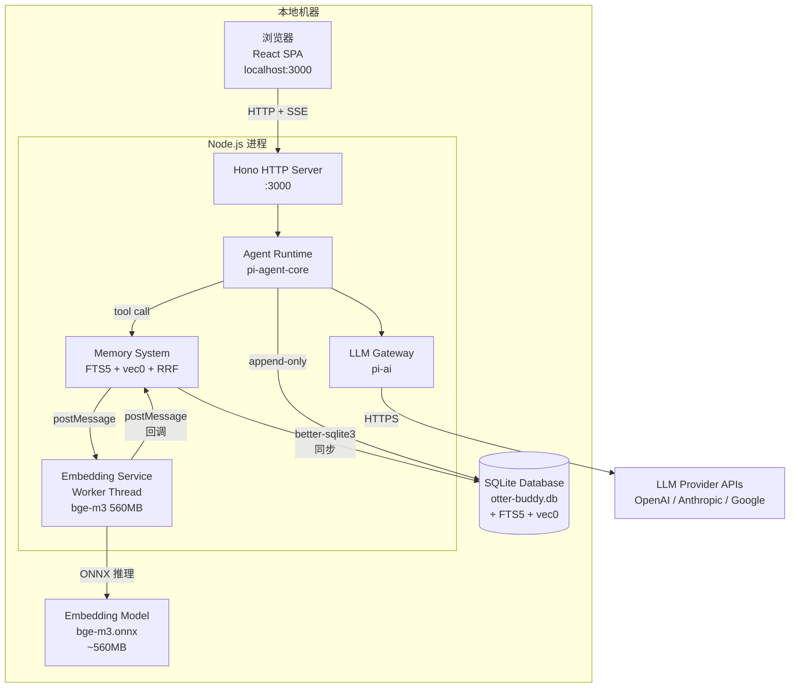

# 部署图 (S3-A7)

> 4+1 Physical View。来源：F20260709p4q7 数据模型设计 S3-A7。

## 物理组件清单

| 组件 | 位置 | 技术 | 说明 |
|------|------|------|------|
| React SPA | 浏览器 | React 19 + Tailwind 4 | 用户界面 |
| Hono HTTP Server | Node.js 主线程 | Hono | REST API + SSE 流式推送 |
| Agent Runtime | Node.js 主线程 | pi-agent-core | 大獭/小獭 Agent 实例 |
| LLM Gateway | Node.js 主线程 | pi-ai | 多提供商 LLM 抽象 |
| Memory System | Node.js 主线程 | 自建 | 混合检索引擎 |
| Embedding Service | Node.js Worker Thread | @huggingface/transformers | bge-m3 异步推理 |
| SQLite Database | 本地文件 | better-sqlite3 + sqlite-vec | 数据持久化 |
| Embedding Model | 本地文件 | Xenova/bge-m3 ONNX | 1024 维多语言 embedding |

## 资源占用估算

| 资源 | 估算 | 说明 |
|------|------|------|
| 内存 | ~200-500MB | Node.js 进程 + Agent 上下文 + bge-m3 模型 |
| 磁盘 | ~600MB-1GB | bge-m3 模型 (~560MB) + SQLite 数据库 |
| CPU | 低（空闲时） | 单用户，消息驱动 |
| 网络 | 仅 LLM API | HTTPS 出站到 LLM Provider |
