# F20260709m2n8 [architecture] 能力模块架构设计（S2）

## [design-time]

> 本文档记录 S2（能力模块架构设计）的全部产出物。基于 S1 产品形态定义（F20260709x7k3）和 Issue #3 设计哲学，设计系统架构。

## 背景 [required]

S1 完成了产品形态定义：大獭+临时小獭模型、三层记忆系统、对话树、重启獭生、统一能力库、8 个核心用例、5 个限界上下文。S2 基于 S1 产出物，设计能力模块架构。

### 技术选型输入

| 问题 | 用户决策 | 架构师分析 |
|------|---------|-----------|
| Agent 框架 | Pi Agent (pi-mono) | TypeScript 原生，pi-ai 多 LLM 提供商抽象 + pi-agent-core Agent 运行时，68.9k stars，MIT |
| 前端形态 | Web (React) | 参考 snail-shell 技术栈：React + Tailwind + Hono |
| 记忆检索 | FTS5 基线 + 远超 FTS5 | 混合检索：FTS5(BM25) + sqlite-vec(KNN) + RRF 融合 + 权重重排 |

### 已自主决策项

| 项目 | 决策 | 依据 |
|------|------|------|
| 用户规模 | 单用户 | S1 NFR |
| 部署形态 | 本地运行 | S1 NFR |
| Agent 间通信 | 进程内直接函数调用 | 单进程本地应用 |
| 消息存储 | SQLite + append-only | Chat as Substrate，消息不可变 |
| 后端语言 | TypeScript/Node.js | 项目初始化已确定 |
| 记忆系统接口 | MCP 式工具接口 | UA-13 要求 |

## 用户意图锚 [required]

| # | 来源 | 用户原话（逐字引用） | 关键修饰语 | 架构师解读 |
|---|------|---------------------|-----------|-----------|
| UA-S2-1 | S2 讨论 | 我在想使用pi agent，因为听说这个agent非常灵活，自定义自由度比较高 | 程度：非常灵活；属性：自定义自由度高 | 使用 Pi Agent 作为 Agent 框架基座 |
| UA-S2-2 | S2 讨论 | 不想直接使用llm api，因为还需要做非常多的agent能力 | 否定：直接 LLM API；原因：需建大量 agent 能力 | 不从零构建 Agent 能力，复用现有框架 |
| UA-S2-3 | S2 讨论 | 觉得不如直接用现有的agent | 判断：不如用现有的 | 优先复用而非自建 |
| UA-S2-4 | S2 讨论 | web | 形态：Web | 前端为 Web 应用 |
| UA-S2-5 | S2 讨论 | snail shell项目使用了react/tailwind/hono等，我感觉不错 | 参照：snail shell 技术栈；判断：不错 | 技术栈参考 snail-shell |
| UA-S2-6 | S2 讨论 | 技术选型你具体分析 | 委托：架构师具体分析 | 架构师自主选型 |
| UA-S2-7 | S2 讨论 | 少自己造轮子，有业界主流的就用 | 原则：少造轮子；优先：业界主流 | 优先使用成熟库 |
| UA-S2-8 | S2 讨论 | web生态应该非常强大了 | 判断：Web 生态强大 | 充分利用 Web 生态 |
| UA-S2-9 | S2 讨论 | 首先，肯定会有sqlite fts5 | 肯定：有 FTS5 | FTS5 是基线 |
| UA-S2-10 | S2 讨论 | 其次，这还远远不够 | 程度：远远不够 | FTS5 不充分 |
| UA-S2-11 | S2 讨论 | 我觉得这一块必须先做搜索引擎的deep research | 动作：deep research；对象：搜索引擎 | 需研究搜索引擎技术 |
| UA-S2-12 | S2 讨论 | 我要的是一个强大的记忆系统 | 程度：强大；对象：记忆系统 | 记忆系统是核心差异化 |
| UA-S2-13 | S2 讨论 | 不能只是简单的fts5这种 | 否定：只是简单 FTS5 | 需超越关键词匹配 |

## 目标 [required]

### P1 - 能力模块架构设计

基于 S1 产出物 + Pi Agent 框架 + 混合检索技术，设计 otter-buddy 的完整系统架构，包括 C4 视图、领域模型、序列图、状态机、接口定义、ADR 和测试策略。

## 非目标 [required]

- 不设计数据模型（schema、DDL）-- S3
- 不实现任何代码 -- S4
- 不修改 S1 已锁定的产品形态定义

## 技术栈选型 [required]

### Agent 框架：Pi Agent (pi-mono)

> **Why Pi Agent**：用户明确要求使用 Pi Agent（UA-S2-1/2/3）。Pi 是 TypeScript 原生的 Agent 工具包，68.9k stars，MIT 许可。模块化设计允许按需使用。

| Pi 包 | 用途 | 在 otter-buddy 中的角色 |
|-------|------|----------------------|
| `@earendil-works/pi-ai` | 统一多提供商 LLM API | LLM Gateway，支持 OpenAI/Anthropic/Google 等，用户按需选择 |
| `@earendil-works/pi-agent-core` | Agent 运行时 | 大獭/小獭的 Agent 实例基座，提供工具调用、状态管理、事件流 |

**Pi Agent 核心能力映射**：

| otter-buddy 概念 | Pi Agent 对应 |
|-----------------|--------------|
| 大獭 | 持久 Agent 实例 |
| 小獭 | 临时 Agent 实例 |
| 对话消息 | AgentMessage[] |
| 工作记忆 | Agent 的 message context + transformContext |
| 统一能力库 | AgentTool[] |
| 手脚 | AgentTool（调用外部系统） |
| 重启獭生 | Agent.reset() + session 归档 |

### 前端：React + Tailwind + Hono

> **Why React+Tailwind+Hono**：用户参考 snail-shell 技术栈（UA-S2-5），要求少造轮子（UA-S2-7）。React 生态最成熟，Tailwind 原子化 CSS 效率高，Hono 轻量后端框架。

| 技术 | 用途 |
|------|------|
| React 19 | 前端 UI 框架 |
| Tailwind CSS 4 | 样式系统 |
| Hono | 后端 API 服务器 |
| react-flow | 对话树可视化（D11） |
| EventSource (SSE) | LLM 流式响应推送 |

### 记忆检索：混合检索架构

> **Why 混合检索**：用户明确"FTS5 远远不够"（UA-S2-10），要"强大的记忆系统"（UA-S2-12）。基于 deep research 结论，采用 FTS5 + sqlite-vec + RRF 融合 + 权重重排的混合架构。

| 技术 | 用途 | 选型理由 |
|------|------|---------|
| SQLite FTS5 | 关键词检索（BM25） | SQLite 内置，零依赖 |
| sqlite-vec | 向量检索（KNN） | better-sqlite3 兼容，Mozilla 赞助，sqlite-vss 继任者 |
| @huggingface/transformers | 本地 Embedding 生成 | ONNX 运行时，无需 API 调用，worker thread 异步推理 |
| Xenova/bge-m3 | Embedding 模型 | 1024 维，100+ 语言含中文，8192 token 上下文 |
| RRF (Reciprocal Rank Fusion) | 排序融合 | ~20 行代码，无需分数归一化 |

## S2-A1: 系统上下文图（C4 Level 1）[required]

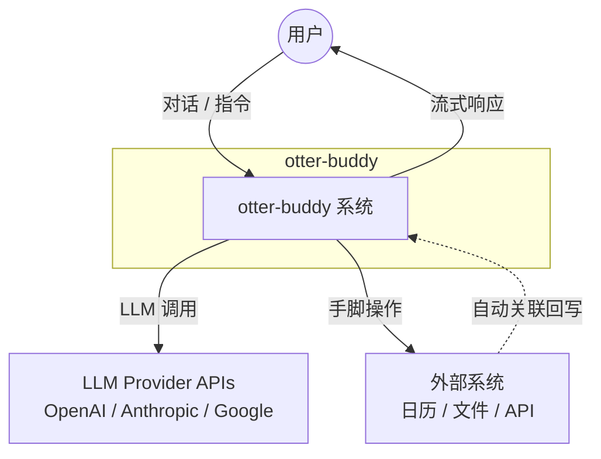
```mermaid
graph TB
    User((用户))

    subgraph otter-buddy
        OB[otter-buddy 系统]
    end

    LLM[LLM Provider APIs<br/>OpenAI / Anthropic / Google]
    ExtSys[外部系统<br/>日历 / 文件 / API]

    User -->|对话 / 指令| OB
    OB -->|流式响应| User
    OB -->|LLM 调用| LLM
    OB -->|手脚操作| ExtSys
    ExtSys -.->|自动关联回写| OB
```

### 外部参与者

| 参与者 | 交互方式 | 说明 |
|--------|---------|------|
| 用户 | HTTP + SSE | 单用户，本地浏览器访问 |
| LLM Provider | HTTPS API | 通过 pi-ai 抽象，支持多提供商 |
| 外部系统 | 协议特定 | 通过手脚（AgentTool）触达 |

## S2-A2: 容器图（C4 Level 2）[required]

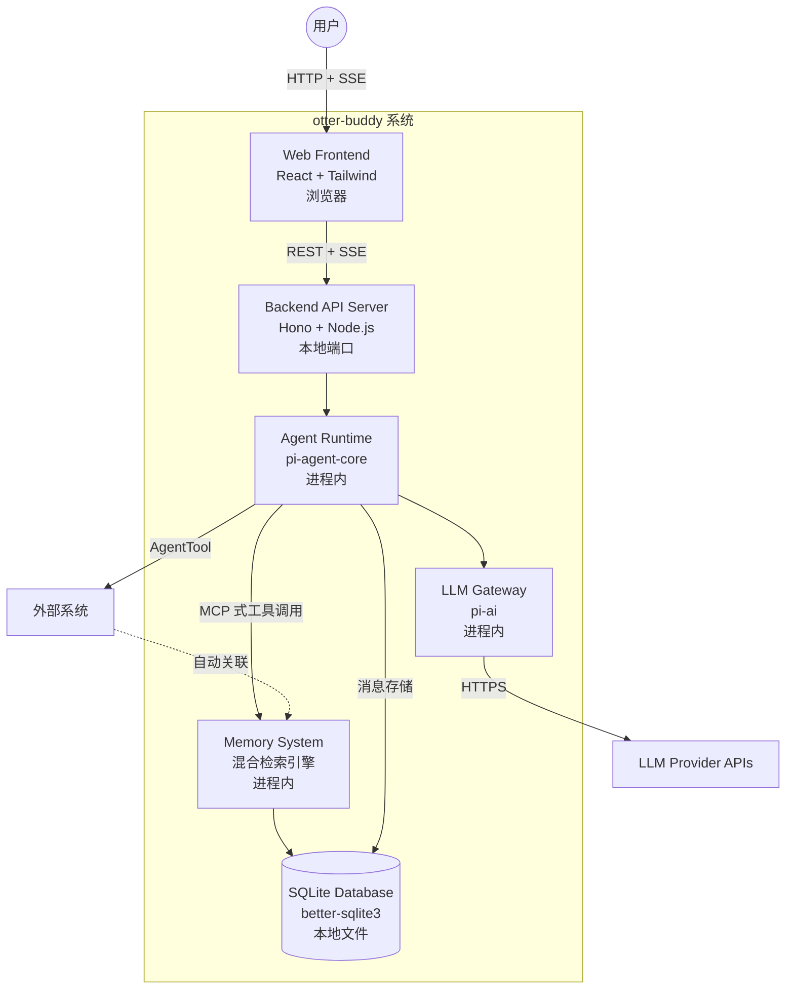
```mermaid
graph TB
    subgraph "otter-buddy 系统"
        FE[Web Frontend<br/>React + Tailwind<br/>浏览器]
        API[Backend API Server<br/>Hono + Node.js<br/>本地端口]
        AR[Agent Runtime<br/>pi-agent-core<br/>进程内]
        LLMG[LLM Gateway<br/>pi-ai<br/>进程内]
        MEM[Memory System<br/>混合检索引擎<br/>进程内]
        DB[(SQLite Database<br/>better-sqlite3<br/>本地文件)]
    end

    LLM[LLM Provider APIs]
    ExtSys[外部系统]

    User((用户)) -->|HTTP + SSE| FE
    FE -->|REST + SSE| API
    API --> AR
    AR --> LLMG
    LLMG -->|HTTPS| LLM
    AR -->|MCP 式工具调用| MEM
    MEM --> DB
    AR -->|AgentTool| ExtSys
    ExtSys -.->|自动关联| MEM
    AR -->|消息存储| DB
```

### 容器说明

| 容器 | 技术 | 职责 | 通信方式 |
|------|------|------|---------|
| Web Frontend | React 19 + Tailwind 4 | 聊天 UI、对话树可视化、记忆管理 UI | HTTP + SSE |
| Backend API Server | Hono + Node.js | REST API、SSE 流式推送、请求路由 | 进程内调用 |
| Agent Runtime | pi-agent-core | 大獭/小獭实例管理、工具执行、事件流 | 进程内调用 |
| LLM Gateway | pi-ai | 多提供商 LLM 抽象、流式响应 | HTTPS |
| Memory System | 自建 | 三层记忆、混合检索、权重系统 | MCP 式工具接口 |
| SQLite Database | better-sqlite3 + sqlite-vec | 消息、记忆、Agent 元数据、对话树、Skill 定义 | 进程内 |

## S2-A3: 逻辑视图 -- 领域模型 [required]

> **Persistence-ignorant**：不在此步考虑存储细节，存储适配在 S3 完成。

### 对话上下文（核心域）

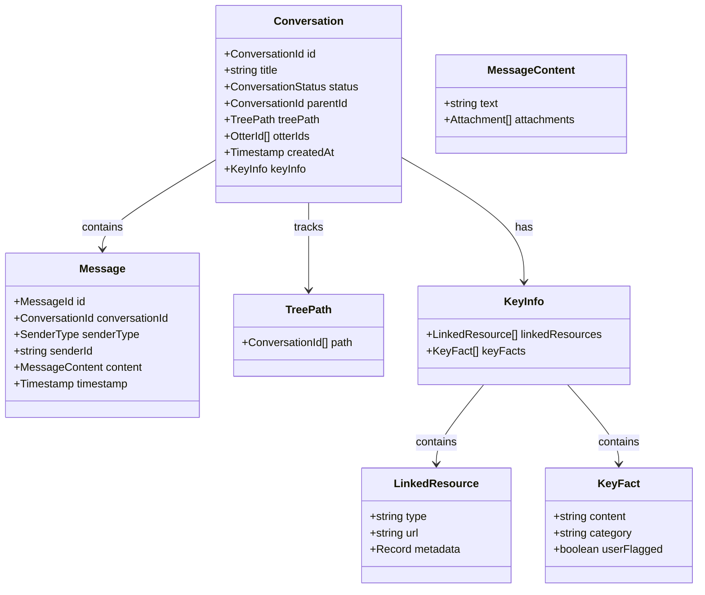
```mermaid
classDiagram
    class Conversation {
        +ConversationId id
        +string title
        +ConversationStatus status
        +ConversationId parentId
        +TreePath treePath
        +OtterId[] otterIds
        +Timestamp createdAt
        +KeyInfo keyInfo
    }
    class Message {
        +MessageId id
        +ConversationId conversationId
        +SenderType senderType
        +string senderId
        +MessageContent content
        +Timestamp timestamp
    }
    class MessageContent {
        +string text
        +Attachment[] attachments
    }
    class TreePath {
        +ConversationId[] path
    }
    class KeyInfo {
        +LinkedResource[] linkedResources
        +KeyFact[] keyFacts
    }
    class LinkedResource {
        +string type
        +string url
        +Record metadata
    }
    class KeyFact {
        +string content
        +string category
        +boolean userFlagged
    }

    Conversation --> Message : contains
    Conversation --> KeyInfo : has
    Conversation --> TreePath : tracks
    KeyInfo --> LinkedResource : contains
    KeyInfo --> KeyFact : contains
```

**聚合根**：Conversation
**实体**：Conversation, Message
**值对象**：MessageContent, TreePath, KeyInfo, LinkedResource, KeyFact
**领域事件**：ConversationCreated, MessageSent, ConversationCompleted, ConversationArchived, ChildConversationCreated, ConversationTreeNavigated

### 记忆上下文（核心域）

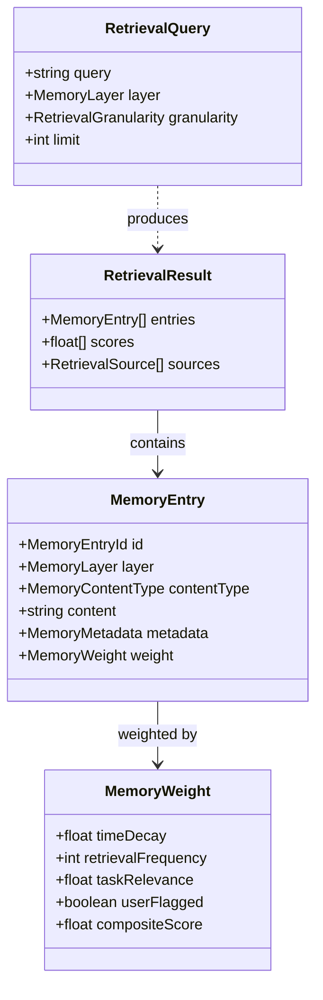
```mermaid
classDiagram
    class MemoryEntry {
        +MemoryEntryId id
        +MemoryLayer layer
        +MemoryContentType contentType
        +string content
        +MemoryMetadata metadata
        +MemoryWeight weight
    }
    class MemoryWeight {
        +float timeDecay
        +int retrievalFrequency
        +float taskRelevance
        +boolean userFlagged
        +float compositeScore
    }
    class RetrievalQuery {
        +string query
        +MemoryLayer layer
        +RetrievalGranularity granularity
        +int limit
    }
    class RetrievalResult {
        +MemoryEntry[] entries
        +float[] scores
        +RetrievalSource[] sources
    }

    MemoryEntry --> MemoryWeight : weighted by
    RetrievalQuery ..> RetrievalResult : produces
    RetrievalResult --> MemoryEntry : contains
```

**聚合根**：MemoryEntry
**实体**：MemoryEntry
**值对象**：MemoryWeight, RetrievalQuery, RetrievalResult, MemoryLayer, RetrievalGranularity
**领域事件**：MemoryStored, MemoryRetrieved, MemoryWeightUpdated, KeyInfoAdded

### Otter 上下文（支撑域）

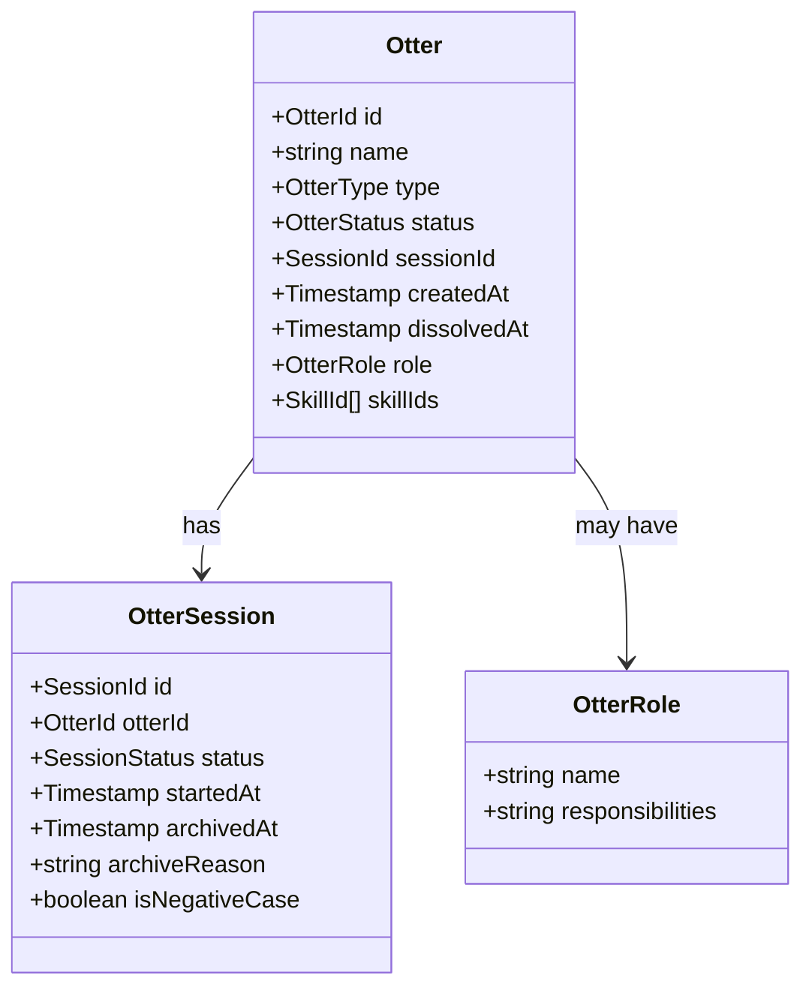
```mermaid
classDiagram
    class Otter {
        +OtterId id
        +string name
        +OtterType type
        +OtterStatus status
        +SessionId sessionId
        +Timestamp createdAt
        +Timestamp dissolvedAt
        +OtterRole role
        +SkillId[] skillIds
    }
    class OtterSession {
        +SessionId id
        +OtterId otterId
        +SessionStatus status
        +Timestamp startedAt
        +Timestamp archivedAt
        +string archiveReason
        +boolean isNegativeCase
    }
    class OtterRole {
        +string name
        +string responsibilities
    }

    Otter --> OtterSession : has
    Otter --> OtterRole : may have
```

**聚合根**：Otter
**实体**：Otter, OtterSession
**值对象**：OtterRole, OtterType(big/small), OtterStatus(active/dissolved), SessionStatus(active/archived/restarted)
**领域事件**：SmallOtterCreated, SmallOtterDissolved, RestartOtterLifeTriggered, SessionArchived

### 能力上下文（支撑域）

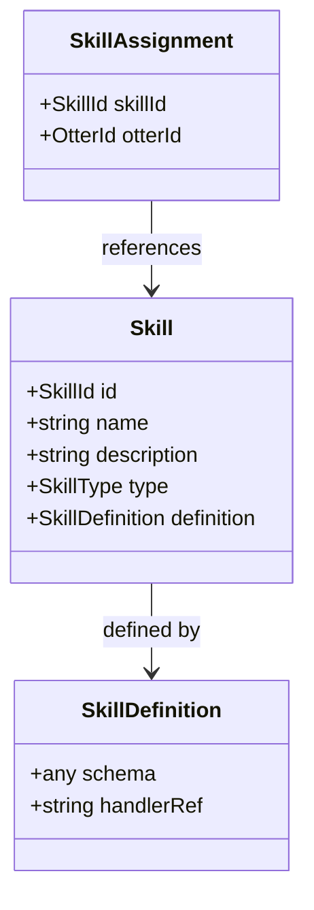
```mermaid
classDiagram
    class Skill {
        +SkillId id
        +string name
        +string description
        +SkillType type
        +SkillDefinition definition
    }
    class SkillDefinition {
        +any schema
        +string handlerRef
    }
    class SkillAssignment {
        +SkillId skillId
        +OtterId otterId
    }

    Skill --> SkillDefinition : defined by
    SkillAssignment --> Skill : references
```

**聚合根**：Skill
**实体**：Skill, SkillAssignment
**值对象**：SkillType(tool/prompt_template/workflow), SkillDefinition
**领域事件**：SkillRegistered, SkillLoaded, SkillUnloaded

### 外部系统上下文（支撑域）

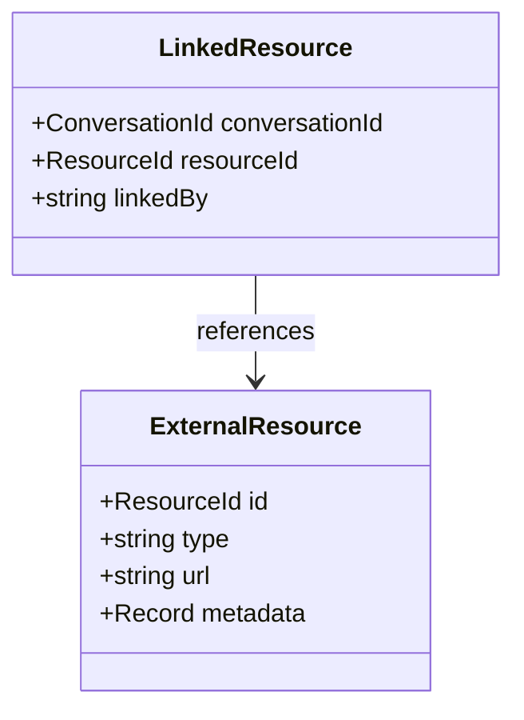
```mermaid
classDiagram
    class ExternalResource {
        +ResourceId id
        +string type
        +string url
        +Record metadata
    }
    class LinkedResource {
        +ConversationId conversationId
        +ResourceId resourceId
        +string linkedBy
    }

    LinkedResource --> ExternalResource : references
```

**聚合根**：ExternalResource
**实体**：ExternalResource, LinkedResource
**领域事件**：ResourceLinked, ExternalOperationExecuted, ResourceAutoLinked

### 上下文映射（S2 细化版）

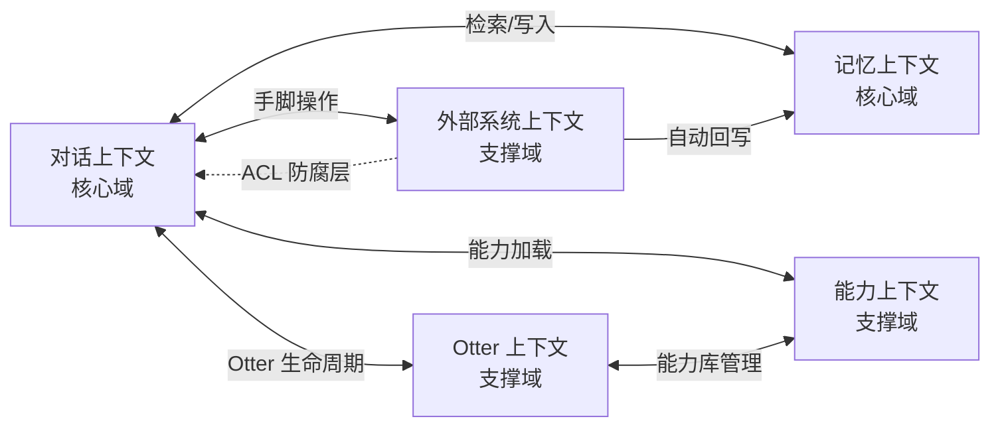
```mermaid
graph LR
    Conv[对话上下文<br/>核心域] <-->|检索/写入| Mem[记忆上下文<br/>核心域]
    Conv <-->|Otter 生命周期| Ott[Otter 上下文<br/>支撑域]
    Conv <-->|能力加载| Cap[能力上下文<br/>支撑域]
    Conv <-->|手脚操作| Ext[外部系统上下文<br/>支撑域]
    Ott <-->|能力库管理| Cap
    Ext -->|自动回写| Mem
    Ext -.->|ACL 防腐层| Conv
```

> **ACL 防腐层**：外部系统数据模型与内部不同，S1 标注的待评估项。S2 确认需要 ACL，转换外部数据格式为内部 LinkedResource。

## S2-A4: 进程视图 [required]

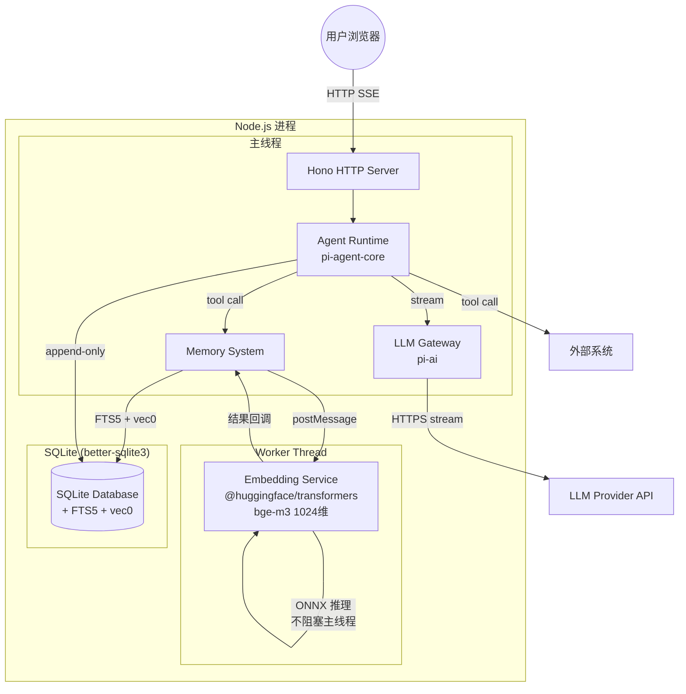
```mermaid
graph TB
    subgraph "Node.js 进程"
        subgraph "主线程"
            Hono[Hono HTTP Server]
            AgentRT[Agent Runtime<br/>pi-agent-core]
            LLMG[LLM Gateway<br/>pi-ai]
            MemSys[Memory System]
        end

        subgraph "Worker Thread"
            Embed[Embedding Service<br/>@huggingface/transformers<br/>bge-m3 1024维]
        end

        subgraph "SQLite (better-sqlite3)"
            DB[(SQLite Database<br/>+ FTS5 + vec0)]
        end
    end

    LLM[LLM Provider API]
    User((用户浏览器))

    User -->|HTTP SSE| Hono
    Hono --> AgentRT
    AgentRT -->|stream| LLMG
    LLMG -->|HTTPS stream| LLM
    AgentRT -->|tool call| MemSys
    AgentRT -->|tool call| ExtSys[外部系统]
    MemSys -->|FTS5 + vec0| DB
    MemSys -->|postMessage| Embed
    Embed -->|ONNX 推理<br/>不阻塞主线程| Embed
    Embed -->|结果回调| MemSys
    AgentRT -->|append-only| DB
```

### 并发模型

| 场景 | 并发策略 | 说明 |
|------|---------|------|
| LLM 流式响应 | SSE 单向流 | Agent 事件流 -> Hono SSE -> 浏览器 EventSource |
| 记忆检索 | 同步阻塞 | better-sqlite3 同步调用，单用户无并发冲突 |
| Embedding 生成 | Worker Thread 异步 | bge-m3 1024 维推理 200-500ms，必须在 worker thread 中执行，通过 postMessage 通信，不阻塞主线程事件循环 |
| 多 Otter 对话 | Agent 内部 turn-based | Pi Agent 的 turn_start/turn_end 机制 |
| 消息写入 | 串行 append | 消息不可变，INSERT only |

## S2-A5: 关键场景序列图 [required]

### UC1: 与大獭对话

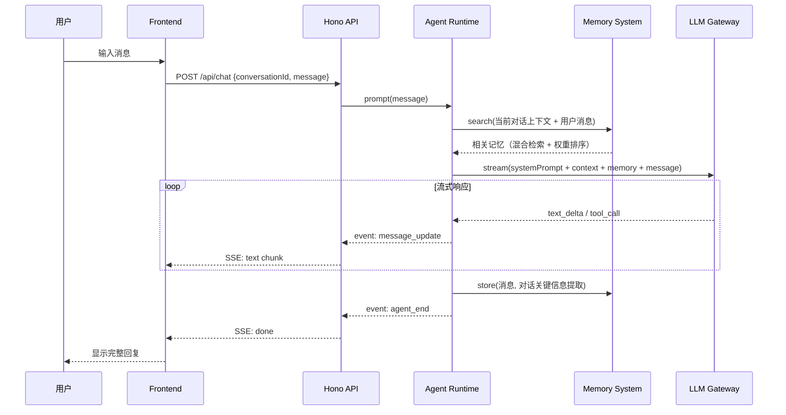
```mermaid
sequenceDiagram
    participant U as 用户
    participant FE as Frontend
    participant API as Hono API
    participant AR as Agent Runtime
    participant MEM as Memory System
    participant LLM as LLM Gateway

    U->>FE: 输入消息
    FE->>API: POST /api/chat {conversationId, message}
    API->>AR: prompt(message)
    AR->>MEM: search(当前对话上下文 + 用户消息)
    MEM-->>AR: 相关记忆（混合检索 + 权重排序）
    AR->>LLM: stream(systemPrompt + context + memory + message)
    loop 流式响应
        LLM-->>AR: text_delta / tool_call
        AR-->>API: event: message_update
        API-->>FE: SSE: text chunk
    end
    AR->>MEM: store(消息, 对话关键信息提取)
    AR-->>API: event: agent_end
    API-->>FE: SSE: done
    FE-->>U: 显示完整回复
```

### UC2: 历史对话检索

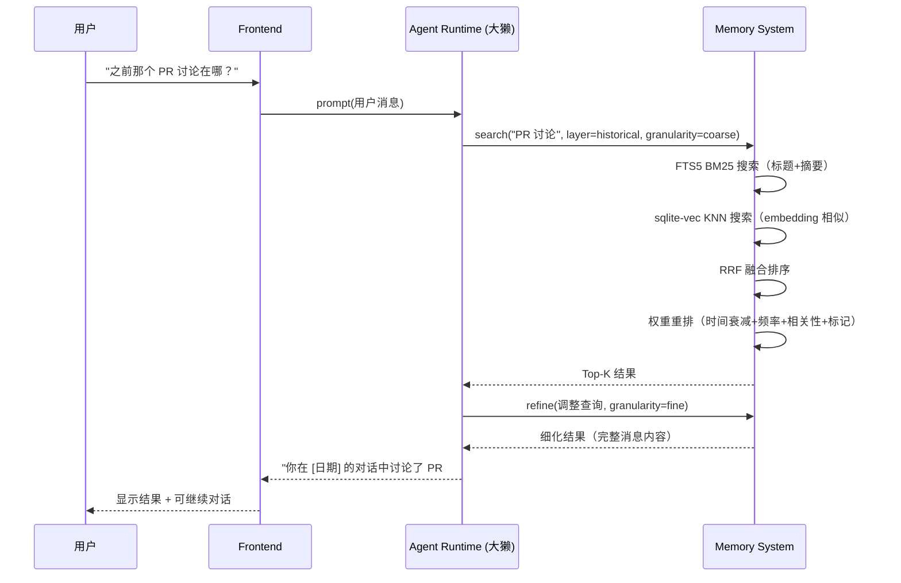
```mermaid
sequenceDiagram
    participant U as 用户
    participant FE as Frontend
    participant AR as Agent Runtime (大獭)
    participant MEM as Memory System

    U->>FE: "之前那个 PR 讨论在哪？"
    FE->>AR: prompt(用户消息)
    AR->>MEM: search("PR 讨论", layer=historical, granularity=coarse)
    MEM->>MEM: FTS5 BM25 搜索（标题+摘要）
    MEM->>MEM: sqlite-vec KNN 搜索（embedding 相似）
    MEM->>MEM: RRF 融合排序
    MEM->>MEM: 权重重排（时间衰减+频率+相关性+标记）
    MEM-->>AR: Top-K 结果
    AR->>MEM: refine(调整查询, granularity=fine)
    MEM-->>AR: 细化结果（完整消息内容）
    AR-->>FE: "你在 [日期] 的对话中讨论了 PR #xxx..."
    FE-->>U: 显示结果 + 可继续对话
```

### UC3: 多 Otter 对话协作

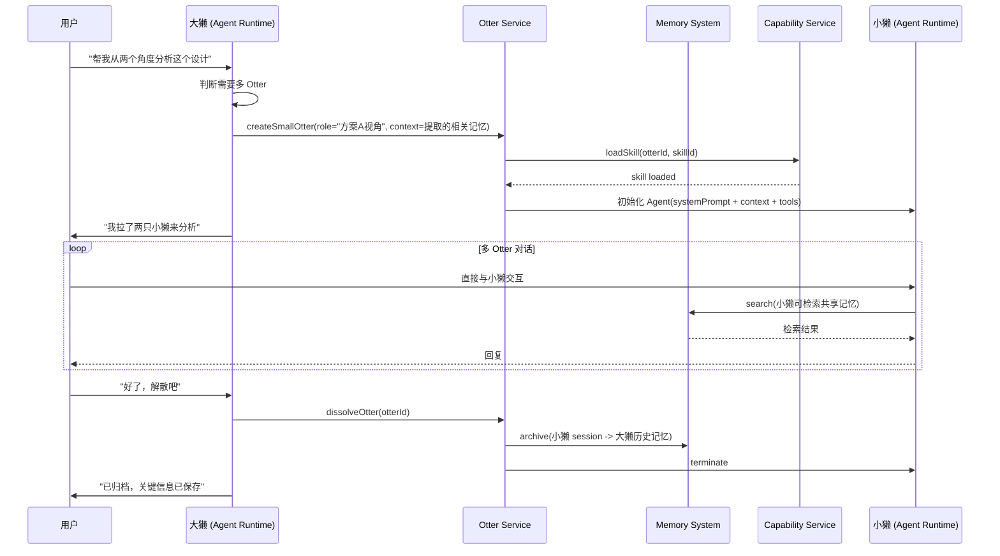
```mermaid
sequenceDiagram
    participant U as 用户
    participant AR as 大獭 (Agent Runtime)
    participant OT as Otter Service
    participant MEM as Memory System
    participant CAP as Capability Service
    participant SO as 小獭 (Agent Runtime)

    U->>AR: "帮我从两个角度分析这个设计"
    AR->>AR: 判断需要多 Otter
    AR->>OT: createSmallOtter(role="方案A视角", context=提取的相关记忆)
    OT->>CAP: loadSkill(otterId, skillId)
    CAP-->>OT: skill loaded
    OT->>SO: 初始化 Agent(systemPrompt + context + tools)
    AR->>U: "我拉了两只小獭来分析"

    loop 多 Otter 对话
        U->>SO: 直接与小獭交互
        SO->>MEM: search(小獭可检索共享记忆)
        MEM-->>SO: 检索结果
        SO-->>U: 回复
    end

    U->>AR: "好了，解散吧"
    AR->>OT: dissolveOtter(otterId)
    OT->>MEM: archive(小獭 session -> 大獭历史记忆)
    OT->>SO: terminate
    AR->>U: "已归档，关键信息已保存"
```

### UC4: 重启獭生

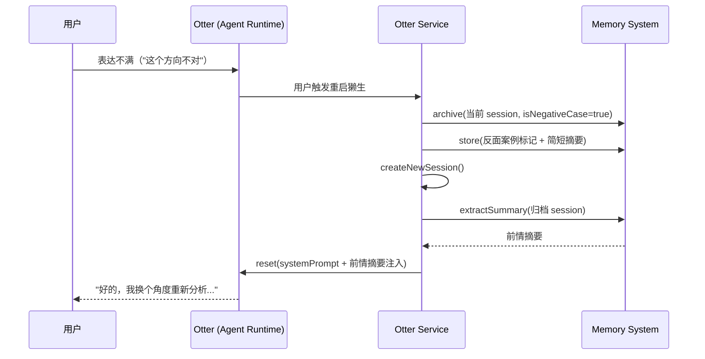
```mermaid
sequenceDiagram
    participant U as 用户
    participant AR as Otter (Agent Runtime)
    participant OT as Otter Service
    participant MEM as Memory System

    U->>AR: 表达不满（"这个方向不对"）
    AR->>OT: 用户触发重启獭生
    OT->>MEM: archive(当前 session, isNegativeCase=true)
    OT->>MEM: store(反面案例标记 + 简短摘要)
    OT->>OT: createNewSession()
    OT->>MEM: extractSummary(归档 session)
    MEM-->>OT: 前情摘要
    OT->>AR: reset(systemPrompt + 前情摘要注入)
    AR-->>U: "好的，我换个角度重新分析..."
```

> **重启獭生不影响对话树**：重启在当前对话节点内进行，不创建新的树节点（R7 风险缓解）。

### UC5: 外部系统操作 + 自动关联

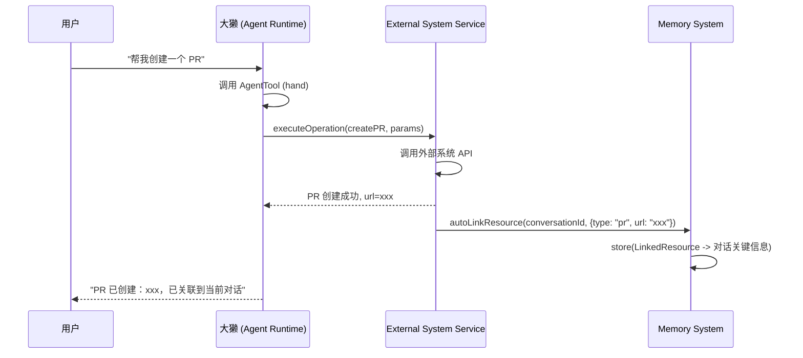
```mermaid
sequenceDiagram
    participant U as 用户
    participant AR as 大獭 (Agent Runtime)
    participant EXT as External System Service
    participant MEM as Memory System

    U->>AR: "帮我创建一个 PR"
    AR->>AR: 调用 AgentTool (hand)
    AR->>EXT: executeOperation(createPR, params)
    EXT->>EXT: 调用外部系统 API
    EXT-->>AR: PR 创建成功, url=xxx
    EXT->>MEM: autoLinkResource(conversationId, {type: "pr", url: "xxx"})
    MEM->>MEM: store(LinkedResource -> 对话关键信息)
    AR-->>U: "PR 已创建：xxx，已关联到当前对话"
```

### UC6: 小獭能力加载

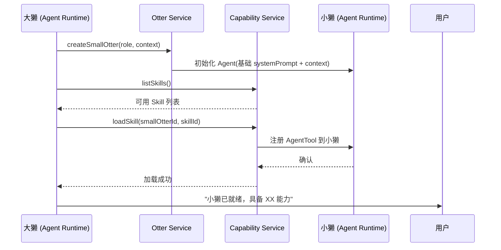
```mermaid
sequenceDiagram
    participant AR as 大獭 (Agent Runtime)
    participant OT as Otter Service
    participant CAP as Capability Service
    participant SO as 小獭 (Agent Runtime)
    participant U as 用户

    AR->>OT: createSmallOtter(role, context)
    OT->>SO: 初始化 Agent(基础 systemPrompt + context)
    AR->>CAP: listSkills()
    CAP-->>AR: 可用 Skill 列表
    AR->>CAP: loadSkill(smallOtterId, skillId)
    CAP->>SO: 注册 AgentTool 到小獭
    SO-->>CAP: 确认
    CAP-->>AR: 加载成功
    AR->>U: "小獭已就绪，具备 XX 能力"
```

### UC7: 对话树导航

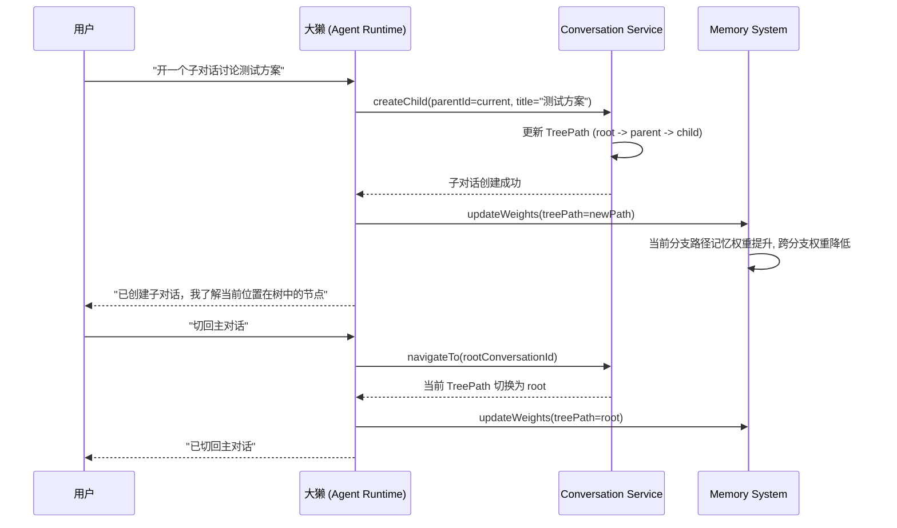
```mermaid
sequenceDiagram
    participant U as 用户
    participant AR as 大獭 (Agent Runtime)
    participant CONV as Conversation Service
    participant MEM as Memory System

    U->>AR: "开一个子对话讨论测试方案"
    AR->>CONV: createChild(parentId=current, title="测试方案")
    CONV->>CONV: 更新 TreePath (root -> parent -> child)
    CONV-->>AR: 子对话创建成功
    AR->>MEM: updateWeights(treePath=newPath)
    MEM->>MEM: 当前分支路径记忆权重提升, 跨分支权重降低
    AR-->>U: "已创建子对话，我了解当前位置在树中的节点"

    U->>AR: "切回主对话"
    AR->>CONV: navigateTo(rootConversationId)
    CONV-->>AR: 当前 TreePath 切换为 root
    AR->>MEM: updateWeights(treePath=root)
    AR-->>U: "已切回主对话"
```

> **对话树权重影响**：切换对话节点时，记忆检索权重自动调整。同分支路径记忆权重 ×1.5，跨分支 ×0.8。这是 UA-16 的核心要求。

> **UC8 覆盖说明**：UC8（对话外部关联）的自动关联场景已在 UC5 中覆盖。手动关联场景较简单（用户调用 `linkResource`），不单独画序列图。

## S2-A6: 状态机图 [required]

### Otter 生命周期

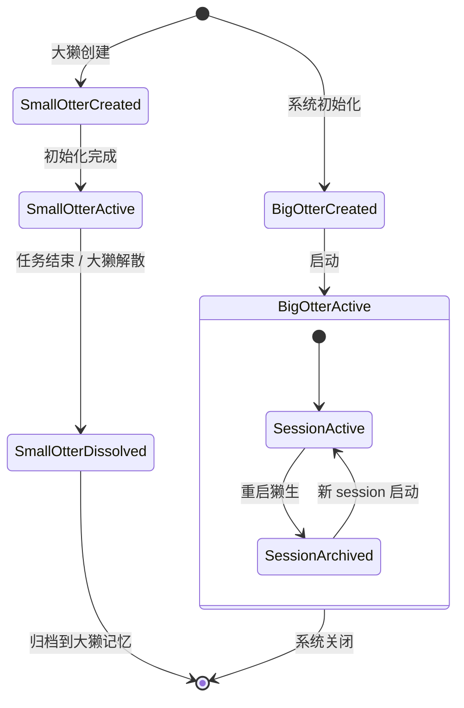
```mermaid
stateDiagram-v2
    [*] --> BigOtterCreated: 系统初始化
    [*] --> SmallOtterCreated: 大獭创建

    BigOtterCreated --> BigOtterActive: 启动

    SmallOtterCreated --> SmallOtterActive: 初始化完成
    SmallOtterActive --> SmallOtterDissolved: 任务结束 / 大獭解散

    state BigOtterActive {
        [*] --> SessionActive
        SessionActive --> SessionArchived: 重启獭生
        SessionArchived --> SessionActive: 新 session 启动
    }

    SmallOtterDissolved --> [*]: 归档到大獭记忆
    BigOtterActive --> [*]: 系统关闭
```

### 对话生命周期

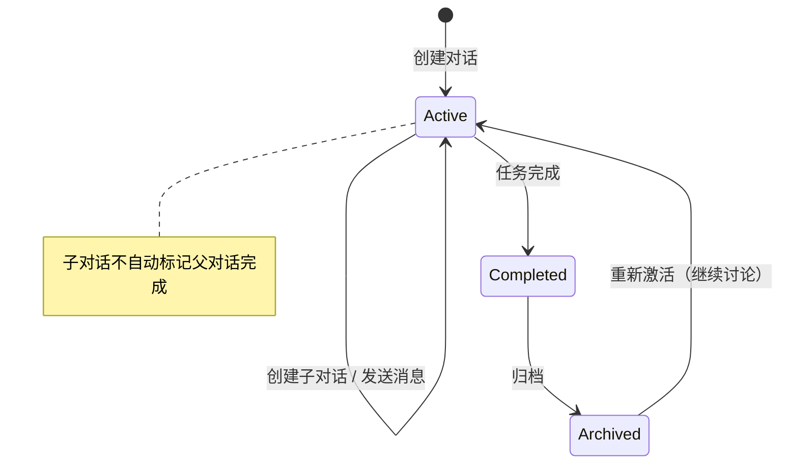
```mermaid
stateDiagram-v2
    [*] --> Active: 创建对话
    Active --> Active: 创建子对话 / 发送消息
    Active --> Completed: 任务完成
    Completed --> Archived: 归档
    Archived --> Active: 重新激活（继续讨论）

    note right of Active: 子对话不自动标记父对话完成
```

## S2-A7/A10: 编号说明

> S2-A7（组件图，C4 Level 3）为 P2 可选项，当前阶段不产出，待 S3 或 S4 按需补充。
> S2-A10（软件架构文档）即本文档本身，不单独产出。

## S2-A8: 接口定义 [required]

### Memory Service（MCP 式工具接口）

```typescript
interface MemoryService {
  /** 存储记忆条目 */
  store(entry: MemoryEntryInput): Promise<MemoryEntryId>;

  /** 混合检索（FTS5 + vec + RRF + 权重重排） */
  search(query: SearchQuery): Promise<RetrievalResult>;

  /** 细化上一次检索 */
  refine(prevSearchId: string, adjustedQuery: SearchQuery): Promise<RetrievalResult>;

  /** 按 ID 获取完整内容 */
  getById(id: MemoryEntryId): Promise<MemoryEntry | null>;

  /** 获取上下文消息（前/后） */
  expand(id: MemoryEntryId, direction: 'before' | 'after' | 'both', count: number): Promise<MemoryEntry[]>;

  /** 查找相似条目 */
  searchSimilar(id: MemoryEntryId, limit: number): Promise<RetrievalResult>;

  /** 更新单个记忆条目权重 */
  updateWeight(id: MemoryEntryId, weight: Partial<MemoryWeightInput>): Promise<void>;

  /** 按对话树路径批量更新记忆权重 */
  updateWeights(treePath: ConversationId[]): Promise<void>;

  /** 添加对话关键信息 */
  addKeyInfo(conversationId: ConversationId, keyInfo: KeyInfoInput): Promise<void>;

  /** 链接外部资源 */
  linkResource(conversationId: ConversationId, resource: ExternalResourceInput): Promise<void>;
}

interface SearchQuery {
  query: string;
  layer?: MemoryLayer;        // 工作记忆/历史对话/关键信息
  granularity?: 'coarse' | 'fine';  // 粗粒度(标题+摘要) / 细粒度(完整内容)
  conversationId?: ConversationId;   // 限定对话范围
  treePath?: ConversationId[];       // 对话树分支路径（影响权重）
  limit?: number;
}
```

### Conversation Service

```typescript
interface ConversationService {
  createConversation(params: { title: string; parentId?: ConversationId; otterIds: OtterId[] }): Promise<Conversation>;
  sendMessage(conversationId: ConversationId, message: MessageInput): Promise<void>;
  getConversation(id: ConversationId): Promise<Conversation | null>;
  getMessages(conversationId: ConversationId, limit?: number, before?: MessageId): Promise<Message[]>;
  getTree(rootId: ConversationId): Promise<ConversationTreeNode>;
  createChild(parentId: ConversationId, title: string): Promise<Conversation>;
  navigateTo(conversationId: ConversationId): Promise<void>;
  completeConversation(id: ConversationId): Promise<void>;
  archiveConversation(id: ConversationId): Promise<void>;
}
```

### Otter Service

```typescript
interface OtterService {
  getBigOtter(): Promise<Otter>;
  createSmallOtter(params: { name: string; role?: OtterRole; context?: string; skillIds?: SkillId[] }): Promise<Otter>;
  dissolveOtter(otterId: OtterId): Promise<void>;
  triggerRestart(otterId: OtterId): Promise<SessionId>;
  getOtter(otterId: OtterId): Promise<Otter | null>;
}
```

### Capability Service

```typescript
interface CapabilityService {
  registerSkill(skill: SkillDefinitionInput): Promise<SkillId>;
  loadSkill(otterId: OtterId, skillId: SkillId): Promise<void>;
  unloadSkill(otterId: OtterId, skillId: SkillId): Promise<void>;
  listSkills(): Promise<Skill[]>;
}
```

### External System Service

```typescript
interface ExternalSystemService {
  executeOperation(operation: ExternalOperationInput): Promise<OperationResult>;
  linkResource(conversationId: ConversationId, resource: ExternalResourceInput): Promise<void>;
  getLinkedResources(conversationId: ConversationId): Promise<LinkedResource[]>;
}
```

## 混合检索架构设计 [required]

> **基于 deep research 结论**。用户要求"强大的记忆系统"（UA-S2-12），"不能只是简单的 FTS5"（UA-S2-13）。

### 检索流水线

```
用户查询
  │
  ├─→ [FTS5 BM25 关键词检索] ──→ 排序列表 A (词法匹配)
  │     粗粒度: conversation_fts (标题+摘要)
  │     细粒度: message_fts (完整消息内容)
  │
  ├─→ [sqlite-vec KNN 语义检索] ──→ 排序列表 B (语义匹配)
  │     conversation_vec / key_info_vec
  │     1024 维 bge-m3 多语言 embedding
  │
  ├─→ [RRF 融合] ──→ 合并排序列表 (k=60)
  │
  └─→ [权重重排] ──→ 最终结果
        时间衰减 × 检索频率 × 任务相关性 × 用户标记
```

### 多粒度索引设计

| 粒度 | FTS5 表 | 索引内容 | 用途 |
|------|---------|---------|------|
| 粗粒度 | conversation_fts | 对话 ID + 标题 + 摘要 | 快速定位相关对话 |
| 细粒度 | message_fts | 消息 ID + 对话 ID + 角色 + 完整内容 | 精确查找具体消息 |

### 权重系统

```
final_score = base_retrieval_score     // BM25 或 RRF 分数
  × time_decay_weight                  // 指数衰减，默认半衰期 30 天
  × frequency_boost                    // log(1 + retrieval_count) × 0.1 + 1
  × task_relevance_weight              // 当前对话树路径加成 (同路径 ×1.5, 跨路径 ×0.8)
  × user_flag_multiplier               // 用户标记 ×2.0, 未标记 ×1.0
```

### AI Agent 检索工具（迭代检索）

| 工具 | 说明 |
|------|------|
| `memory_search` | 初始搜索（关键词 + 语义混合） |
| `memory_refine` | 基于上次结果调整查询 |
| `memory_get` | 按 ID 获取完整内容 |
| `memory_expand` | 获取上下文消息（前后） |
| `memory_similar` | 查找相似条目 |

> **设计依据**：Issue #3 决策 3"AI Agent 作为检索引擎用户" -- AI 可迭代检索，检索系统不需要完美。

## 核心业务行为 [required]

| # | 场景 | 预期行为 | 意图锚 |
|---|------|---------|--------|
| B1 | 当用户在活跃对话中发送消息时 | 大獭应基于记忆系统检索的相关上下文回复，回复通过流式推送 | UA-3, UA-5 |
| B2 | 当用户询问历史对话内容时 | 大獭应通过多维度检索搜索历史记忆，返回包含对话位置和摘要的结果 | UA-7 |
| B3a | 当大獭判断当前任务需要多角度协作时 | 大獭应创建临时小獭并注入相关上下文 | UA-4, UA-11 |
| B3b | 当小獭被创建后 | 小獭应具备通过标准化接口检索共享记忆的能力 | UA-13 |
| B4a | 当用户对 Otter 回复表达不满时 | 系统应封存当前 session 并标记为反面案例 | UA-8 |
| B4b | 当反面案例封存完成后 | 系统应创建新 session 并注入前情摘要，换角度重新处理 | UA-9 |
| B5a | 当大獭或用户创建子对话时 | 系统应建立父子关系并维护从根到当前节点的完整路径 | UA-15 |
| B5b | 当对话树节点切换时 | 当前分支路径上的记忆在检索中获得更高权重，跨分支记忆权重降低 | UA-16 |
| B6 | 当 Otter 通过手脚执行外部系统操作时 | 系统应自动将操作产生的资源链接到当前对话的关键信息 | UA-10 |
| B7a | 当小獭的任务完成并解散时 | 系统应将小獭的 session 归档到大獭的历史对话记忆中 | UA-12 |
| B7b | 当小獭解散后 | 小獭的工作记忆（当前 session）应消失，不残留 | UA-12 |
| B8 | 当用户或大獭向对话添加关键信息时 | 系统应将其存储为对话关键信息，并建立可检索的索引 | UA-17, UA-S2-12 |
| B9 | 当记忆检索返回结果时 | 结果应按复合权重排序（权重因子见设计文档） | UA-13 |
| B10 | 当对话的所有子对话完成时 | 父对话不自动标记为完成，需用户或大獭显式操作 | S1 决策 |
| B11 | 当大獭为小獭加载能力时 | 小獭应获得对应 Skill 的调用权限，能力在解散时回收 | UA-10, UA-11 |
| B12 | 当用户或大獭在对话树中导航时 | 系统应维护当前位置路径，大獭可感知当前位置在树中的节点 | UA-15, UA-16 |
| B13 | 当 Otter 发起记忆检索时 | 系统应根据查询意图路由到对应记忆层（工作记忆/历史对话/关键信息） | S1 三层模型 |
| B14 | 当 LLM 调用失败时 | 系统应向用户显示错误信息，已生成的部分回复应保留，不丢失对话上下文 | R3 |
| B15 | 当外部系统操作失败时 | 系统应向用户报告失败原因，不自动重试，已产生的部分资源应保留关联 | R3 |

## S2-A9: 架构决策记录 [required]

### D14: 使用 Pi Agent (pi-mono) 作为 Agent 框架

- **决策点**：Agent 运行时基座选型
- **正方论点**：TypeScript 原生，pi-ai 多 LLM 抽象，pi-agent-core 提供完整 Agent 能力（工具调用、状态管理、事件流），68.9k stars 社区活跃，MIT 许可
- **反方论点**：Pi 主要是 coding agent，非通用 agent 框架；依赖第三方维护
- **最终决策**：使用 pi-ai + pi-agent-core 两个包，不使用 pi-coding-agent
- **决策依据**：用户明确要求（UA-S2-1/2/3），模块化设计允许按需使用，避免从零构建 Agent 能力
- **参与者**：架构师-1（起草），架构师-2（技术验证通过，确认 pi-agent-core 是通用 Agent 框架）

### D15: 前端 = React + Tailwind + Hono

- **决策点**：前端技术栈选型
- **正方论点**：用户参考 snail-shell 技术栈（UA-S2-5），React 生态最成熟，少造轮子（UA-S2-7）
- **反方论点**：React 全栈较重，纯 API 可能更简单
- **最终决策**：React 19 + Tailwind 4 + Hono + react-flow（对话树）
- **决策依据**：用户指定 Web + 参考 snail-shell，对话树可视化需要 react-flow
- **参与者**：架构师-1（起草），架构师-2（审视通过）

### D16: 记忆检索 = FTS5 + sqlite-vec + RRF 混合检索

- **决策点**：记忆检索架构选型
- **正方论点**：用户明确"FTS5 远远不够"（UA-S2-10），要"强大记忆系统"（UA-S2-12）；混合检索是业界主流方案；sqlite-vec 与 better-sqlite3 兼容，无外部依赖
- **反方论点**：复杂度高于纯 FTS5；embedding 生成有延迟（1024 维 bge-m3 200-500ms，需 worker thread）
- **最终决策**：FTS5(BM25) + sqlite-vec(KNN) + RRF 融合 + 权重重排
- **决策依据**：deep research 结论 + 用户要求 + 技术可行性
- **参与者**：架构师-1（起草），架构师-2（审视通过，提出 R1 修正 embedding 模型）

### D17: Agent 间通信 = 进程内直接函数调用

- **决策点**：大獭与小獭间通信方式
- **正方论点**：单用户本地应用，单进程，消息队列无收益
- **反方论点**：未来扩展为多进程时需要重构
- **最终决策**：进程内直接函数调用
- **决策依据**：S1 NFR 约束（单用户本地），Pi Agent 本身是单进程
- **参与者**：架构师-1（起草），架构师-2（审视，无异议）

### D18: 消息存储 = SQLite append-only

- **决策点**：消息存储方式
- **正方论点**：消息不可变（Chat as Substrate），append-only 语义清晰，SQLite 足够
- **反方论点**：append-only event log 更符合事件溯源模式，但复杂度高
- **最终决策**：SQLite 表 + INSERT only 语义（应用层保证不 UPDATE/DELETE）
- **决策依据**：Chat as Substrate + 简单优先
- **参与者**：架构师-1（起草），架构师-2（审视，无异议）

### D19: Embedding = 本地 bge-m3（多语言）

- **决策点**：Embedding 模型选型
- **正方论点**：用户对话为中文，bge-m3 支持 100+ 语言含中文；@huggingface/transformers 本地运行，无 API 依赖；8192 token 上下文窗口
- **反方论点**：560M 参数，1024 维向量（数据库增大 ~2.67x），单次推理 200-500ms（需 worker thread 不阻塞主线程）
- **最终决策**：Xenova/bge-m3（1024 维，多语言）。bge-small-en-v1.5 不作为备选--无法分词中文，对中文场景无价值
- **决策依据**：用户对话为中文，英文模型不可用（非"效果待验证"而是"根本不可用"）。用户要求"强大的记忆系统"（UA-S2-12），embedding 质量直接影响语义检索质量
- **风险缓解**：推理在 worker thread 中执行，不阻塞主线程事件循环；560MB 模型体积对本地单用户可接受
- **参与者**：架构师-1（起草），架构师-2（审视，提出 R1 修正），架构师-1（接受修正）

### D20: LLM = 多提供商 via pi-ai

- **决策点**：LLM 提供商选型
- **正方论点**：pi-ai 内置多提供商支持（OpenAI/Anthropic/Google 等），用户按需选择
- **反方论点**：多提供商支持增加测试复杂度
- **最终决策**：通过 pi-ai 支持多 LLM，用户可随时切换
- **决策依据**：用户不想绑定特定 LLM（UA-S2-1/2），pi-ai 已提供抽象
- **参与者**：架构师-1

### D21: 流式推送 = SSE（Server-Sent Events）

- **决策点**：前后端实时通信方式选型
- **正方论点**：SSE 是服务器到客户端的单向流，正好匹配 LLM 流式响应场景；客户端到服务器通过 HTTP POST 发送消息，无需双向流；SSE 比 WebSocket 简单，浏览器原生支持（EventSource API），无需额外库；多 Otter 对话场景下，服务器可通过同一条 SSE 连接推送多个 Otter 的事件（多路复用）
- **反方论点**：WebSocket 支持双向通信，未来可能需要客户端推送流式数据；SSE 有连接数限制（浏览器默认 6 个同域连接）
- **最终决策**：SSE 用于服务器到客户端流式推送，HTTP POST 用于客户端到服务器消息发送
- **决策依据**：LLM 流式响应是单向的（服务器->客户端），SSE 足够；多 Otter 事件通过 SSE 多路复用；单用户本地应用无连接数压力
- **参与者**：架构师-1（起草），架构师-2（审视提出 G3）

### D22: 错误处理策略 = 分层降级

- **决策点**：系统错误处理架构
- **正方论点**：S1 MVP 策略要求"完整流程"，错误处理是流程组成部分；不需要完美恢复，但需定义"失败时用户看到什么"
- **反方论点**：过度设计错误恢复增加复杂度
- **最终决策**：分层降级策略：
  - LLM 调用失败：保留部分回复，显示错误信息，不丢失上下文（B14）
  - 外部系统操作失败：报告失败原因，不自动重试，保留部分结果（B15）
  - Embedding 生成失败：降级为纯 FTS5 检索（语义检索层跳过）
  - SQLite 写入失败：事务回滚，向用户报告
- **决策依据**：每层有独立降级策略，避免单点失败导致整个系统不可用；用户始终能看到错误信息
- **参与者**：架构师-1（起草），架构师-2（审视提出 R3）

## S2-A11: 测试策略 [required]

### 测试分层

| 层级 | 范围 | 工具 | 覆盖目标 |
|------|------|------|---------|
| 单元测试 | 领域逻辑（聚合、实体、VO）、权重计算、RRF 融合 | Vitest | 核心算法正确性 |
| 集成测试 | Service 接口、SQLite 查询、FTS5/vec0 检索 | Vitest + better-sqlite3 | 接口契约正确性 |
| 记忆检索测试 | 检索质量、排序准确性、多粒度一致性 | Vitest + 测试数据集 | 检索结果质量 |
| Agent 行为测试 | Pi Agent 工具调用、状态管理、事件流 | Vitest + pi-agent-core mock | Agent 交互正确性 |
| 端到端测试 | 8 个 UC 完整流程 | Vitest + Hono 测试客户端 | 用例流程完整性 |

### 记忆检索测试方法

1. **测试数据集**：预设 100+ 条多类型记忆条目（短消息、长对话、关键信息）
2. **查询集**：20+ 查询，覆盖关键词匹配、语义匹配、混合匹配、无匹配
3. **断言**：Top-K 结果包含预期条目、排序合理、权重生效
4. **回归**：新增记忆后已有查询结果不退化

### Agent 行为测试方法

1. **Mock LLM**：使用 pi-ai 的 Faux Provider 生成确定性响应
2. **工具调用验证**：验证 Agent 在正确场景调用正确工具
3. **状态转换验证**：验证 Otter 生命周期、对话生命周期状态转换
4. **事件流验证**：验证 SSE 事件序列正确性

## 设计约束摘要 [required]

### 硬约束（违反即 bug）

- 大獭是用户唯一持久 Otter，小獭临时存活于特定会话
- 记忆系统是系统级模块，所有 Otter 可通过 MCP 式接口主动检索
- 重启獭生只能由用户表达不满触发，是 Otter 个体内部行为
- 对话树支持父子关系，大獭知道当前在树的哪个节点
- 消息存储为 append-only，不可修改或删除

### 设计取舍（不得自行推翻）

- 使用 Pi Agent (pi-ai + pi-agent-core) 作为 Agent 框架基座
- 混合检索架构（FTS5 + sqlite-vec + RRF + 权重重排）
- 前端 React + Tailwind + Hono 技术栈
- 三层记忆模型（S1 锁定）
- 完整流程 + 最小实现 + 扩展点 MVP 策略（S1 锁定）

### 语义不变量（实现中必须保持为真）

- 除当前 session 外，所有记忆信息对所有 Otter 通用共享
- 重启獭生是 Otter 个体内部行为，其他 Otter 不感知
- 子对话继承父对话的链接资源（可追加，不覆盖）
- 重启獭生不影响对话树结构
- 消息一旦存储不可修改

### 扩展点设计要求

| 扩展类型 | 设计要求 | 具体实现 |
|---------|---------|---------|
| 字段扩展 | Entity 用可扩展结构 | KeyInfo 的 linked_resources 开放机制 |
| 类型扩展 | 枚举用注册式 | SkillType、ExternalResource.type 注册式 |
| 算法扩展 | 算法用接口定义 | 检索算法接口化，可替换 FTS5/vec/RRF 实现 |
| 流程步骤扩展 | 管道用插件式 | 记忆检索流水线可插入新的检索阶段 |

## 改动范围 [required]

全部为新增文件：

| 文件/目录 | 说明 |
|----------|------|
| `docs/features/2026/07/09/F20260709m2n8-capability-module-architecture.md` | S2 架构设计特性文档（含内嵌 Mermaid 图） |

## 验证 [required]

### S2 产出物完整性

- [x] S2-A1 系统上下文图（C4 L1）-- Mermaid 图
- [x] S2-A2 容器图（C4 L2）-- Mermaid 图
- [x] S2-A3 领域模型类图 -- 5 个上下文各一张 Mermaid 图
- [x] S2-A4 进程视图 -- Mermaid 图 + 并发模型表（含 worker thread）
- [x] S2-A5 关键场景序列图 -- 7 个核心 UC（UC1-UC7）
- [x] S2-A6 状态机图 -- Otter 生命周期 + 对话生命周期
- [x] S2-A7 组件图（C4 L3）-- P2 可选，暂不产出
- [x] S2-A8 接口定义 -- 5 个 Service 接口
- [x] S2-A9 ADR -- 9 条决策记录（D14-D22）
- [x] S2-A10 软件架构文档 -- 即本文档
- [x] S2-A11 测试策略 -- 5 层测试 + 检索测试方法

### 两位架构师共识

- [x] 架构师-1 独立分析并产出草稿
- [x] 架构师-2 对抗审视（10 项发现：R1-R3 风险 + G1-G4 遗漏 + A1 替代方案）
- [x] 架构师-1 回应并修正（F1-F10 全部处置）
- [x] 架构师-2 最终确认（全部 10 项修复已验证 + ADR 格式修正）
- [x] 双方确认设计方案可接受

### 用户确认

- [x] Pi Agent 作为 Agent 框架
- [x] React + Tailwind + Hono 前端技术栈
- [x] 混合检索架构
- [x] 核心业务行为列表

## 关联 [required]

- **S1 产品形态定义**：[F20260709x7k3](./F20260709x7k3-product-form-definition.md)
- **设计哲学和架构决策（历史记录）**：[otter-buddy#3](https://github.com/chenlaicai/otter-buddy/issues/3)
- **项目实施计划**：[otter-buddy#5](https://github.com/chenlaicai/otter-buddy/issues/5)
- **Pi Agent**：[earendil-works/pi](https://github.com/earendil-works/pi)（原 badlogic/pi-mono）
- **sqlite-vec**：[asg017/sqlite-vec](https://github.com/asg017/sqlite-vec)
