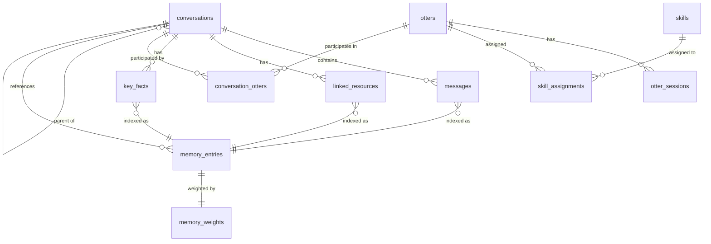
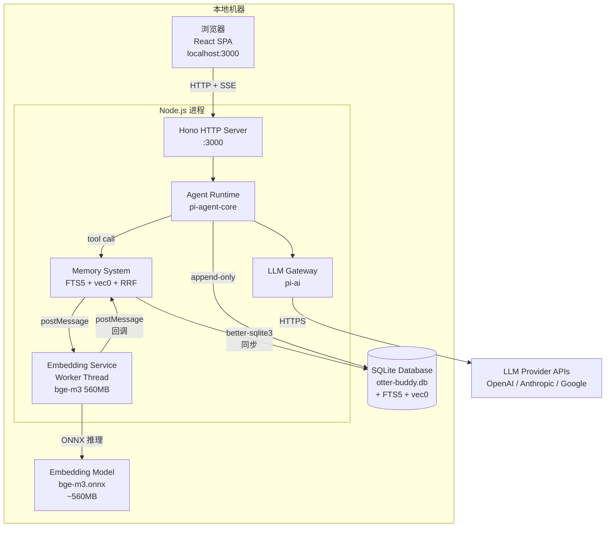

# F20260709p4q7 [data-model] 数据模型设计（S3）

## [design-time]

> 本文档记录 S3（数据模型设计）的全部产出物。基于 S1 产品形态定义（F20260709x7k3）和 S2 能力模块架构设计（F20260709m2n8），设计 SQLite 数据库 Schema、Repository 接口、记忆存储映射、检索索引策略和权重系统 Schema。

> **⚠️ 文档定位声明（D28）**：本文档为初版设计，旨在提供全局视图和跨模块协调基础。后续具体实现时，应按模块逐一深入分析设计，根据实际业务场景调整。本文档不作为绝对遵从不可变的守则，各模块实现时拥有调整权，但调整需记录偏差和理由。

## 背景 [required]

S1 定义了三层记忆模型（工作记忆/历史对话记忆/对话关键信息）、对话树、大獭+临时小獭模型。S2 设计了系统架构（Pi Agent + React + Hono + 混合检索）、5 个限界上下文的领域模型、接口定义和 9 条 ADR。S3 将 S2 的 persistence-ignorant 领域模型落地为 SQLite Schema，并设计记忆检索的索引和权重存储。

### 约束输入

- Issue #3 的 8 项已锁定决策（经 S1 变更后：Chat as Substrate、三层记忆、脑手分离、AI Agent 作为检索引擎用户、多粒度检索、合规=外部系统+Skill 链、大獭+临时小獭、大獭创建临时小獭）
- S1 全部产出物（F20260709x7k3）
- S2 全部产出物（F20260709m2n8）
- S1 NFR：单用户、本地运行、无加密需求、无 SLA 要求
- S2 技术栈：SQLite (better-sqlite3) + sqlite-vec + FTS5 + bge-m3 (1024 维)

### 已自主决策项

| 项目 | 决策 | 依据 |
|------|------|------|
| 记忆数据加密 | 不加密 | S1 NFR 已明确"本地数据，无加密需求" |
| 权重半衰期 | 7 天 | 用户确认（S3-I2），短期快速迭代阶段偏好近期记忆 |
| FTS5 分词器 | trigram | CJK 友好，SQLite 3.34+ 内置，无需额外扩展 |
| tree_path 存储格式 | 物化路径（`/root_id/parent_id/self_id/`） | 高效前缀匹配，无需 JSON 解析 |
| memory_entries 设计 | 统一索引表 + 领域表 | CQRS 式分离：领域表为 source of truth，memory_entries 为检索索引 |
| embedding 生成时机 | 异步（worker thread） | S2 D19 已决定，不阻塞主线程 |

## 用户意图锚 [required]

> S3 是 S2 的自然延伸，用户输入需求最少。用户指令"继续 s3 部分"是延续 S1/S2 已锁定的设计方向。以下引用 S1/S2 中直接影响 S3 数据模型设计的意图锚。

| # | 来源 | 用户原话（逐字引用） | 关键修饰语 | 架构师解读 |
|---|------|---------------------|-----------|-----------|
| UA-S3-1 | 当前讨论 | 继续来看https://github.com/chenlaicai/otter-buddy/issues/5，继续s3部分 | 动作：继续；对象：s3 部分 | 用户要求按 Issue #5 计划推进 S3 数据模型设计 |
| UA-S3-2 | S1 讨论（引用） | 记忆系统仍然是非常核心的一环，要做大做强 | 程度：非常核心；动作：做大做强 | S3 存储设计必须支撑强大的记忆检索能力 |
| UA-S3-3 | S1 讨论（引用） | 除了自身当前session这部分是各个ai专有的，其余的 所有信息，可能都是通用的、大家都可触及到的 | 专有：当前 session；通用：其余所有 | S3 必须支持共享存储 + session 级别隔离 |
| UA-S3-4 | S1 讨论（引用） | 这种结构 要在记忆中也要有所侧重，ai知道当前本对话在某一个节点 | 影响：记忆侧重；感知：知道位置 | S3 必须存储 tree_path 并支持基于路径的权重计算 |
| UA-S3-5 | S2 讨论（引用） | 首先，肯定会有sqlite fts5 | 肯定：有 FTS5 | S3 必须使用 FTS5 作为基线检索 |
| UA-S3-6 | S2 讨论（引用） | 其次，这还远远不够 | 程度：远远不够 | S3 必须超越 FTS5，添加向量检索 |

### S3 用户确认项

> Issue #5 S3 部分定义了两个用户输入需求。基于 S1/S2 已建立的上下文，以下为架构师默认值，待用户确认。

| # | 问题 | 架构师默认值 | 依据 | 状态 |
|---|------|------------|------|------|
| S3-I1 | 记忆数据是否需要加密？ | 不加密 | S1 NFR："本地数据，无加密需求"，单用户本地运行 | ✅ 已确认 |
| S3-I2 | 权重系统时间衰减半衰期？ | 7 天 | 用户确认：短期快速迭代，偏好近期记忆 | ✅ 已确认 |

## 目标 [required]

### P1 - 数据模型设计

基于 S2 领域模型，设计完整的 SQLite 数据库 Schema，包括：
- 5 个限界上下文的表结构（DDL + 索引）
- Repository 接口定义
- 三层记忆存储映射
- 消息 append-only 存储设计
- 混合检索索引策略（FTS5 + sqlite-vec + RRF + 权重重排）
- 权重系统 Schema
- 部署图

## 非目标 [required]

- 不实现任何代码（Repository 实现属于 S4）
- 不修改 S2 已锁定的领域模型和接口定义
- 不修改 S1 已锁定的产品形态定义
- 不设计迁移脚本或兼容性桥接（遵循代码仓完美状态原则）

## S3-A1: 数据库 Schema 设计 [required]

> **方法论**：ER 建模 + DDD Repository Pattern。将 S2 的 persistence-ignorant 领域模型落地为 SQLite 表结构。所有表使用 `CREATE TABLE IF NOT EXISTS`，遵循代码仓完美状态原则。

### ER 图



> **注**：external_resources 与 linked_resources 通过 resource_type + url 语义关联（非外键），不在此 ER 图中表示。linked_resources 归属 conversation 模块（Q1 决策）。

### DDL -- 对话上下文（核心域）

```sql
-- ============================================================
-- 对话上下文：conversations + messages
-- ============================================================

CREATE TABLE IF NOT EXISTS conversations (
  id TEXT PRIMARY KEY,                        -- ConversationId (UUID)
  title TEXT NOT NULL,
  status TEXT NOT NULL DEFAULT 'active',      -- active | completed | archived
  parent_id TEXT,                             -- 父对话 ID (NULL = root)
  tree_path TEXT NOT NULL,                    -- 物化路径: '/root_id/.../self_id/'
  summary TEXT,                               -- 对话摘要 (粗粒度检索用)
  created_at TEXT NOT NULL DEFAULT (datetime('now')),
  updated_at TEXT NOT NULL DEFAULT (datetime('now')),
  completed_at TEXT,
  archived_at TEXT,
  FOREIGN KEY (parent_id) REFERENCES conversations(id)
);

CREATE INDEX IF NOT EXISTS idx_conversations_parent_id ON conversations(parent_id);
CREATE INDEX IF NOT EXISTS idx_conversations_status ON conversations(status);
CREATE INDEX IF NOT EXISTS idx_conversations_tree_path ON conversations(tree_path);

-- messages: append-only (INSERT only, no UPDATE/DELETE)
CREATE TABLE IF NOT EXISTS messages (
  id TEXT PRIMARY KEY,                        -- MessageId (UUID)
  conversation_id TEXT NOT NULL,
  sender_type TEXT NOT NULL,                  -- 'user' | 'otter'
  sender_id TEXT NOT NULL,                    -- OtterId or 'user'
  content TEXT NOT NULL,                      -- 消息文本内容
  attachments TEXT,                           -- JSON array of attachments
  sequence_num INTEGER NOT NULL,              -- per-conversation 消息序号
  created_at TEXT NOT NULL DEFAULT (datetime('now')),
  FOREIGN KEY (conversation_id) REFERENCES conversations(id)
);

CREATE INDEX IF NOT EXISTS idx_messages_conversation_id ON messages(conversation_id);
CREATE INDEX IF NOT EXISTS idx_messages_seq ON messages(conversation_id, sequence_num);
CREATE INDEX IF NOT EXISTS idx_messages_created_at ON messages(created_at);

-- conversation_otters: 对话与 Otter 的关联 (S2 Conversation.otterIds 持久化)
CREATE TABLE IF NOT EXISTS conversation_otters (
  conversation_id TEXT NOT NULL,
  otter_id TEXT NOT NULL,
  joined_at TEXT NOT NULL DEFAULT (datetime('now')),
  PRIMARY KEY (conversation_id, otter_id),
  FOREIGN KEY (conversation_id) REFERENCES conversations(id),
  FOREIGN KEY (otter_id) REFERENCES otters(id)
);

CREATE INDEX IF NOT EXISTS idx_conversation_otters_otter_id ON conversation_otters(otter_id);
```

### DDL -- 记忆上下文（核心域）

```sql
-- ============================================================
-- 记忆上下文：memory_entries + memory_weights + FTS5 + vec0
-- ============================================================

-- memory_entries: 统一检索索引表 (CQRS 读模型)
-- 领域表 (messages, key_facts, linked_resources) 为 source of truth
-- memory_entries 为检索系统提供统一查询入口
CREATE TABLE IF NOT EXISTS memory_entries (
  id TEXT PRIMARY KEY,                        -- MemoryEntryId (UUID)
  layer TEXT NOT NULL,                        -- 'working' | 'historical' | 'key_info'
  content_type TEXT NOT NULL,                 -- 'message' | 'conversation_summary' | 'key_fact' | 'linked_resource'
  source_id TEXT NOT NULL,                    -- 源对象 ID (message_id, conversation_id, etc.)
  source_table TEXT NOT NULL,                 -- 源表名 ('messages', 'conversations', 'key_facts', 'linked_resources')
  conversation_id TEXT,                       -- 关联对话
  tree_path TEXT,                             -- 冗余: 关联对话的 tree_path（创建时写入，不可变，消除 memory -> conversation 跨模块读依赖）
  granularity TEXT NOT NULL DEFAULT 'fine',   -- 'coarse' | 'fine' (检索粒度)
  content TEXT NOT NULL,                      -- 可搜索内容
  metadata TEXT,                              -- JSON: 额外元数据
  created_at TEXT NOT NULL DEFAULT (datetime('now')),
  FOREIGN KEY (conversation_id) REFERENCES conversations(id)
);

CREATE INDEX IF NOT EXISTS idx_memory_entries_layer ON memory_entries(layer);
CREATE INDEX IF NOT EXISTS idx_memory_entries_content_type ON memory_entries(content_type);
CREATE INDEX IF NOT EXISTS idx_memory_entries_conversation_id ON memory_entries(conversation_id);
CREATE INDEX IF NOT EXISTS idx_memory_entries_source ON memory_entries(source_table, source_id);
CREATE INDEX IF NOT EXISTS idx_memory_entries_created_at ON memory_entries(created_at);
CREATE INDEX IF NOT EXISTS idx_memory_entries_tree_path ON memory_entries(tree_path);

-- memory_weights: 权重存储 (仅存储需持久化的部分，其余查询时计算)
CREATE TABLE IF NOT EXISTS memory_weights (
  memory_entry_id TEXT PRIMARY KEY,
  retrieval_count INTEGER NOT NULL DEFAULT 0,
  last_retrieved_at TEXT,
  user_flagged INTEGER NOT NULL DEFAULT 0,    -- 0 = not flagged, 1 = flagged
  FOREIGN KEY (memory_entry_id) REFERENCES memory_entries(id)
);

-- FTS5: 关键词检索 (BM25)
-- trigram 分词器：CJK 友好，3-gram 子串匹配，SQLite 3.34+ 内置
CREATE VIRTUAL TABLE IF NOT EXISTS memory_fts USING fts5(
  memory_entry_id UNINDEXED,
  content,
  tokenize = 'trigram'
);

-- vec0: 向量检索 (KNN)
-- bge-m3 1024 维 embedding
CREATE VIRTUAL TABLE IF NOT EXISTS memory_vec USING vec0(
  memory_entry_id TEXT PRIMARY KEY,
  embedding FLOAT[1024]
);
```

### DDL -- 对话关键信息

```sql
-- ============================================================
-- 对话关键信息：linked_resources + key_facts
-- ============================================================

-- linked_resources: 开放机制，不预设固定类型枚举 (S1 D12)
CREATE TABLE IF NOT EXISTS linked_resources (
  id TEXT PRIMARY KEY,                        -- LinkedResourceId (UUID)
  conversation_id TEXT NOT NULL,
  resource_type TEXT NOT NULL,                -- 'pr' | 'worktree' | 'branch' | 'file' | 'url' | ... (开放)
  url TEXT NOT NULL,
  title TEXT,                                 -- 资源标题 (可选，用于检索)
  metadata TEXT,                              -- JSON: 额外元数据
  linked_by TEXT NOT NULL,                    -- 'user' | 'otter'
  otter_id TEXT,                              -- 关联 Otter (如果 linked_by = 'otter')
  auto_linked INTEGER NOT NULL DEFAULT 0,     -- 0 = manual, 1 = auto (手脚操作自动回写)
  created_at TEXT NOT NULL DEFAULT (datetime('now')),
  FOREIGN KEY (conversation_id) REFERENCES conversations(id)
);

CREATE INDEX IF NOT EXISTS idx_linked_resources_conversation_id ON linked_resources(conversation_id);
CREATE INDEX IF NOT EXISTS idx_linked_resources_type ON linked_resources(resource_type);

-- key_facts: 关键决策、结论、承诺信号 (隐式任务追踪载体)
CREATE TABLE IF NOT EXISTS key_facts (
  id TEXT PRIMARY KEY,                        -- KeyFactId (UUID)
  conversation_id TEXT NOT NULL,
  content TEXT NOT NULL,                      -- 关键事实内容
  category TEXT,                              -- 分类 (开放机制，不固定枚举)
  user_flagged INTEGER NOT NULL DEFAULT 0,    -- 用户标记
  created_by TEXT NOT NULL,                   -- 'user' | 'otter'
  otter_id TEXT,
  created_at TEXT NOT NULL DEFAULT (datetime('now')),
  FOREIGN KEY (conversation_id) REFERENCES conversations(id)
);

CREATE INDEX IF NOT EXISTS idx_key_facts_conversation_id ON key_facts(conversation_id);
CREATE INDEX IF NOT EXISTS idx_key_facts_user_flagged ON key_facts(user_flagged);
```

### DDL -- Otter 上下文（支撑域）

```sql
-- ============================================================
-- Otter 上下文：otters + otter_sessions
-- ============================================================

CREATE TABLE IF NOT EXISTS otters (
  id TEXT PRIMARY KEY,                        -- OtterId (UUID)
  name TEXT NOT NULL,
  type TEXT NOT NULL,                         -- 'big' | 'small'
  status TEXT NOT NULL DEFAULT 'active',      -- active | dissolved
  role_name TEXT,                             -- 角色名称 (小獭)
  role_responsibilities TEXT,                 -- JSON array of strings, 角色职责列表 (小獭)
  parent_otter_id TEXT,                       -- 创建者 Otter ID (大獭创建小獭)
  created_at TEXT NOT NULL DEFAULT (datetime('now')),
  dissolved_at TEXT,
  FOREIGN KEY (parent_otter_id) REFERENCES otters(id)
);

CREATE INDEX IF NOT EXISTS idx_otters_type ON otters(type);
CREATE INDEX IF NOT EXISTS idx_otters_status ON otters(status);
CREATE INDEX IF NOT EXISTS idx_otters_parent_otter_id ON otters(parent_otter_id);

-- otter_sessions: session 生命周期管理 (重启獭生机制)
CREATE TABLE IF NOT EXISTS otter_sessions (
  id TEXT PRIMARY KEY,                        -- SessionId (UUID)
  otter_id TEXT NOT NULL,
  status TEXT NOT NULL DEFAULT 'active',      -- active | archived | restarted
  started_at TEXT NOT NULL DEFAULT (datetime('now')),
  archived_at TEXT,
  archive_reason TEXT,                        -- 'restart' | 'dissolve' | 'manual'
  is_negative_case INTEGER NOT NULL DEFAULT 0,-- 0 = normal, 1 = 反面案例 (重启獭生)
  summary TEXT,                               -- 归档时的前情摘要
  FOREIGN KEY (otter_id) REFERENCES otters(id)
);

CREATE INDEX IF NOT EXISTS idx_otter_sessions_otter_id ON otter_sessions(otter_id);
CREATE INDEX IF NOT EXISTS idx_otter_sessions_status ON otter_sessions(status);
CREATE INDEX IF NOT EXISTS idx_otter_sessions_negative ON otter_sessions(is_negative_case);
```

### DDL -- 能力上下文（支撑域）

```sql
-- ============================================================
-- 能力上下文：skills + skill_assignments
-- ============================================================

CREATE TABLE IF NOT EXISTS skills (
  id TEXT PRIMARY KEY,                        -- SkillId (UUID)
  name TEXT NOT NULL UNIQUE,
  description TEXT,
  type TEXT NOT NULL,                         -- 'tool' | 'prompt_template' | 'workflow'
  definition TEXT NOT NULL,                   -- JSON: { schema, handlerRef }
  created_at TEXT NOT NULL DEFAULT (datetime('now'))
);

CREATE INDEX IF NOT EXISTS idx_skills_type ON skills(type);

-- skill_assignments: Skill 与 Otter 的关联 (可回收)
CREATE TABLE IF NOT EXISTS skill_assignments (
  id TEXT PRIMARY KEY,                        -- SkillAssignmentId (UUID)
  skill_id TEXT NOT NULL,
  otter_id TEXT NOT NULL,
  assigned_at TEXT NOT NULL DEFAULT (datetime('now')),
  revoked_at TEXT,                            -- NULL = active, non-NULL = revoked (解散时回收)
  FOREIGN KEY (skill_id) REFERENCES skills(id),
  FOREIGN KEY (otter_id) REFERENCES otters(id)
);

CREATE INDEX IF NOT EXISTS idx_skill_assignments_otter_id ON skill_assignments(otter_id);
CREATE INDEX IF NOT EXISTS idx_skill_assignments_skill_id ON skill_assignments(skill_id);
CREATE INDEX IF NOT EXISTS idx_skill_assignments_active ON skill_assignments(otter_id, revoked_at);
```

### DDL -- 外部系统上下文（支撑域）

```sql
-- ============================================================
-- 外部系统上下文：external_resources
-- ============================================================

-- external_resources: 外部资源注册表 (去重，同一 URL 可关联多个对话)
CREATE TABLE IF NOT EXISTS external_resources (
  id TEXT PRIMARY KEY,                        -- ResourceId (UUID)
  type TEXT NOT NULL,                         -- 资源类型 (与 linked_resources.resource_type 对应)
  url TEXT NOT NULL,
  metadata TEXT,                              -- JSON
  first_seen_at TEXT NOT NULL DEFAULT (datetime('now'))
);

CREATE INDEX IF NOT EXISTS idx_external_resources_url ON external_resources(url);
CREATE INDEX IF NOT EXISTS idx_external_resources_type ON external_resources(type);
```

## S3-A2: 聚合持久化设计 [required]

> **方法论**：DDD Repository Pattern。每个 Aggregate Root 对应一个 Repository 接口。Repository 负责对象的持久化、检索和聚合内一致性。

### Repository 接口定义

```typescript
// ============================================================
// ConversationRepository -- Conversation 聚合根
// 聚合内: Conversation, Message, KeyInfo (linked_resources, key_facts)
// ============================================================

interface ConversationRepository {
  // 对话 CRUD
  create(params: { title: string; parentId?: string; otterIds: string[] }): Promise<Conversation>;
  getById(id: string): Promise<Conversation | null>;
  update(id: string, updates: Partial<Conversation>): Promise<void>;
  complete(id: string): Promise<void>;
  archive(id: string): Promise<void>;

  // 对话树
  getTree(rootId: string): Promise<ConversationTreeNode>;
  createChild(parentId: string, title: string): Promise<Conversation>;
  getChildren(parentId: string): Promise<Conversation[]>;

  // 消息 (append-only: 只有 create 和 read，没有 update 和 delete)
  sendMessage(conversationId: string, message: MessageInput): Promise<Message>;
  getMessages(conversationId: string, opts?: { limit?: number; before?: string }): Promise<Message[]>;
  getMessageById(id: string): Promise<Message | null>;
  expandMessage(messageId: string, direction: 'before' | 'after' | 'both', count: number): Promise<Message[]>;

  // 对话关键信息
  addKeyInfo(conversationId: string, keyInfo: KeyInfoInput): Promise<void>;
  getKeyInfo(conversationId: string): Promise<KeyInfo>;
  addKeyFact(conversationId: string, fact: KeyFactInput): Promise<KeyFact>;
  linkResource(conversationId: string, resource: LinkedResourceInput): Promise<LinkedResource>;
  getLinkedResources(conversationId: string): Promise<LinkedResource[]>;
}

// ============================================================
// MemoryRepository -- MemoryEntry 聚合根
// 聚合内: MemoryEntry, MemoryWeight
// ============================================================

interface MemoryEntryInput {
  layer: 'working' | 'historical' | 'key_info';
  content_type: 'message' | 'conversation_summary' | 'key_fact' | 'linked_resource';
  source_id: string;
  source_table: string;
  conversation_id?: string;
  tree_path?: string;              // 冗余: 关联对话的 tree_path（创建时写入，不可变）
  granularity: 'coarse' | 'fine';
  content: string;
  metadata?: Record<string, unknown>;
}

interface MemoryRepository {
  // 记忆条目 CRUD
  store(entry: MemoryEntryInput): Promise<string>;
  getById(id: string): Promise<MemoryEntry | null>;
  getBySource(sourceTable: string, sourceId: string): Promise<MemoryEntry | null>;

  // 检索 (FTS5 + vec0 + RRF + 权重重排)
  searchFTS(query: string, opts: { layer?: string; granularity?: string; limit?: number }): Promise<FTSHit[]>;
  searchVec(embedding: number[], opts: { layer?: string; limit?: number }): Promise<VecHit[]>;
  rrfFusion(ftsHits: FTSHit[], vecHits: VecHit[], k?: number): Promise<RrfHit[]>;

  // 权重
  getWeight(memoryEntryId: string): Promise<MemoryWeight>;
  updateWeight(memoryEntryId: string, updates: Partial<WeightUpdate>): Promise<void>;
  updateWeightsByTreePath(currentTreePath: string): Promise<void>;
  incrementRetrievalCount(memoryEntryId: string): Promise<void>;
  flagMemory(memoryEntryId: string, flagged: boolean): Promise<void>;

  // Embedding
  storeEmbedding(memoryEntryId: string, embedding: number[]): Promise<void>;
  getEmbedding(memoryEntryId: string): Promise<number[] | null>;
}

// ============================================================
// OtterRepository -- Otter 聚合根
// 聚合内: Otter, OtterSession
// ============================================================

interface OtterRepository {
  // Otter CRUD
  create(params: { name: string; type: 'big' | 'small'; roleName?: string; roleResponsibilities?: string; parentOtterId?: string }): Promise<Otter>;
  getById(id: string): Promise<Otter | null>;
  getBigOtter(): Promise<Otter>;
  dissolve(otterId: string): Promise<void>;

  // Session 管理
  createSession(otterId: string): Promise<OtterSession>;
  getActiveSession(otterId: string): Promise<OtterSession | null>;
  archiveSession(sessionId: string, params: { reason: string; isNegativeCase?: boolean; summary?: string }): Promise<void>;
  getSessionHistory(otterId: string): Promise<OtterSession[]>;
}

// ============================================================
// SkillRepository -- Skill 聚合根
// 聚合内: Skill, SkillAssignment
// ============================================================

interface SkillRepository {
  register(skill: SkillDefinitionInput): Promise<string>;
  getById(id: string): Promise<Skill | null>;
  getByName(name: string): Promise<Skill | null>;
  listAll(): Promise<Skill[]>;
  assignToOtter(skillId: string, otterId: string): Promise<void>;
  revokeFromOtter(skillId: string, otterId: string): Promise<void>;
  getOtterSkills(otterId: string): Promise<Skill[]>;
  getAssignments(otterId: string): Promise<SkillAssignment[]>;
}

// ============================================================
// ExternalResourceRepository -- ExternalResource 聚合根
// 聚合内: ExternalResource（linked_resources 归属 conversation 模块，见 Q1 决策）
// ============================================================

interface ExternalResourceRepository {
  registerOrCreate(params: { type: string; url: string; metadata?: Record<string, unknown> }): Promise<ExternalResource>;
  getByUrl(url: string): Promise<ExternalResource | null>;
}
```

### Repository 实现策略

| Repository | 实现策略 | 说明 |
|-----------|---------|------|
| ConversationRepository | 直接 SQL | better-sqlite3 同步调用，事务保证聚合内一致性 |
| MemoryRepository | 直接 SQL + Worker Thread | FTS5/vec0 查询同步，embedding 生成异步 |
| OtterRepository | 直接 SQL | 简单 CRUD |
| SkillRepository | 直接 SQL | 简单 CRUD |
| ExternalResourceRepository | 直接 SQL | registerOrCreate 使用 INSERT OR IGNORE |

> **S3-A2 vs S3-A8 接口对齐说明**：S3-A2 定义的 Repository 接口是底层持久化接口，包含所有 CRUD 方法。S3-A8 定义的 Port 接口是模块的公开 API，只暴露业务需要的方法。S3-A2 中有但 S3-A8 Port 中没有的方法（如 ConversationRepository.update()、getChildren()、getMessageById()）是 _internal/ 实现细节，不暴露为 Port 方法。

### S2 接口委托路径

> S2 定义的 Service 接口中，部分方法通过 Repository 组合实现，而非直接映射。

| S2 方法 | 委托路径 | 说明 |
|---------|---------|------|
| MemoryService.refine(prevSearchId, adjustedQuery) | Service 层缓存上次搜索结果 + MemoryRepository.searchFTS/searchVec | Service 层维护搜索历史（内存缓存），refine 基于上次结果调整查询参数后重新检索 |
| MemoryService.searchSimilar(id, limit) | MemoryRepository.getEmbedding(id) -> MemoryRepository.searchVec(embedding, {limit}) | 先获取条目 embedding，再执行 KNN 搜索 |
| MemoryService.expand(id, direction, count) | MemoryRepository.getBySource('messages', sourceId) 转换 MemoryEntryId -> messageId -> ConversationRepository.expandMessage(messageId, direction, count) | 仅 content_type='message' 的条目支持 expand |
| ConversationService.navigateTo(conversationId) | Service 层运行时状态管理，不涉及持久化 | Service 层维护 currentTreePath 变量，调用 MemoryRepository.updateWeightsByTreePath() 触发权重更新 |

### 事务边界

| 操作 | 事务范围 | 编排层 | 说明 |
|------|---------|-------|------|
| 发送消息 | ConversationPort.sendMessage(messages INSERT) + MemoryPort.store(memory_entries + memory_fts + memory_weights INSERT) | app/orchestration | 跨模块事务，由 orchestration 编排 |
| 创建对话 | conversations INSERT + conversation_otters INSERT | domain/conversation | 单模块事务 |
| 创建子对话 | conversations INSERT (child) + conversations UPDATE (parent updated_at) + conversation_otters INSERT | domain/conversation | 单模块事务 |
| 添加关键事实 | key_facts INSERT + memory_entries INSERT + memory_fts INSERT + memory_weights INSERT | domain/conversation + domain/memory | 跨模块，由 orchestration 编排 |
| 链接资源 | external_resources INSERT OR IGNORE + linked_resources INSERT + memory_entries INSERT + memory_fts INSERT + memory_weights INSERT | domain/external + domain/conversation + domain/memory | 跨模块，由 orchestration 编排 |
| 重启獭生 | otter_sessions UPDATE (archive) + otter_sessions INSERT (new) | domain/otter | 单模块事务 |
| 解散小獭 | otters UPDATE (dissolved) + skill_assignments UPDATE (revoked) + otter_sessions UPDATE (archived) | app/orchestration | 跨模块事务 |
| Session 归档 | memory_entries UPDATE (layer working->historical) + conversations UPDATE (summary) + memory_entries INSERT (conversation_summary) + memory_fts INSERT + memory_weights INSERT | app/orchestration | 跨模块事务，embedding 异步 |

## S3-A3: 三层记忆存储映射 [required]

> **方法论**：DDD 持久化 + Issue #3 决策 2（S1 变更为三层）。将 S1 的三层记忆模型映射到具体表结构。

### 三层记忆 -> 存储映射

| 记忆层 | 归属 | 存储方式 | 表 | 生命周期 | 清理策略 |
|--------|------|---------|-----|---------|---------|
| **工作记忆** | 各 Otter 专有 | Agent 内存上下文（pi-agent-core message context）+ messages 表（全量共享，Otter 隔离在 Agent 层） | messages | Session 级别 | Session 归档时不删除，转为历史记忆 |
| **历史对话记忆** | 系统级共享 | SQLite 持久化 + FTS5 + vec0 索引 | memory_entries (layer='historical') + memory_fts + memory_vec + memory_weights | 永久 | 不删除（append-only 语义） |
| **对话关键信息** | 系统级共享 | SQLite 持久化 + FTS5 + vec0 索引 | memory_entries (layer='key_info') + linked_resources + key_facts + memory_fts + memory_vec + memory_weights | Per-conversation，永久 | 对话归档时保留（可检索） |

### 工作记忆 -> 历史记忆的转化

```
Session 活跃期间:
  消息存储 -> messages 表
  消息索引 -> memory_entries (layer='working')
  Agent 上下文 -> pi-agent-core 内存

Session 归档时 (解散/重启獭生):
  1. memory_entries UPDATE: layer 'working' -> 'historical'
  2. 生成对话摘要 -> conversations.summary
  3. 创建 conversation_summary memory_entry (layer='historical', granularity='coarse')
  4. 为 conversation_summary 生成 embedding -> memory_vec
  5. 小獭 session 摘要归档到大獭历史记忆
```

### 记忆条目索引同步

当领域对象创建时，同步写入 `memory_entries` 索引：

| 领域事件 | memory_entries 写入 | memory_fts 写入 | memory_vec 写入 | memory_weights 写入 |
|---------|---------------------|-----------------|-----------------|---------------------|
| 消息发送 | layer='working', content_type='message', granularity='fine' | content=消息内容 | 异步生成 embedding | 默认权重 |
| 对话摘要生成 | layer='historical', content_type='conversation_summary', granularity='coarse' | content=标题+摘要 | 异步生成 embedding | 默认权重 |
| 关键事实添加 | layer='key_info', content_type='key_fact', granularity='coarse' | content=事实内容 | 异步生成 embedding | 默认权重 (user_flagged 同步) |
| 资源链接 | layer='key_info', content_type='linked_resource', granularity='coarse' | content=类型+URL+标题 | 异步生成 embedding | 默认权重 |
| Session 归档 | UPDATE layer 'working' -> 'historical' | 无变化 | 无变化 | 无变化 |

## S3-A4: 消息存储设计 [required]

> **方法论**：Append-only Event Log（S2 D18 决策）。消息不可变，INSERT only。

### 消息存储约束

| 约束 | 实现方式 | 说明 |
|------|---------|------|
| 不可变性 | 应用层保证：Repository 只有 `sendMessage` 和 `getMessages`，无 update/delete | messages 表无 UPDATE/DELETE 操作 |
| 顺序性 | `sequence_num` 字段，per-conversation 自增 | 应用层维护序号 |
| 完整性 | 单事务写入 messages + memory_entries + memory_fts + memory_weights | 保证消息和索引一致 |
| 可检索 | memory_fts (trigram) + memory_vec (bge-m3 embedding) | 混合检索 |

### 消息查询模式

```sql
-- 按对话获取消息（分页）
SELECT * FROM messages
WHERE conversation_id = ?
  AND sequence_num < ?
ORDER BY sequence_num DESC
LIMIT ?;

-- 获取消息上下文 (expand)
-- before
SELECT * FROM messages
WHERE conversation_id = ?
  AND sequence_num < (SELECT sequence_num FROM messages WHERE id = ?)
ORDER BY sequence_num DESC
LIMIT ?;

-- after
SELECT * FROM messages
WHERE conversation_id = ?
  AND sequence_num > (SELECT sequence_num FROM messages WHERE id = ?)
ORDER BY sequence_num ASC
LIMIT ?;
```

## S3-A5: 检索索引策略 [required]

> **方法论**：Issue #3 决策 3/4/5。多粒度检索 + AI Agent 迭代检索。

### 索引架构

```
领域数据 (messages, conversations, key_facts, linked_resources)
  │
  ├── 写入时同步 ──> memory_entries (统一索引表)
  │                   ├── memory_fts (FTS5 trigram, BM25)
  │                   ├── memory_vec (vec0, bge-m3 1024维 KNN)
  │                   └── memory_weights (retrieval_count, user_flagged)
  │
  └── 查询时 ──> MemoryService.search()
                    │
                    ├─ FTS5 BM25 搜索 (memory_fts)
                    │   可选过滤: layer, granularity (通过 memory_entries JOIN)
                    │
                    ├─ vec0 KNN 搜索 (memory_vec)
                    │   可选过滤: layer (通过 memory_entries JOIN)
                    │
                    ├─ RRF 融合 (k=60)
                    │
                    └─ 权重重排
                        time_decay × frequency_boost × task_relevance × user_flag
```

### 多粒度索引设计

| 粒度 | 数据来源 | memory_entries.granularity | 检索用途 |
|------|---------|---------------------------|---------|
| 粗粒度 | 对话标题+摘要、关键事实、链接资源 | 'coarse' | 快速定位相关对话/关键信息 |
| 细粒度 | 完整消息内容 | 'fine' | 精确查找具体消息 |

### FTS5 查询示例

```sql
-- 细粒度搜索 (消息内容)
SELECT me.*, rank AS bm25_score
FROM memory_fts fts
JOIN memory_entries me ON fts.memory_entry_id = me.id
WHERE memory_fts MATCH ?
  AND me.layer = ?
  AND me.granularity = 'fine'
ORDER BY rank
LIMIT ?;

-- 粗粒度搜索 (对话摘要、关键信息)
SELECT me.*, rank AS bm25_score
FROM memory_fts fts
JOIN memory_entries me ON fts.memory_entry_id = me.id
WHERE memory_fts MATCH ?
  AND me.layer = ?
  AND me.granularity = 'coarse'
ORDER BY rank
LIMIT ?;
```

### vec0 查询示例

```sql
-- 语义搜索 (KNN)
SELECT mv.memory_entry_id, mv.distance
FROM memory_vec mv
JOIN memory_entries me ON mv.memory_entry_id = me.id
WHERE mv.embedding MATCH ?
  AND k = ?
  AND me.layer = ?
ORDER BY mv.distance;
```

### RRF 融合算法

```typescript
// Reciprocal Rank Fusion (~20 行代码，S2 D16)
function rrfFusion(ftsHits: Hit[], vecHits: Hit[], k = 60): Map<string, number> {
  const scores = new Map<string, number>();
  for (const [rank, hit] of ftsHits.entries()) {
    scores.set(hit.id, (scores.get(hit.id) ?? 0) + 1 / (k + rank + 1));
  }
  for (const [rank, hit] of vecHits.entries()) {
    scores.set(hit.id, (scores.get(hit.id) ?? 0) + 1 / (k + rank + 1));
  }
  return scores;
}
```

### 检索降级策略 (S2 D22)

| 故障 | 降级策略 | 实现 |
|------|---------|------|
| Embedding 生成失败（检索侧） | 纯 FTS5 检索（跳过 vec0 搜索） | MemoryRepository.searchVec 返回空数组 |
| Embedding 生成失败（写入侧） | 接受丢失，该条目仅可通过 FTS5 检索，不可被语义检索。系统不自动重试 | worker thread 回调失败时记录日志，memory_vec 无该条目记录 |
| sqlite-vec 扩展加载失败 | 纯 FTS5 检索 | 启动时检测，记录日志 |
| FTS5 查询异常 | 返回空结果 + 错误信息 | 不降级为全表扫描 |

## S3-A6: 权重系统 Schema [required]

> **方法论**：Issue #3 洞察 1（时间衰减+检索频率+任务相关性+用户标记）+ S2 权重公式。

### 权重计算公式 (S2 已定义，S3 落地为 Schema)

```
final_score = base_retrieval_score              // BM25 或 RRF 分数 (查询时计算)
  × time_decay_weight                           // 指数衰减，半衰期 7 天 (查询时计算)
  × frequency_boost                             // log(1 + retrieval_count) × 0.1 + 1 (查询时计算)
  × task_relevance_weight                       // 对话树路径加成 (查询时计算)
  × user_flag_multiplier                        // 用户标记加成 (查询时计算)
```

### 存储部分 vs 计算部分

| 权重因子 | 存储方式 | 计算方式 | 说明 |
|---------|---------|---------|------|
| base_retrieval_score | 不存储 | 查询时从 FTS5 rank / RRF 获取 | 每次检索不同 |
| time_decay_weight | 不存储 | `exp(-ln(2) * age_days / 7)` 从 `memory_entries.created_at` 计算 | 半衰期 7 天 (S3-I2 用户确认) |
| frequency_boost | `memory_weights.retrieval_count` | `log(1 + retrieval_count) * 0.1 + 1` | 每次检索后 incrementRetrievalCount |
| task_relevance_weight | 不存储 | 从 `conversations.tree_path` 计算 | 同路径 ×1.5, 跨路径 ×0.8, 无路径上下文 ×1.0 |
| user_flag_multiplier | `memory_weights.user_flagged` | `flagged ? 2.0 : 1.0` | 用户可通过 MemoryService.flagMemory 设置 |

### 权重更新时机

| 事件 | 更新操作 | 说明 |
|------|---------|------|
| 记忆条目创建 | INSERT memory_weights (默认值) | retrieval_count=0, user_flagged=0 |
| 记忆被检索 | UPDATE retrieval_count += 1, last_retrieved_at = now | 检索后异步更新 |
| 用户标记记忆 | UPDATE user_flagged = 1 | 显式操作 |
| 用户取消标记 | UPDATE user_flagged = 0 | 显式操作 |
| 对话树切换 | 不更新数据库 | 查询时根据 current tree_path 计算 task_relevance |

### task_relevance 计算逻辑

```typescript
function computeTaskRelevance(
  entryTreePath: string,    // memory_entry 关联对话的 tree_path
  currentTreePath: string   // 当前对话的 tree_path
): number {
  // 物化路径前缀匹配
  // 同分支: currentTreePath 是 entryTreePath 的前缀，或反之
  if (entryTreePath.startsWith(currentTreePath) ||
      currentTreePath.startsWith(entryTreePath)) {
    return 1.5;  // 同路径加成
  }
  return 0.8;    // 跨路径衰减
}
```

## S3-A7: 部署图 [required]

> **方法论**：4+1 Physical View。S2 已确定单用户本地部署。



### 物理组件清单

| 组件 | 位置 | 技术 | 说明 |
|------|------|------|------|
| React SPA | 浏览器 | React 19 + Tailwind 4 | 用户界面 |
| Hono HTTP Server | Node.js 主线程 | Hono | REST API + SSE 流式推送 |
| Agent Runtime | Node.js 主线程 | pi-agent-core | 大獭/小獭 Agent 实例 |
| LLM Gateway | Node.js 主线程 | pi-ai | 多提供商 LLM 抽象 |
| Memory System | Node.js 主线程 | 自建 | 混合检索引擎 |
| Embedding Service | Node.js Worker Thread | @huggingface/transformers | bge-m3 异步推理 |
| SQLite Database | 本地文件 | better-sqlite3 + sqlite-vec | 数据持久化 |
| Embedding Model | 本地文件 | Xenova/bge-m3 ONNX | 1024 维多语言 embedding |

### 资源占用估算

| 资源 | 估算 | 说明 |
|------|------|------|
| 内存 | ~200-500MB | Node.js 进程 + Agent 上下文 + bge-m3 模型 |
| 磁盘 | ~600MB-1GB | bge-m3 模型 (~560MB) + SQLite 数据库 |
| CPU | 低（空闲时） | 单用户，消息驱动 |
| 网络 | 仅 LLM API | HTTPS 出站到 LLM Provider |

## S3-A8: 代码目录结构规划 [required]

> **方法论**：DDD 分层架构 + 六边形架构（Ports & Adapters）。参考 snail shell 已验证的架构实践，采用全局 4 层结构（infra -> domain -> app -> adapter），模块内扁平（model.ts + port.ts + _internal/）。禁止 shared/、kernel/ 目录。
>
> **Snail Shell 参考**：snail shell 实践证明全局 4 层 + Provider 拥有 Port + _internal/ 封装的架构在单进程应用中优于模块内三层嵌套。本节基于 snail shell 架构，针对 otter-buddy 的领域特点（对话 + 记忆 + Otter + 能力 + 外部系统）适配。

### 设计原则

1. **全局 4 层**：infra（技术能力）-> domain（原子业务模块）-> app（跨模块编排）-> adapter（外部接口）。依赖方向：adapter -> app -> domain -> infra
2. **Provider 拥有 Port**：`domain/memory/port.ts` 定义 MemoryPort，所有需要记忆服务的模块 import `@domain/memory/port`。接口只定义一次，归属清晰
3. **禁止 shared/、kernel/**：类型由归属最清晰的模块拥有（`MemoryEntryId` 在 `domain/memory/model.ts`，`ConversationId` 在 `domain/conversation/model.ts`）
4. **模块内扁平**：每个 domain 模块内部为 `model.ts` + `port.ts` + `_internal/`，不嵌套子层
5. **_internal/ 强制封装**：ESLint 规则禁止跨模块 import `_internal/`，只有 `main.ts`（Composition Root）豁免
6. **逐模块可实现**：模块间依赖最小化，可按依赖顺序逐一实现和测试

### 顶层目录结构

```
src/
├── main.ts                              # Composition Root：模块初始化 + 依赖注入
│
├── infra/                               # 基础设施层（技术能力，被 domain 依赖）
│   ├── database.ts                      # better-sqlite3 连接
│   ├── schema.ts                        # S3 DDL 初始化
│   ├── embedding/                       # bge-m3 Worker thread
│   ├── llm-gateway.ts                   # pi-ai LLM 网关
│   ├── config.ts                        # 配置常量
│   └── logger.ts                        # 日志
│
├── domain/                              # 领域层（原子业务模块，模块间不互相依赖）
│   ├── conversation/                    # 对话上下文（核心域，含 Message/LinkedResource/KeyFact）
│   ├── memory/                          # 记忆上下文（核心域）
│   ├── otter/                           # Otter 上下文（支撑域）
│   ├── capability/                      # 能力上下文（支撑域）
│   └── external/                        # 外部系统上下文（支撑域）
│
├── app/                                 # 应用层（跨模块编排，职责严格限定）
│   ├── orchestration/                   # 跨模块事务编排（5 个操作）
│   │   ├── port.ts
│   │   └── _internal/
│   │       ├── adapter.ts
│   │       └── initor.ts
│   └── agent-runtime/                   # Agent 运行时（pi-agent-core 集成）
│       ├── port.ts
│       └── _internal/
│           ├── adapter.ts
│           ├── tools.ts
│           └── initor.ts
│
├── adapter/                             # 适配器层（外部接口）
│   └── http/                            # HTTP 适配器（Hono，含 DTO + 端点定义）
│       ├── app.ts
│       ├── routes/
│       ├── sse.ts
│       └── dto.ts
│
└── web/                                 # 前端 React SPA
    ├── components/
    ├── pages/
    ├── hooks/
    └── services/
```

### 模块内部结构（Provider 拥有 Port + _internal/ 封装）

每个 domain 模块统一采用扁平结构：

```
src/domain/conversation/
├── model.ts                 # 公开类型（Entity, Value Object, Domain Event）
├── port.ts                  # 公开接口（ConversationPort，所有消费方 import 此文件）
└── _internal/               # 私有实现（ESLint 禁止跨模块 import）
    ├── repository.ts        # SQLite 持久化
    ├── mapper.ts            # 领域对象 <-> DB 行映射
    ├── adapter.ts           # 业务逻辑（实现 ConversationPort）
    └── initor.ts            # 工厂函数（创建 repo + adapter，返回 port）
```

### ConversationPort 方法分组（14 方法）

```typescript
interface ConversationPort {
  // --- Conversation CRUD ---
  create(params: { title: string; parentId?: string; otterIds: string[] }): Promise<Conversation>;
  getById(id: string): Promise<Conversation | null>;
  complete(id: string): Promise<void>;
  archive(id: string): Promise<void>;

  // --- Tree ---
  getTree(rootId: string): Promise<ConversationTreeNode>;
  createChild(parentId: string, title: string): Promise<Conversation>;
  navigateTo(conversationId: string): Promise<void>;

  // --- Messages ---
  sendMessage(conversationId: string, message: MessageInput): Promise<Message>;
  getMessages(conversationId: string, opts?: { limit?: number; before?: string }): Promise<Message[]>;
  expandMessage(messageId: string, direction: 'before' | 'after' | 'both', count: number): Promise<Message[]>;

  // --- Key Info ---
  addKeyFact(conversationId: string, fact: KeyFactInput): Promise<KeyFact>;
  linkResource(conversationId: string, resource: LinkedResourceInput): Promise<LinkedResource>;
  getKeyInfo(conversationId: string): Promise<KeyInfo>;
  getLinkedResources(conversationId: string): Promise<LinkedResource[]>;
}
```

### 跨模块通信 -- Provider 拥有 Port

> 模块间通过 Port 接口通信，提供方定义接口，消费方 import，main.ts 装配。

**示例：conversation 需要写 memory 索引**

```
1. memory 模块在 domain/memory/port.ts 定义:
   interface MemoryPort {
     store(entry: MemoryEntryInput): Promise<string>;
     search(query: SearchQuery): Promise<RetrievalResult>;
     ...
   }

2. memory 模块在 domain/memory/_internal/adapter.ts 实现:
   class MemoryAdapter implements MemoryPort { ... }

3. app/orchestration 模块 import @domain/memory/port:
   import type { MemoryPort } from '@domain/memory/port';

4. main.ts 装配:
   const memoryPort = initMemory({ db, embedding });
   const conversationPort = initConversation({ db });
   const orchestration = initOrchestration({ conversationPort, memoryPort, otterPort, capabilityPort });
```

### app/orchestration -- 跨模块事务编排

> app/orchestration 的职责严格限定为跨模块事务编排，不包含单聚合内的业务逻辑。

| 操作 | 涉及模块 | 说明 |
|------|---------|------|
| sendMessage | conversation + memory | 发送消息 + 写记忆索引，单事务 |
| archiveSession | otter + memory | Session 归档 + memory layer 变更，单事务 |
| dissolveOtter | otter + capability + memory | 解散小獭 + 能力回收 + layer 变更，单事务 |
| createSmallOtter | otter + capability + conversation | 创建小獭 + 分配能力 + 关联对话（conversation_otters INSERT），单事务 |
| restartOtterLife | otter + memory | 重启獭生（archive + new session + layer 变更），单事务 |

> 以下操作**不在** app/orchestration，属于 domain 模块内部：
> - 对话树导航、关键信息管理、消息查询 -> domain/conversation
> - 记忆检索、权重计算、FTS5/vec0 搜索 -> domain/memory

### 跨模块事务方案（方案 A）

> 采用方案 A：app/orchestration 编排事务。不用方案 B（conversation 接收 memoryStore 参数），因为方案 B 会导致 ConversationPort 签名引用 MemoryPort 类型，违反 domain 模块间不互相依赖原则。

```
app/orchestration/_internal/adapter.ts:
  sendMessage(conversationId, message):
    1. 开启 SQLite 事务
    2. conversationPort.sendMessage(conversationId, message)  // 写 messages 表
    3. memoryPort.store({                                      // 写 memory_entries + fts + weights
         content: message.content,
         tree_path: conversation.tree_path, ...
       })
    4. 提交事务
```

### main.ts -- Composition Root

> main.ts 是唯一的 Composition Root，按依赖顺序调用各模块的 initor.ts 工厂函数，注入依赖。

```typescript
// main.ts（伪代码）
const db = initDatabase();                          // infra/database
const embedding = initEmbedding({ db });            // infra/embedding
const llm = initLLMGateway();                       // infra/llm-gateway

const otterPort = initOtter({ db });                // domain/otter
const memoryPort = initMemory({ db, embedding });   // domain/memory
const conversationPort = initConversation({ db });  // domain/conversation
const capabilityPort = initCapability({ db });      // domain/capability
const externalPort = initExternal({ db });          // domain/external

const orchestration = initOrchestration({           // app/orchestration
  conversationPort, memoryPort, otterPort, capabilityPort
});
const agentRuntime = initAgentRuntime({             // app/agent-runtime
  orchestration, conversationPort, memoryPort, otterPort, capabilityPort, llm
});

const httpServer = initHTTPServer({ agentRuntime }); // adapter/http
httpServer.listen(3000);
```

### 模块依赖关系与实现顺序

> memory 在 conversation 之前实现，消除循环依赖。memory_entries.tree_path 冗余存储（D29），memory 模块计算 task_relevance 时无需跨模块查询。

```
infra/db(0) ───────────────────────── 基础设施，最先实现
    │
    ├── domain/otter(①) ───────────── Otter 生命周期
    │
    ├── domain/memory(②) ──────────── 记忆索引 + 检索（自包含，FTS5 立即可用，vec0 待⑨）
    │
    ├── domain/conversation(③) ────── 对话 + 消息 + 关键信息（自包含，仅依赖 infra/db）
    │
    ├── domain/capability(④) ──────── 能力管理（依赖 otter，通过 Port）
    │
    └── domain/external(⑤) ────────── 外部系统（依赖 conversation，通过 Port）

    ── 以上为 domain 层，以下为 app/adapter 层 ──

    app/orchestration(⑥) ──────────── 跨模块事务编排（5 个操作）
    app/agent-runtime(⑦) ──────────── Agent 运行时 + 工具
    adapter/http(⑧) ───────────────── HTTP API + SSE
    infra/embedding(⑨) ────────────── Embedding Worker
    web/(⑩) ───────────────────────── React SPA
```

| 顺序 | 模块 | 依赖（通过 Port） | 说明 |
|------|------|-------------------|------|
| 0 | infra/db | 无 | SQLite 连接 + schema 初始化 |
| 1 | domain/otter | infra/db | Otter CRUD + Session 生命周期 |
| 2 | domain/memory | infra/db | 记忆索引 + FTS5 + vec0 + RRF + 权重 |
| 3 | domain/conversation | infra/db | 对话 + 消息 + 对话树 + 关键信息（自包含，跨模块操作在 app/orchestration） |
| 4 | domain/capability | otterPort | Skill 注册 + 分配 + 回收 |
| 5 | domain/external | conversationPort | 外部资源 + 自动关联 |
| 6 | app/orchestration | conversationPort + memoryPort + otterPort + capabilityPort | 跨模块事务编排 |
| 7 | app/agent-runtime | orchestration + 全部 domain ports | pi-agent-core + Agent 工具 |
| 8 | adapter/http | agentRuntime | Hono HTTP + SSE + REST API |
| 9 | infra/embedding | memoryPort | bge-m3 Worker thread |
| 10 | web/ | http | React SPA + 对话树可视化 |

> **增量可用性说明**：domain/memory(②) 的 FTS5 关键词检索立即可用，vec0 语义检索在 infra/embedding(⑨) 实现后可用。中间阶段 memory.search 降级为纯 FTS5（符合 D22 降级策略）。

### 测试目录约定

采用 **co-located** 模式，测试与源码同目录：

```
src/domain/conversation/
├── model.ts
├── model.test.ts            # 领域类型测试（纯逻辑）
├── port.ts
└── _internal/
    ├── repository.ts
    ├── repository.test.ts   # 集成测试（real SQLite）
    ├── adapter.ts
    └── adapter.test.ts      # 应用层测试（mock port）
```

> 端到端测试放 `tests/e2e/`，通过 HTTP API 测试完整流程。

### 路径别名（tsconfig.json）

```json
{
  "compilerOptions": {
    "paths": {
      "@infra/*": ["src/infra/*"],
      "@domain/*": ["src/domain/*"],
      "@app/*": ["src/app/*"],
      "@adapter/*": ["src/adapter/*"]
    }
  }
}
```

> 路径别名让 import 就能看出依赖方向：`import { MemoryPort } from '@domain/memory/port'` 一目了然。

### ESLint _internal/ 封装规则

```javascript
// eslint.config.mjs
{
  rules: {
    'no-restricted-imports': ['error', {
      patterns: ['*/_internal/*']
    }]
  },
  overrides: [{
    files: ['src/main.ts'],
    rules: { 'no-restricted-imports': 'off' }  // Composition Root 豁免
  }]
}
```

> 没有这条规则，AI 会绕过 port 直接 import `_internal/repository.ts`。这是设计从纸面落到代码的执行保障。

### 与 S2/S3 的映射关系

| S2 限界上下文 | S2 Service 接口 | S3 表 | 代码目录 |
|-------------|----------------|-------|---------|
| 对话上下文 | ConversationService | conversations, messages, conversation_otters, linked_resources, key_facts | src/domain/conversation/ |
| 记忆上下文 | MemoryService | memory_entries, memory_weights, memory_fts, memory_vec | src/domain/memory/ |
| Otter 上下文 | OtterService | otters, otter_sessions | src/domain/otter/ |
| 能力上下文 | CapabilityService | skills, skill_assignments | src/domain/capability/ |
| 外部系统上下文 | ExternalSystemService | external_resources | src/domain/external/ |


## 核心业务行为 [required]

> 从 S2 继承的行为条目，S3 补充存储层面约束。

| # | 场景 | 预期行为 | 意图锚 | S3 存储约束 |
|---|------|---------|--------|------------|
| B1 | 当用户在活跃对话中发送消息时 | 大獭应基于记忆系统检索的相关上下文回复 | UA-3, UA-5 | app/orchestration.sendMessage 编排 ConversationPort.sendMessage(messages INSERT) + MemoryPort.store(memory_entries + memory_fts + memory_weights INSERT) 单事务 |
| B2 | 当用户询问历史对话内容时 | 大獭应通过多维度检索搜索历史记忆 | UA-7 | FTS5 + vec0 + RRF + 权重重排 |
| B3a | 当大獭判断当前任务需要多角度协作时 | 大獭应创建临时小獭并注入相关上下文 | UA-4, UA-11 | otters INSERT + otter_sessions INSERT |
| B3b | 当小獭被创建后 | 小獭应具备通过标准化接口检索共享记忆的能力 | UA-13 | memory_entries 共享查询，无 Otter 隔离 |
| B4a | 当用户对 Otter 回复表达不满时 | 系统应封存当前 session 并标记为反面案例 | UA-8 | otter_sessions UPDATE (is_negative_case=1, summary=前情摘要) |
| B4b | 当反面案例封存完成后 | 系统应创建新 session 并注入前情摘要 | UA-9 | otter_sessions INSERT (new session) + memory_entries UPDATE (layer working->historical) |
| B5a | 当大獭或用户创建子对话时 | 系统应建立父子关系并维护从根到当前节点的完整路径 | UA-15 | conversations INSERT (tree_path 物化路径) |
| B5b | 当对话树节点切换时 | 当前分支路径上的记忆在检索中获得更高权重 | UA-16 | 查询时 task_relevance 计算 (同路径 ×1.5, 跨路径 ×0.8) |
| B6 | 当 Otter 通过手脚执行外部系统操作时 | 系统应自动将操作产生的资源链接到当前对话的关键信息 | UA-10 | external_resources INSERT OR IGNORE + linked_resources INSERT (auto_linked=1) + memory_entries INSERT + memory_fts INSERT + memory_weights INSERT |
| B7a | 当小獭的任务完成并解散时 | 系统应将小獭的 session 归档到大獭的历史对话记忆中 | UA-12 | otters UPDATE (dissolved) + otter_sessions UPDATE (archived) + skill_assignments UPDATE (revoked) + memory_entries UPDATE (layer working->historical) |
| B7b | 当小獭解散后 | 小獭的工作记忆（当前 session）应消失，不残留 | UA-12 | 工作记忆 = Agent 内存，Otter 实例销毁即消失；DB 中 messages 保留为历史记忆 |
| B8 | 当用户或大獭向对话添加关键信息时 | 系统应将其存储为对话关键信息，并建立可检索的索引 | UA-17, UA-S2-12 | key_facts INSERT + memory_entries INSERT + memory_fts INSERT + memory_weights INSERT |
| B9 | 当记忆检索返回结果时 | 结果应按复合权重排序 | UA-13 | 权重公式: base × time_decay × frequency × task_relevance × user_flag |
| B10 | 当对话的所有子对话完成时 | 父对话不自动标记为完成 | S1 决策 | 无自动 UPDATE，需显式 completeConversation |
| B11 | 当大獭为小獭加载能力时 | 小獭应获得对应 Skill 的调用权限，能力在解散时回收 | UA-10, UA-11 | skill_assignments INSERT (assign) / UPDATE revoked_at (revoke) |
| B12 | 当用户或大獭在对话树中导航时 | 系统应维护当前位置路径 | UA-15, UA-16 | tree_path 存储在 conversations，查询时传递 current tree_path |
| B13 | 当 Otter 发起记忆检索时 | 系统应根据查询意图路由到对应记忆层 | S1 三层模型 | memory_entries.layer 过滤 |
| B14 | 当 LLM 调用失败时 | 系统应向用户显示错误信息，已生成的部分回复应保留 | R3 | 已存储的 messages 不回滚 |
| B15 | 当外部系统操作失败时 | 系统应向用户报告失败原因，不自动重试 | R3 | 已创建的 linked_resources 保留 |
| B-S3-1 | 当记忆条目被检索时 | retrieval_count 应递增，last_retrieved_at 应更新 | UA-S3-2 | memory_weights UPDATE |
| B-S3-2 | 当 embedding 生成失败时 | 检索侧：系统应降级为纯 FTS5 检索，不阻塞检索流程。写入侧：该记忆条目仅可通过 FTS5 关键词检索，不可被语义检索，系统不自动重试 | S2 D22 | 检索侧：memory_vec 查询返回空，FTS5 结果正常返回；写入侧：memory_vec 无该条目记录 |
| B-S3-3 | 当消息存储事务部分失败时 | 消息和索引都不应写入（事务回滚） | S2 D18 | SQLite 事务保证原子性 |

## 架构决策记录 [required]

### D23: FTS5 分词器 = trigram

- **决策点**：FTS5 分词器选型
- **正方论点**：trigram 是 SQLite 3.34+ 内置分词器，3-gram 子串匹配对 CJK 文本友好，无需额外安装分词扩展；对中文、英文混合文本均可工作
- **反方论点**：trigram 要求查询至少 3 个字符；索引体积比 unicode61 大 ~3x（每个 token 是 3 字符子串）
- **最终决策**：使用 `tokenize = 'trigram'`
- **决策依据**：用户对话为中文（UA-S2-9），unicode61 对 CJK 只产生单字 token，复合词检索效果差；trigram 的 3 字符最低查询长度对记忆检索场景可接受（用户/AI 查询通常 >3 字符）
- **参与者**：架构师-1（起草），架构师-2（审视通过）

### D24: 统一索引表 (memory_entries) vs 多表分别索引

- **决策点**：记忆检索索引架构
- **正方论点**：统一索引表提供单一查询入口，MemoryService.search() 无需跨表 UNION；memory_entries 的 layer/granularity/content_type 字段提供灵活过滤；CQRS 式分离使领域表和检索索引各司其职
- **反方论点**：数据冗余（消息同时存在于 messages 和 memory_entries）；写入时需要双写（事务保证一致性）
- **最终决策**：使用统一索引表 (memory_entries) + FTS5 (memory_fts) + vec0 (memory_vec)
- **决策依据**：S2 的 MemoryService 接口设计（getById, expand, searchSimilar）需要统一的 MemoryEntryId 空间；单用户场景下双写性能开销可忽略
- **参与者**：架构师-1（起草），架构师-2（审视通过）

### D25: tree_path 使用物化路径

- **决策点**：对话树路径存储格式
- **正方论点**：物化路径 (`/root_id/parent_id/self_id/`) 支持高效前缀匹配（LIKE '/root/%'），无需 JSON 解析；task_relevance 计算只需字符串前缀比较
- **反方论点**：路径长度随树深度增长；节点移动需要更新所有子节点路径（但 S1 限制树深度 2-3 层，且对话树不支持移动节点）
- **最终决策**：使用物化路径格式 `/root_id/.../self_id/`
- **决策依据**：S1 MVP 限制树深度 2-3 层（R4 风险缓解），路径长度可控；对话树只创建子节点不移动节点
- **参与者**：架构师-1（起草），架构师-2（审视通过）

### D26: 权重因子分离存储

- **决策点**：权重系统的存储策略
- **正方论点**：只存储需持久化的因子（retrieval_count, user_flagged），查询时计算动态因子（time_decay, task_relevance, frequency_boost），避免定时任务更新过期权重
- **反方论点**：查询时计算增加 CPU 开销
- **最终决策**：memory_weights 只存储 retrieval_count + last_retrieved_at + user_flagged，其余查询时计算
- **决策依据**：单用户场景下查询量小，计算开销可忽略；避免定时任务维护过期权重增加系统复杂度
- **参与者**：架构师-1（起草），架构师-2（审视通过）

### D27: 消息索引同步写入，Embedding 异步写入

- **决策点**：memory_entries 索引同步策略
- **正方论点**：FTS5 索引同步写入保证消息存储后立即可检索（B1 行为要求）；embedding 生成 200-500ms（D19），异步写入避免阻塞消息存储事务
- **反方论点**：embedding 异步写入期间，该消息不可被语义检索（但可被关键词检索）
- **最终决策**：messages + memory_entries + memory_fts + memory_weights 单事务同步写入；memory_vec 异步写入（worker thread 回调后 INSERT）
- **决策依据**：FTS5 同步保证即时可检索；embedding 延迟可接受（用户刚发送的消息不太需要语义检索同一消息）；降级策略已定义（D22）
- **参与者**：架构师-1（起草），架构师-2（审视通过）

### D28: 文档定位 = 初版设计，非不可变守则

- **决策点**：S3 数据模型设计文档的权威级别
- **正方论点**：一次性设计全部数据模型必然存在错误/误差/缺漏；按模块逐一实现时可根据实际业务场景深入分析；高内聚低耦合的模块边界应在实现中逐步验证和调整
- **反方论点**：缺乏全局约束可能导致模块间不一致；实现时随意调整可能破坏跨模块协作
- **最终决策**：本文档为初版设计，提供全局视图和跨模块协调基础。各模块实现时应逐一深入分析，拥有调整权，但调整需记录偏差和理由。本文档不作为绝对遵从不可变的守则。
- **决策依据**：用户明确指出一次性设计全部数据模型不合理，无法在设计阶段确定所有细节。模块化逐步实现更符合实际开发节奏，允许在实现中发现和修正问题。
- **参与者**：架构师-2（起草），用户（确认）

### D29: 全局 4 层 + Provider 拥有 Port + _internal/ 封装

- **决策点**：代码目录组织方式 + Port 归属 + 模块封装策略
- **正方论点**：全局 4 层（infra/domain/app/adapter）使依赖方向一目了然；Provider 拥有 Port 避免接口重复定义；无 shared/、kernel/ 堵住类型泄漏漏洞；_internal/ + ESLint 规则强制封装；snail shell 实践验证有效
- **反方论点**：全局分层不如模块自包含"纯粹"（但单进程应用无实际影响）；需要配套 ESLint 规则阻止 _internal/ 跨模块导入
- **最终决策**：采用 snail shell 验证的全局 4 层架构（infra -> domain -> app -> adapter）；domain 模块内扁平（model.ts + port.ts + _internal/）；Provider 拥有 Port（`domain/memory/port.ts` 定义 MemoryPort）；禁止 shared/、kernel/（类型由归属最清晰的模块拥有）；ESLint 禁止跨模块 import _internal/（main.ts 豁免）；memory_entries.tree_path 冗余消除跨模块读依赖
- **决策依据**：用户基于 snail shell 实践经验否决了扁平+shared 结构和消费方定义 Port 的模式。snail shell 的全局 4 层 + Provider Port + _internal/ 封装在生产环境验证有效。两位架构师讨论收敛：按聚合边界划分 domain 模块（conversation 含 Message/LinkedResource/KeyFact）、app/orchestration 严格限定为 5 个跨模块操作、memory 内部保留拆分 + search-engine 协调器
- **参与者**：架构师-2（起草 + snail shell 分析），架构师-1（审视 + 补充 5 个操作和命名建议），用户（确认方向）

## 设计约束摘要 [required]

### 硬约束（违反即 bug）

- 所有表使用 `CREATE TABLE IF NOT EXISTS`，禁止 ALTER TABLE
- 消息存储为 append-only，禁止 UPDATE 和 DELETE
- memory_entries 与领域表双写必须在单事务内完成（embedding 除外）
- tree_path 物化路径格式为 `/root_id/.../self_id/`，以 `/` 开头和结尾
- memory_weights 只存储 retrieval_count, last_retrieved_at, user_flagged

### 设计取舍（不得自行推翻）

- FTS5 使用 trigram 分词器（CJK 友好）
- 统一索引表 memory_entries + 单 FTS5 表 + 单 vec0 表
- 权重动态因子查询时计算，不持久化
- embedding 异步写入，FTS5 同步写入
- 代码采用全局 4 层架构（infra/domain/app/adapter），Provider 拥有 Port，模块间通过 Port 接口通信（D29）
- 禁止 shared/、kernel/ 目录，类型由归属最清晰的模块拥有
- ESLint 禁止跨模块 import _internal/（main.ts 豁免），强制封装
- memory_entries.tree_path 冗余存储，消除 memory -> conversation 跨模块读依赖（D29）
- app/orchestration 严格限定为 5 个跨模块操作，不包含单聚合内业务逻辑
- domain 模块间不互相依赖，跨模块操作全部在 app/orchestration 编排（D29）
- 测试文件 co-located，E2E 测试放 tests/e2e/

### 语义不变量（实现中必须保持为真）

- 消息一旦存储不可修改（append-only）
- memory_entries 的 layer 字段在 session 归档时从 'working' 变为 'historical'
- 子对话的 tree_path 包含父对话的 tree_path 作为前缀
- linked_resources 的 auto_linked=1 只能由手脚操作触发，不能手动设置
- skill_assignments 的 revoked_at 在小獭解散时必须设置（能力回收）

### 扩展点设计要求

| 扩展类型 | 设计要求 | 具体实现 |
|---------|---------|---------|
| 字段扩展 | memory_entries.metadata JSON 开放 | 可存储任意额外元数据 |
| 类型扩展 | linked_resources.resource_type / key_facts.category 开放 | 不预设固定枚举（S1 D12） |
| 算法扩展 | RRF k 参数可配置 / 权重因子系数可调 | 实现为配置常量，非硬编码 |
| 索引扩展 | memory_vec 支持替换 embedding 模型 | vec0 表维度由配置决定，非硬编码 1024 |

## 改动范围 [required]

全部为新增文件：

| 文件/目录 | 说明 |
|----------|------|
| `docs/features/2026/07/09/F20260709p4q7-data-model-design.md` | S3 数据模型设计特性文档（本文档，含部署图） |

## 验证 [required]

### S3 产出物完整性

- [x] S3-A1 数据库 Schema 设计 -- DDL（7 个领域表含 conversation_otters + 3 个索引表）+ ER 图 + 索引
- [x] S3-A2 聚合持久化设计 -- 5 个 Repository 接口 + 实现策略 + S2 接口委托路径 + 事务边界
- [x] S3-A3 三层记忆存储映射 -- 三层记忆 -> 表结构映射 + 索引同步策略
- [x] S3-A4 消息存储设计 -- append-only 约束 + 查询模式
- [x] S3-A5 检索索引策略 -- FTS5 + vec0 + RRF + 查询示例 + 降级策略
- [x] S3-A6 权重系统 Schema -- 存储vs计算分离 + 更新时机 + task_relevance 计算
- [x] S3-A7 部署图 -- Mermaid 部署图 + 物理组件清单 + 资源占用估算
- [x] S3-A8 代码目录结构规划 -- 全局 4 层 + Provider Port + _internal/ 封装 + app/orchestration + 路径别名 + ESLint 规则

### 数据模型与 S2 领域模型一致性

- [x] Conversation 聚合 (Conversation + Message + KeyInfo) -> conversations + messages + linked_resources + key_facts
- [x] MemoryEntry 聚合 (MemoryEntry + MemoryWeight) -> memory_entries + memory_weights
- [x] Otter 聚合 (Otter + OtterSession + OtterRole) -> otters + otter_sessions
- [x] Skill 聚合 (Skill + SkillAssignment + SkillDefinition) -> skills + skill_assignments
- [x] ExternalResource 聚合 (ExternalResource + LinkedResource) -> external_resources + linked_resources
- [x] S2 接口定义的每个方法在 Repository 接口中都有对应实现路径

### 数据模型与 S1 产品形态一致性

- [x] 三层记忆模型 -> memory_entries.layer 字段
- [x] 对话树 -> conversations.tree_path 物化路径
- [x] 对话关键信息 (linked_resources + key_facts) -> 独立表 + memory_entries 索引
- [x] 大獭 + 临时小獭 -> otters.type 字段 + otter_sessions 生命周期
- [x] 统一能力库 -> skills 表 + skill_assignments 可回收
- [x] 重启獭生 -> otter_sessions.is_negative_case + summary

### 两位架构师共识

- [x] 架构师-1 独立分析并产出草稿
- [x] 架构师-2 对抗审视（9 项发现：F1-F2 阻断项 + F3-F6 应修复项 + F7-F9 次要项）
- [x] 架构师-1 全部修复（F1: 新增 conversation_otters 表；F2: 补全事务边界；F3-F5: 补充 S2 接口委托路径；F6: 补充写入侧降级策略；F7: 标题修正；F8: 工作记忆隔离澄清；F9: 字段格式标注）
- [x] 架构师-2 起草 S3-A8 代码目录结构（全局 4 层 + Provider Port + _internal/ 封装）
- [x] 架构师-1 审视 S3-A8（5 项发现：F10-F14）
- [x] 架构师-2 修复 S3-A8（F10: 循环依赖；F11: 测试目录；F12: 配置位置；F13: D29 ADR；F14: 设计约束）
- [x] 架构师-1 审视六边形重构（3 项发现：F15-F17）
- [x] 架构师-2 修复（F15: Port 命名；F16: 增量可用性；F17: 示例一致性）
- [x] 用户否决扁平+shared 结构，要求 DDD + 六边形架构
- [x] 架构师-2 分析 snail shell 架构，提出全局 4 层方案
- [x] 两位架构师讨论优化点（5 个问题 + 2 个额外审视），收敛为最终方案
- [x] 双方确认设计方案可接受（17 项发现全部修复 + 优化讨论收敛）

## 关联 [required]

- **S1 产品形态定义**：[F20260709x7k3](./F20260709x7k3-product-form-definition.md)
- **S2 能力模块架构设计**：[F20260709m2n8](./F20260709m2n8-capability-module-architecture.md)
- **项目实施计划**：[otter-buddy#5](https://github.com/chenlaicai/otter-buddy/issues/5)
- **设计哲学和架构决策（历史记录）**：[otter-buddy#3](https://github.com/chenlaicai/otter-buddy/issues/3)
- **sqlite-vec**：[asg017/sqlite-vec](https://github.com/asg017/sqlite-vec)
- **SQLite FTS5 trigram**：[SQLite FTS5 Extension](https://www.sqlite.org/fts5.html)
