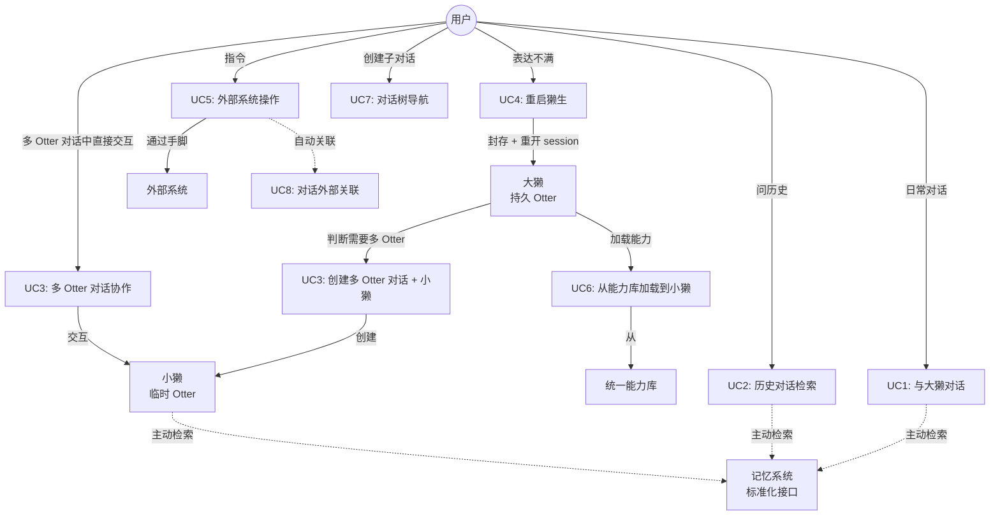
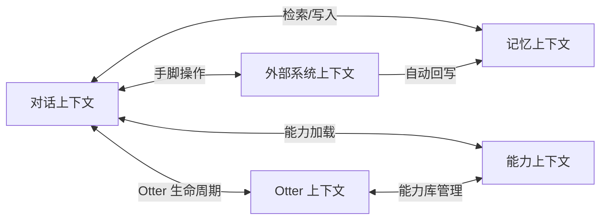

# F20260709x7k3 [product-setup] 产品形态定义（S1）

## [design-time]

> 本文档记录 S1（产品形态确认）的全部产出物。重点记录"为什么这样设计"而非仅仅是"设计了什么"。

## 背景 [required]

otter-buddy 项目在完成代码仓初始化（F20260708r6p5）后，需要确定产品形态。Issue #3 记录了初始的设计哲学和架构决策（8 项已锁定决策 + 8 个关键洞察），但用户与 Joy 讨论后产品形态有重大变化。

本 Feature 文档是 S1 的产出物，定义了更新后的产品能力模型、用例、术语表、限界上下文、MVP 范围等。后续 S2（能力模块架构设计）以本文档为输入。

## 用户意图锚 [required]

| # | 来源 | 用户原话（逐字引用） | 关键修饰语 | 架构师解读 |
|---|------|---------------------|-----------|-----------|
| UA-1 | S1 讨论 | 不执着于微信的好友形态 | 程度：不执着；对象：好友形态 | 放弃 Issue #3 的"持久多 Agent 通讯录"模型 |
| UA-2 | S1 讨论 | 对于用户来说，多个 Agent 和单个 Agent 的区别是什么 | 视角：用户视角；状态：疑问 | 触发对多 Agent 价值的根本性重新思考 |
| UA-3 | S1 讨论 | 应该有一个类似于 前台/总管家 的ai，每个问题用户都是与他对话 | 结构：前台/总管家；行为：每个问题都与他对话 | 用户唯一持久入口 = 大獭 |
| UA-4 | S1 讨论 | 由他决定他自己就能做好，还是拉出一个ai团队来做 | 决策者：大獭；选项：独立 or 团队 | 大獭有编排能力 |
| UA-5 | S1 讨论 | 前台ai要知道 所有的对话 | 范围：所有；主体：前台 ai | 记忆系统是核心，大獭拥有全量历史 |
| UA-6 | S1 讨论 | 记忆系统仍然是非常核心的一环，要做大做强 | 程度：非常核心；动作：做大做强 | 记忆系统是核心差异化能力 |
| UA-7 | S1 讨论 | 当我时隔几天需要找到某一个历史对话时，我不需要人工去翻对话记录，而是ai直接告诉我 | 场景：跨时间检索；行为：ai 主动 | 记忆检索是 UC2 的核心场景 |
| UA-8 | S1 讨论 | 封存已有对话作为反面案例、然后是一个新ai | 机制：封存 + 新 AI；标记：反面案例 | 重启獭生机制的雏形 |
| UA-9 | S1 讨论 | 而不是我新开一个会话，然后复制我的问题再问一遍 | 否定：新开会话 + 复制；需求：不丢失上下文 | 重启獭生是同一对话内的重启 |
| UA-10 | S1 讨论 | 能力还是沉淀为skill，然后，不由某一个固定的ai来承载能力 | 归属：系统级 skill；否定：固定 AI 承载 | 统一能力库，能力不绑定角色 |
| UA-11 | S1 讨论 | 前台ai是一个母体，能够创建新的ai（赋予名称、角色职责等等），并且能赋予新的ai具备不同的能力 | 比喻：母体；能力：创建 + 赋能 | 大獭 = 母体，创建小獭 + 加载能力 |
| UA-12 | S1 讨论 | 这种需求是有临时实效边界的，并不需要像微信这种持久固定的多个通讯录中的好友 | 时效：临时；否定：持久固定 | 小獭是临时的，任务结束解散 |
| UA-13 | S1 讨论 | 记忆系统 是贯彻系统的一个模块，提供mcp这种的 调用接口，所有ai都可用 | 范围：贯彻系统；接口：MCP 式；用户：所有 AI | 记忆系统是系统级模块，不是大獭专属 |
| UA-14 | S1 讨论 | 除了自身当前session这部分是各个ai专有的，其余的 所有信息，可能都是通用的、大家都可触及到的 | 专有：当前 session；通用：其余所有 | 三层记忆模型：工作记忆专有，其余共享 |
| UA-15 | S1 讨论 | 对话要支持一定的组织结构，比如树状 | 结构：树状；需求：组织结构 | 对话树是核心架构概念 |
| UA-16 | S1 讨论 | 这种结构 要在记忆中也要有所侧重，ai知道当前本对话在某一个节点 | 影响：记忆侧重；感知：知道位置 | 对话树影响记忆检索权重 |
| UA-17 | S1 讨论 | 我不期望在ai时代 多个版本迭代修改，或者说，尽量不要修改，可以新增 | 偏好：新增 > 修改；程度：尽量 | MVP 策略：完整流程 + 最小实现 + 扩展点 |
| UA-18 | S1 讨论 | 整体流程的每一个模块都要具备，边界要划分清晰 | 要求：每个模块具备；边界：清晰 | 流程完整性 > 实现完整性 |
| UA-19 | S1 讨论 | 不要叫ai，既然有了otter形象，那就应该叫otter | 否定：AI；要求：用 Otter | 术语统一为 Otter 系 |
| UA-20 | S1 讨论 | 不要叫《翻篇》，叫 交接？或者别的 | 否定：翻篇；候选：交接 | 术语需要优化 |
| UA-21 | S1 讨论 | 翻身 改为《重启獭生》吧 | 最终选择：重启獭生 | 术语确定 |

## 目标 [required]

### P1 - 产品形态定义

定义 otter-buddy 的产品能力模型，包括：产品愿景、核心概念、用例图、统一语言术语表、限界上下文、子域分类、上下文映射、MVP 定义、风险清单、NFR 清单。

## 非目标 [required]

- 不设计系统架构（模块接口、数据模型等）-- S2
- 不设计数据模型（schema、DDL）-- S3
- 不实现任何代码 -- S4
- 不更新 Issue #3（Issue #3 保留为历史记录，变更体现在本 Feature 文档中）

## 产品愿景 [required]

一个以对话为入口、以大獭为中枢的 Otter 协作系统。用户始终与一个大獭对话，大獭基于记忆系统理解用户上下文，自主判断是独立处理还是创建临时小獭协作。对话支持树状结构以承载长程任务，对话关键信息开放关联外部系统。能力不绑定固定角色，从统一能力库按需加载。

## Issue #3 决策变更 [required]

> **Why**：用户与 Joy 讨论后，产品形态发生重大变化。Issue #3 中的 8 项决策有 3 项需要变更。Issue #3 保留为历史记录，不修改，变更记录在此。

| # | 决策 | 状态 | 变更说明 | 变更原因 |
|---|------|------|---------|---------|
| 1 | Chat as Substrate | ✅ 不变 | 对话仍是系统入口 | 用户确认对话为入口（UA-3） |
| 2 | 四层记忆模型 | ❌ 变更 | 四层 -> 三层 | 用户要求记忆系统为系统级通用模块（UA-13, UA-14），移除个人记录空间和对话备忘录，新增对话关键信息 |
| 3 | 脑手分离 | ✅ 不变 | 外部系统仍通过手脚触达 | 用户确认外部系统仍存在 |
| 4 | AI Agent 作为检索引擎用户 | ✅ 不变 | 所有 Otter 都可主动检索记忆 | 用户确认所有 AI 都可用记忆系统（UA-13） |
| 5 | 多粒度检索 | ✅ 不变 | 多粒度检索历史对话和关键信息 | 未涉及变更 |
| 6 | 合规 = 外部系统 + Skill 链 | ✅ 不变 | 未涉及变更 | 未涉及变更 |
| 7 | 默认 Agent + 渐进分化 | ❌ 重大变更 | 变为"大獭 + 按需创建临时小獭" | 用户明确不需要持久固定多 Agent（UA-1, UA-12），多 Agent 是临时场景驱动的（UA-3, UA-4） |
| 8 | Fork 模型 | ❌ 重大变更 | 变为"大獭创建临时小獭（提取上下文，用完归档）" | Fork 模型基于"持久 Agent 拷贝记忆独立演化"，新模型中小獭是临时的，不需要独立记忆演化（UA-12） |

### 决策 2 变更详情：四层 -> 三层

> **Why**：用户明确记忆系统是系统级通用模块（UA-13），所有 Otter 可用。原四层模型中"个人记录空间"是 Otter 私有的，与"通用共享"矛盾。"对话备忘录"是持久 Agent 间的信息桥梁，新模型中小獭是临时的，不需要持久桥接。

| 层 | 原模型 | 新模型 | 变更原因 |
|----|--------|--------|---------|
| 工作记忆 | 每 Agent 当前 session | 各 Otter 专有（不变） | 保留 |
| 历史对话记忆 | 每 Agent 各自历史 | 系统级共享，所有 Otter 可检索 | 用户要求"所有信息通用"（UA-14） |
| 个人记录空间 | 每 Agent 私有笔记 | **移除** | 与"通用共享"矛盾 |
| 对话备忘录 | Agent 间共享 | **移除**，替换为"对话关键信息" | 新模型无持久 Agent 间共享需求 |

**新增：对话关键信息层**。每个对话的关键信息（linked_resources + key_facts），系统级共享。

**隐式任务追踪迁移**：从"个人记录空间"迁移到"对话关键信息"的 key_facts 字段。载体从 Otter 私有变为系统级共享，所有 Otter 可检索任务信号。这是提升 -- 任务信号可检索性更好。

### 决策 7 变更详情：渐进分化 -> 大獭 + 临时小獭

> **Why**：用户明确不需要"持久固定"的多 Agent（UA-1, UA-12）。多 Agent 的场景是临时的（辩论赛、多角度分析），有时效边界。用户心智是"对话为入口"而非"好友通讯录"。

| 维度 | 原模型 | 新模型 |
|------|--------|--------|
| 多 Agent 模式 | 持久分化，各自积累记忆 | 临时创建，任务结束解散 |
| 触发方式 | 用户主动创建 / 质量差异 / 领域聚类 / 检索退化 | 大獭自主判断需要多 Otter |
| Agent 身份 | 记忆积累形成不可逆差异 | 大獭是唯一持久 Otter，小獭临时 |
| 市场定位 | "越用越懂你的 AI 同事" | "一个大獭，需要时拉团队" |

### 决策 8 变更详情：Fork -> 大獭创建临时小獭

> **Why**：Fork 模型是"拷贝全量记忆，独立演化"。新模型中小獭是临时的，不需要独立记忆演化。大獭从自身记忆中提取相关上下文注入小獭，解散时群聊对话归档到大獭的历史对话记忆。

| 维度 | Fork 模型 | 新模型 |
|------|----------|--------|
| 创建方式 | 拷贝全量记忆快照 | 提取相关上下文注入 |
| 独立性 | 独立演化，不可逆分化 | 临时存活，不独立演化 |
| 记忆 | 完整复制后各自独立 | 无独立持久记忆，解散后归档到大獭 |
| 重量 | 重（全量拷贝） | 轻（按需提取） |

## 核心概念 [required]

### 统一语言术语表

> **Why 术语演进**：用户要求"不叫 AI，叫 Otter"（UA-19）。项目名 otter-buddy 已有 otter 形象，术语应与形象匹配。用户还要求"不晦涩过分增加用户理解心智"，因此不创造多余概念（如"獭群"被移除，统一为"对话"）。

| 术语 | 定义 | 演进历史 |
|------|------|---------|
| **大獭** | 用户唯一持久 Otter，带有独占能力 | 前台 AI -> Buddy -> 大獭 |
| **小獭** | 大獭按需创建的临时 Otter，任务结束解散 | 分身 AI -> Otter -> 小獭 |
| **对话** | 用户与 Otter 的交互单元。支持树状结构。可以是 1v1 或多 Otter。 | 对话/群聊 -> 统一为"对话" |
| **重启獭生** | 用户表达不满时触发的 Otter 个体内部机制：封存当前 session 为反面案例，开新 session 换角度重来。其他 Otter 不感知。 | 翻篇 -> 翻身 -> 重启獭生 |
| **统一能力库** | 系统级 Skill 集合 | 不变 |
| **记忆系统** | 系统级模块，标准化接口，三层记忆，所有 Otter 主动检索 | 前台 AI 专属 -> 系统级通用 |
| **手脚** | 工具/Skill/外部系统 | 不变 |
| **对话关键信息** | 每个对话的关键信息（开放机制，大獭和用户可添加） | 新概念，替代个人记录空间 + 对话备忘录 |

### 大獭的独占能力（4 项）

> **Why 4 项不是 5 项**：原设计中"重启獭生"是大獭独占能力。用户指出群聊中某只小獭理解错了也应能重启獭生（UA-20 讨论中）。因此重启獭生从独占能力提升为通用机制。

| # | 能力 | Why 独占 |
|---|------|---------|
| 1 | 创建多 Otter 对话 | 只有大獭能判断是否需要多 Otter |
| 2 | 创建小獭 | 只有大獭能创建新 Otter |
| 3 | 记忆管理 | 用户面对面的功能，由大獭承载 |
| 4 | 能力库管理 | 系统级管理，不应开放给临时 Otter |

### 通用机制（所有 Otter 可用）

| 机制 | Why 通用 |
|------|---------|
| 记忆检索 | 所有 Otter 都需要检索记忆（UA-13） |
| 重启獭生 | 用户可能对任何 Otter 不满，触发重启（个体内部行为，其他不感知） |

> **Why 重启獭生是用户触发而非 Otter 自主**：用户明确"不允许 otter 完全自行判断"。只有用户表达不满时才触发。

## 对话树 [required]

> **Why 需要对话树**：用户提出长程大任务（特性开发、系统开发）需要对话支持树状组织结构（UA-15）。扁平对话会导致所有内容堆积在一个对话中，检索质量下降、上下文混乱。

| 机制 | 说明 |
|------|------|
| 父子关系 | 每个对话可有父对话和子对话。根对话无父。 |
| 树路径 | 大獭知道当前对话在树的哪个节点。 |
| 记忆侧重 | 当前分支路径上的对话权重更高。跨分支仍可检索但权重较低。具体系数 S3 调优。 |
| 上下文继承 | 子对话按需检索父对话及祖先的记忆（不是全量复制）。 |
| 谁可创建 | 大獭和用户都可以创建子对话。 |
| 可视化 | 对话树支持可视化（树形图）。具体 UI 在 S4。 |

> **Why "谁可创建"是两者都可以**：用户明确同意。大獭主动判断（"这个设计问题比较复杂，我开一个子对话"）+ 用户主动请求（"开一个子对话讨论测试方案"）都是合法入口。

### 重启獭生 vs. 新建子对话

> **Why 需要区分**：架构师-2 指出，如果不区分，用户可能用重启獭生来处理应该新建子对话的场景，导致反面案例堆积但问题没有结构化分解。

| 机制 | 场景 | 效果 |
|------|------|------|
| 重启獭生 | 同一问题，方向错了，换思路重试 | 同一节点内重开 session |
| 新建子对话 | 问题的不同方面，需要分开讨论 | 在当前节点下创建子节点 |

### 对话生命周期

> **Why 3 状态不是 4 状态**：架构师-2 建议移除 "paused"。用户不说话就是 paused，不需要显式标记。显式 paused 增加状态机复杂度但价值不大。

| 状态 | 说明 |
|------|------|
| active | 对话进行中 |
| completed | 任务完成 |
| archived | 归档，可检索但不活跃 |

根对话在所有子对话完成前不自动标记为 completed。

## 记忆系统（三层模型） [required]

> **Why 三层不是四层**：见决策 2 变更详情。用户要求记忆系统是系统级通用模块（UA-13），所有 Otter 可用。移除了个人记录空间（Otter 私有）和对话备忘录（持久 Agent 间桥接），新增对话关键信息（per-conversation 共享元数据）。

系统级独立模块，标准化接口（具体协议 S2 确认），所有 Otter 主动检索。

| 层 | 归属 | 内容 | 说明 |
|----|------|------|------|
| **工作记忆** | 各 Otter 专有 | 当前 session 对话 | 小獭 session 随解散消失 |
| **历史对话记忆** | 系统级共享 | 所有历史对话（含对话树各节点） | 权重系统（时间衰减 + 检索频率 + 任务相关性 + 用户标记）；对话树分支路径影响任务相关性 |
| **对话关键信息** | 系统级共享 | 每个对话的关键信息 | 开放机制：linked_resources + key_facts |

### 对话关键信息

> **Why 开放机制而非固定枚举**：用户明确"系统只是提供一个机制，用户和大獭可以往里添加关键信息"（UA-17 讨论中）。不预设固定类型枚举。

- `linked_resources`：开放机制，大獭和用户可添加任意外部资源关联（PR、worktree、branch、file、url 等）。不预设固定类型枚举。
- `key_facts`：关键决策、结论、承诺信号（隐式任务追踪载体）
- 自动关联：大獭通过手脚执行外部操作时，手脚层自动回写 linked_resource
- 手动关联：用户或大獭可手动添加
- 树继承：子对话继承父对话的链接资源（可追加）

> **Why 自动关联**：减少遗漏。大獭通过手脚创建 PR/worktree 时，手脚层自动回写。不需要大獭额外动作。

## 核心用例 [required]

| # | 用例 | 描述 | 用户意图锚 |
|---|------|------|-----------|
| UC1 | 与大獭对话 | 用户发送消息，大獭基于记忆系统理解上下文并回复 | UA-3, UA-5 |
| UC2 | 历史对话检索 | 用户问"之前那个讨论在哪"，大獭检索记忆并定位，用户可继续对话 | UA-7 |
| UC3 | 多 Otter 对话协作 | 大獭判断需要多 Otter -> 创建多 Otter 对话 + 小獭 -> 用户直接与小獭交互 -> 任务结束解散 | UA-4, UA-11, UA-12 |
| UC4 | 重启獭生 | 用户表达不满 -> Otter 封存 session 为反面案例 -> 开新 session 换角度重来 | UA-8, UA-9 |
| UC5 | 外部系统操作 | 用户说"定闹钟""记备忘录"，大獭通过手脚触达外部系统 | - |
| UC6 | 小獭能力加载 | 大獭从统一能力库加载 skill 到小獭 | UA-10, UA-11 |
| UC7 | 对话树导航 | 用户或大獭创建子对话、切换节点、查看树形图。大獭知道当前在树的哪个节点。 | UA-15, UA-16 |
| UC8 | 对话外部关联 | 大獭通过手脚操作外部系统时，自动关联到对话关键信息。用户也可手动添加。 | - |

## 限界上下文 [required]

> **Why 5 个上下文**：基于 DDD 战略设计。对话和记忆是核心域（直接产生差异化价值），Otter/能力/外部系统是支撑域。

| 上下文 | 职责 | 子域分类 | 变化 |
|--------|------|---------|------|
| 对话上下文 | 对话管理、消息路由、Session 生命周期、对话树、可视化 | **核心域** | 新增：树状结构、可视化 |
| 记忆上下文 | 三层记忆存储与检索，标准化接口 | **核心域** | 重大变化：系统级通用，三层模型 |
| Otter 上下文 | 大獭 + 小獭生命周期管理、重启獭生机制 | 支撑域 | 重大变化：1 大獭 + N 临时小獭 |
| 能力上下文 | 统一能力库管理、Skill 加载 | 支撑域 | 提升为独立上下文 |
| 外部系统上下文 | 手脚、自动关联回写 | 支撑域 | 新增：自动关联到对话关键信息 |

### 上下文映射

> **S2 待评估**：外部系统上下文与其他上下文的交互可能需要 ACL（防腐层），因为外部系统数据模型与内部不同。

## MVP 定义 [required]

> **Why "完整流程 + 最小实现"而非"选 3 个 UC 做完整"**：用户明确"不期望多个版本迭代修改，可以新增"（UA-17）。"整体流程的每一个模块都要具备，边界要划分清晰"（UA-18）。流程/管道的后续修改成本远高于新增属性/字段。

**策略：完整流程 + 最小实现 + 扩展点。** 全部 8 个 UC 的流程管道 Day 1 完整存在，每个最小实现，扩展点显式标注。

| UC | 完整流程（不可省略） | 最小实现（可后续增强） | 扩展点（可新增） | S4 优先级 |
|----|-------------------|---------------------|----------------|-----------|
| UC1 | 用户消息 -> 大獭理解上下文 -> 回复 | 纯文本消息 | 消息格式、附件类型 | P0 |
| UC2 | 查询 -> 检索记忆 -> 返回结果 -> 可继续对话 | 关键词匹配 | 检索算法、权重因子 | P0 |
| UC3 | 大獭判断 -> 创建小獭 -> 用户交互 -> 解散 | 小獭无 skill，创建判断简单 | skill 数量、创建策略 | P2 |
| UC4 | 不满 -> 封存 session -> 新 session -> 带前情 | 封存仅标记，前情为简单摘要 | 封存内容丰富度、前情注入策略 | P2 |
| UC5 | 指令 -> 手脚 -> 外部系统 -> 回写 | 1-2 个外部系统 | 外部系统类型 | P2 |
| UC6 | 从能力库选择 -> 加载到小獭 | 1-2 个 skill | skill 数量 | P2 |
| UC7 | 创建子对话 -> 切换 -> 树路径 -> 记忆侧重 -> 可视化 | 树深度 2-3 层，可视化简单 | 树深度、可视化形式 | P1 |
| UC8 | 自动关联 + 手动关联 + 可检索 | 关联类型少 | 关联类型（开放机制） | P1 |

### "不修改只新增"原则的扩展点分类

> **Why 显式标注扩展点**：让 S2 架构设计有明确的可扩展性要求，避免过度设计（用户说"尽量"不是"绝对"）。

| 扩展类型 | S2 设计要求 |
|---------|-----------|
| 字段扩展 | Entity 用可扩展结构 |
| 类型扩展 | 枚举用注册式而非硬编码 |
| 算法扩展 | 算法用接口定义，实现可替换 |
| 流程步骤扩展 | 管道用插件式，步骤可插入 |

## 风险与缓解 [required]

| # | 风险 | 严重 | 影响 | 缓解策略 |
|---|------|------|------|---------|
| R1 | 全流程最小实现工作量超预期 | 中 | S4 延期 | S4 按优先级分批（P0 > P1 > P2），每批流程完整 |
| R2 | LLM 成本和延迟 | 中 | 用户体验 | S2 设计时考虑 LLM 调用优化（缓存、流式） |
| R3 | 记忆检索质量不足 | 中 | UC2 体验差 | MVP 用关键词匹配，后续升级语义检索；AI 可迭代检索弥补 |
| R4 | 对话树复杂度增长 | 低 | UC7 可用性 | MVP 限制树深度 2-3 层，大獭建议过深时拆分 |
| R5 | 多 Otter 协作的消息路由复杂 | 中 | UC3 稳定性 | S2 详细设计消息路由机制，MVP 限制小獭数量 |
| R6 | "不修改只新增"原则被过度解读 | 低 | 设计过度复杂 | 用户说"尽量"不是"绝对"，避免过度设计 |
| R7 | 对话树与重启獭生的交互复杂性 | 低 | 树路径和记忆一致性 | S2 中明确重启獭生不影响树结构 |

## 质量属性与 NFR [required]

> 用户未指定 NFR（Q5 回答"暂时没有"）。以下为架构师默认假设，可在 S2 修正。

| NFR | 默认假设 | 依据 |
|-----|---------|------|
| 用户规模 | 单用户 | Issue #3 全篇以单数"用户"表述 |
| 部署形态 | 本地运行 | 个人项目，无多用户需求 |
| 性能 | 无硬性要求，响应合理即可 | 用户说"暂时没有" |
| 安全 | 本地数据，无加密需求 | 单用户本地运行 |
| 可用性 | 无 SLA 要求 | 个人项目 |

## 关键决策记录 [required]

| # | 决策点 | 最终决策 | 状态 | Why |
|---|--------|----------|------|-----|
| D1 | 术语：持久 Otter 叫什么 | 大獭 | S1 确认 | 用户选择。比 Buddy 更有 otter 特色，"大"体现持久和独占能力 |
| D2 | 术语：临时 Otter 叫什么 | 小獭 | S1 确认 | 用户选择。与"大獭"对称，"小"体现临时和从属 |
| D3 | 术语：对话/群聊是否统一 | 统一为"对话" | S1 确认 | 用户要求不创造额外概念，对话就是对话 |
| D4 | 术语：封存重启叫什么 | 重启獭生 | S1 确认 | 用户最终选择。比"翻篇"更有 otter 特色 |
| D5 | 记忆层数 | 三层 | S1 确认 | 用户要求系统级通用模块，移除私有层和持久桥接层 |
| D6 | 大獭独占能力数量 | 4 项 | S1 确认 | 重启獭生从独占提升为通用机制 |
| D7 | 重启獭生触发方式 | 仅用户触发 | S1 确认 | 用户明确"不允许 otter 完全自行判断" |
| D8 | 重启獭生可见性 | 其他 Otter 不感知 | S1 确认 | 用户视为个体"自我反思"内部行为 |
| D9 | MVP 策略 | 完整流程 + 最小实现 | S1 确认 | 用户"不修改只新增"原则，流程修改成本远高于字段新增 |
| D10 | 对话树创建者 | 大獭和用户都可创建 | S1 确认 | 用户确认两者都是合法入口 |
| D11 | 对话树可视化 | 需要 | S1 确认 | 用户明确"肯定可视化" |
| D12 | linked_resources 类型 | 开放机制 | S1 确认 | 用户明确"系统只是提供机制" |
| D13 | Issue #3 是否修改 | 不修改 | S1 确认 | 用户明确"issue#3就不要去动了"，变更记录在本 Feature 文档 |

## 生效路径 [required]

本 Feature 文档是 S1（产品形态确认）的产出物，作为后续步骤的输入：
- `docs/features/2026/07/09/F20260709x7k3-product-form-definition.md` -- 本文档，S2/S3/S4 的约束输入
- `GitHub Issue #5` -- 项目实施计划 tracking issue，S1 状态已标记完成
- `GitHub Issue #3` -- 历史设计哲学记录，不修改，变更记录在本文档中

## 设计约束摘要 [required]

### 硬约束（违反即 bug）
- 大獭是用户唯一持久 Otter，其他 Otter 只存活于特定会话
- 记忆系统是系统级模块，所有 Otter 可通过标准化接口主动检索
- 重启獭生只能由用户表达不满触发，Otter 不能自主触发
- 对话树支持父子关系，大獭知道当前在树的哪个节点

### 设计取舍（不得自行推翻）
- 四层记忆模型简化为三层（决策 2 变更），移除个人记录空间和对话备忘录
- MVP 策略为"完整流程 + 最小实现 + 扩展点"，不做"选 3 个 UC 做完整再迭代"
- linked_resources 采用开放机制，不预设固定类型枚举
- Issue #3 保留为历史记录，不修改，变更记录在本 Feature 文档

### 语义不变量（实现中必须保持为真）
- 除当前 session 外，所有记忆信息对所有 Otter 通用共享
- 重启獭生是 Otter 个体内部行为，其他 Otter 不感知
- 子对话继承父对话的链接资源（可追加，不覆盖）

### 非目标（不得扩展）
- 不设计系统架构（模块接口、数据模型）-- S2
- 不设计数据模型（schema、DDL）-- S3
- 不实现任何代码 -- S4
- 不更新 Issue #3

## 改动范围 [required]

全部为新增文件：

| 文件 | 说明 |
|------|------|
| `docs/features/2026/07/09/F20260709x7k3-product-form-definition.md` | S1 产品形态定义特性文档 |
| `docs/design/` | 设计产出目录（S2 产出物将存放于此） |

## 验证 [required]

### S1 产出物完整性

- [x] S1-A1 产品愿景文档 -- v4 产品愿景段落
- [x] S1-A2 用例图 -- Mermaid 图，8 个 UC
- [x] S1-A3 统一语言术语表 -- 8 个核心术语
- [x] S1-A4 限界上下文列表 -- 5 个上下文
- [x] S1-A5 上下文映射图 -- Mermaid 图 + 关系表
- [x] S1-A6 子域分类 -- 双核心域 + 三支撑域
- [x] S1-A7 MVP 定义 -- 三列表格（完整流程/最小实现/扩展点）
- [x] S1-A8 风险清单 -- 7 项风险
- [x] S1-A9 NFR 清单 -- 5 项默认假设

### 两位架构师共识

- [x] 架构师-1 独立分析并产出草稿
- [x] 架构师-2 对抗审视，无阻塞项
- [x] 两个非阻塞建议已整合（ACL 标注、R7 风险）
- [x] 架构师-2 PR 审查通过

### 用户确认

- [x] 术语确认（大獭/小獭/对话/重启獭生）
- [x] 记忆三层模型确认
- [x] 对话树确认（创建方式、可视化）
- [x] MVP 策略确认（完整流程 + 最小实现）
- [x] 重启獭生确认（用户触发、个体内部行为）

## 关联 [required]

- **设计哲学和架构决策（历史记录）**：[otter-buddy#3](https://github.com/chenlaicai/otter-buddy/issues/3)
- **项目实施计划**：[otter-buddy#5](https://github.com/chenlaicai/otter-buddy/issues/5)
- **S1 产出物 PR**：[otter-buddy#6](https://github.com/chenlaicai/otter-buddy/pull/6)
- **代码仓初始化**：[F20260708r6p5](../08/F20260708r6p5-project-repo-initialization.md)
