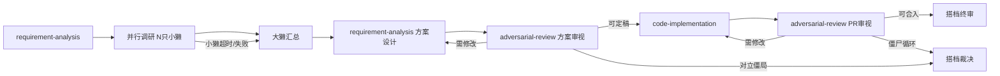

# F20260806sksd: Skill Chain 与模板设计

## 1. 问题分析

### 1.1 现状

Otter 系统有 6 个 skill，分层架构清晰（identity / SYSTEM / skill / tool / orchestration），渐进式披露设计（SKILL.md + references/）合理。Skill 间的衔接通过两种机制实现：

- **软链**：skill 文本中互相引用（如 code-implementation step 8 引用 adversarial-review）
- **调度链**：dispatch-chain-engine 的发言石机制实现 agent-to-agent 传递

### 1.2 结构性缺陷

**缺陷 A：Skill 衔接依赖 LLM 阅读纪律**

code-implementation 的 step 8 写了完整的对抗审视流程，但 LLM 是否认真执行这段描述，系统无法观测。如果 LLM 认为"这个 PR 很小，不需要审视"，它可能直接跳过。当前没有任何机制在 skill 完成后检查是否触发了下一步。

**缺陷 B：核心产出模板在 references/ 里，而非 skill 本体**

adversarial-review 的 `report-template.md` 是审视报告的格式契约，但它在 references/ 里。LLM 可能只 read SKILL.md 就开始写报告，产出格式不对的报告。模板是 skill 的核心契约，应该随 skill 一起被 load。

**缺陷 C：Skill 缺少输入契约**

code-implementation 的 step 2 说"Read the technical plan thoroughly"，但没有说"如果没给 plan 怎么办"。LLM 的默认行为是：没有 plan 就自己编一个。输入契约能强制 LLM 在信息不足时停下来要，而不是猜。

**缺陷 D：触发描述（frontmatter description）混合了两种职责**

description 字段同时承担"索引描述"和"触发短语"两个职责。当多个 skill 的触发条件有交集时（如"提交代码"同时命中 code-implementation 和 repo-safety），LLM 需要靠隐含的优先级判断先加载哪个。

## 2. 设计方案

### 2.1 Skill Chain：后续动作声明

#### 2.1.1 设计思路

每个 skill 在末尾声明自己的"后续动作"（next actions），为 LLM 提供结构化的下一步指引。当前的软链（skill 文本中互相引用）存在两个问题：格式不统一（有的在 step 里写，有的在末尾写），且 LLM 需要通读整个 skill 才能发现衔接关系。后续动作声明把衔接信息集中到一个固定格式的章节，提升**可发现性**（LLM 能快速定位下一步）和**一致性**（所有 skill 的衔接规则格式相同）。

> **诚实定位**：后续动作声明是结构化的 prompt 指引，不提供工程层面的可观测性或强制性。它让 LLM 更容易发现和遵循 skill 间的衔接，但不保证 LLM 一定遵循。工程层面的强制性（如 dispatch-chain-engine 的发言石机制）是独立的、已有的保障。

#### 2.1.2 SKILL.md 新增章节

在每个 skill 的"行为红线"和"参考资料"之间，新增"后续动作声明"章节：

```markdown
## 后续动作声明

本 skill 完成后，根据产出类型，建议的下一步：

| 产出类型 | 下一步动作 | 执行者 | 触发条件 | 不满足时处理 |
|----------|-----------|--------|----------|-------------|
| {本 skill 的产出} | {建议的下一步 skill} | {谁来执行} | {什么条件下触发} | {触发条件不满足时怎么办} |

### 异体执行原则

涉及审视/检视的后续动作，在多 agent 场景下（otter-summon 编排）由架构保证异体执行。
在单 agent 场景下依赖 LLM 自律，此时降级策略为：至少等待搭档确认后才能进入下一阶段。
搭档明确说"跳过"时，记录决策后放行。
```

#### 2.1.3 各 skill 的后续动作声明

**requirement-analysis**：

```markdown
## 后续动作声明

| 产出类型 | 下一步动作 | 执行者 | 触发条件 | 不满足时处理 |
|----------|-----------|--------|----------|-------------|
| 技术方案文档 | 对抗审视 | 检视獭（异体） | 方案落盘后 | 搭档不在场 → 记录方案到 memory，搭档回来后决定是否审视 |
| 需求澄清问题 | 等待搭档回答 | 搭档 | 存在未解答的澄清问题时 | 正常终止，不阻塞 |

### 异体执行原则

方案审视在多 agent 场景下由架构保证异体（大獭召唤检视獭）。
单 agent 场下降级：大獭做方案后，至少等待搭档确认方案后方可进入实现阶段。
搭档明确说"跳过审视"时，记录决策后放行，进入实现阶段。
```

**code-implementation**：

```markdown
## 后续动作声明

| 产出类型 | 下一步动作 | 执行者 | 触发条件 | 不满足时处理 |
|----------|-----------|--------|----------|-------------|
| 代码 PR | 对抗审视 | 检视獭（异体） | PR 创建后 | 搭档不在场 → 记录 PR 链接到 memory，搭档回来后决定是否审视 |
| 排查结论（需提交修复） | repo-safety 流程 | 当前獭 | 结论确认后 | 正常终止，结论记录到 memory |

### 异体执行原则

PR 审视在多 agent 场景下由架构保证异体（大獭召唤检视獭）。
单 agent 场下降级：大獭自己写的 PR，至少等待搭档确认后才能合入。
搭档明确说"跳过审视"时，记录决策后放行。
```

**adversarial-review**：

```markdown
## 后续动作声明

| 产出类型 | 下一步动作 | 执行者 | 触发条件 | 不满足时处理 |
|----------|-----------|--------|----------|-------------|
| 审视报告（需修改） | 作者处置 | 实现者（异体） | 报告交付后 | 正常终止，报告交付搭档 |
| 审视报告（可合入/可定稿） | 搭档终审 | 搭档 | 结论为通过时 | 搭档不在场 → 记录结论到 memory，搭档回来后终审 |
| 审视报告（对立僵局） | 搭档裁决 | 搭档 | 触发升级信号时 | 搭档不在场 → 记录僵局状态到 memory，搭档回来后裁决 |

### 异体执行原则

审视在多 agent 场景下由架构保证异体（检视獭和开发獭是不同 agent）。
单 agent 场下降级：搭档确认审视结论后放行（搭档是非实现者，满足异体要求）。
搭档明确说"跳过审视"时，记录决策后放行。
```

**repo-safety**：

```markdown
## 后续动作声明

| 产出类型 | 下一步动作 | 执行者 | 触发条件 | 不满足时处理 |
|----------|-----------|--------|----------|-------------|
| PR 创建（小改动） | 搭档终审 | 搭档 | PR 创建后 | 搭档不在场 → 记录 PR 链接到 memory，搭档回来后终审 |
| PR 创建（功能开发） | 对抗审视 | 检视獭（异体） | PR 创建后 | 搭档不在场 → 记录 PR 链接到 memory，搭档回来后决定是否审视 |
| commit 失败 | 诊断修复 | 当前獭 | commit hook 失败时 | 正常终止，向搭档报告失败原因 |
```

**core-workflow**：

```markdown
## 后续动作声明

| 产出类型 | 下一步动作 | 执行者 | 触发条件 | 不满足时处理 |
|----------|-----------|--------|----------|-------------|
| 排查结论（需提交修复） | repo-safety 流程 | 当前獭 | 结论涉及仓库改动时 | 正常终止，结论记录到 memory |
| 查询结果 | 记录（如需） | 当前獭 | 搭档明确要求记录，或涉及决策/结论的查询结果 | 正常终止，记录后不再链式触发 |
```

**otter-summon**：

```markdown
## 后续动作声明

本 skill 是编排层，不直接产出交付物。后续动作由被召唤的小獭的 skill 决定。

召唤完成后，大獭的职责：
1. 审视小獭产出质量
2. 整合有价值的产出
3. 决定是否需要追加召唤
4. 向搭档汇报进展
```

#### 2.1.4 SYSTEM.md 新增硬规则

在 SYSTEM.md 的"流程纪律"章节新增一条：

```markdown
**Skill Chain**：skill 执行完成后，检查其"后续动作声明"。如有建议的下一步且触发条件满足，按以下规则处理：
- 低风险动作（查询、诊断）→ 自动执行下一步。记录类动作（create_linked_resource 等）执行后不再链式触发后续动作
- 高风险动作（方案进入实现阶段、PR 创建后触发审视、审视结论触发修复）→ 向搭档确认后执行。注意："PR 合入"不是 LLM 执行的动作，LLM 执行的是"PR 创建"和"呈搭档终审"
- 触发条件不满足（如搭档不在场）→ 记录当前状态到 memory，不阻塞后续独立工作。搭档回来后可从 memory 恢复上下文
- 后续动作声明中的"异体执行原则"必须遵守——审视类动作不得由实现者自行执行。单 agent 场景下降级为搭档确认
- 搭档明确说"跳过"时，记录决策后放行
```

#### 2.1.5 与 dispatch-chain-engine 的关系

Skill chain 是 prompt 层面的概念，不修改 dispatch-chain-engine。它的作用是：

1. 告诉 LLM"下一步该做什么"（可发现性）
2. 让所有 skill 的衔接规则格式统一（一致性）
3. 在多 agent 场景下，指导发言石的路由目标

发言石机制仍然是 agent 间传递的工程手段。Skill chain 填补的是"为什么要传"和"传给谁"的决策空白。

**异体执行的工程保障边界**：
- 多 agent 场景（otter-summon 编排）：异体由架构保证——检视獭和开发獭是不同的 agent session，检视獭只有 read 权限
- 单 agent 场景：无工程保障，依赖 LLM 自律 + 搭档确认作为降级策略
- 这是当前设计的已知限制，不试图在 prompt 层面伪装成工程约束

### 2.2 产出模板内联

#### 2.2.1 设计思路

核心产出模板是 skill 的契约，不是补充材料。它应该随 SKILL.md 一起被 read 进来，而不是在 references/ 里赌 LLM 会主动加载。

#### 2.2.2 迁移规则

| 模板类型 | 当前位置 | 迁移目标 | 理由 |
|----------|----------|----------|------|
| 报告模板（report-template.md） | adversarial-review/references/ | adversarial-review/SKILL.md 内联 | 审视报告格式是核心契约 |
| 作者处置协议 | adversarial-review/references/ | 保持 references/ | 复杂协议，按需加载合理 |
| review-loop.md | adversarial-review/references/ | 保持 references/ | 调度规则，非每次审视都需 |
| review-dimensions.md | adversarial-review/references/ | 保持 references/ | 详细清单，按需加载合理 |
| anti-patterns.md | adversarial-review/references/ | 保持 references/ | 补充材料 |
| output-template.md | requirement-analysis/references/ | requirement-analysis/SKILL.md 内联 | 方案模板是核心契约 |
| commit-convention.md | code-implementation/references/ | 保持 references/ | 详细规范，按需加载合理 |
| testing-rules.md | code-implementation/references/ | 保持 references/ | 补充材料 |
| coding-principles.md | code-implementation/references/ | 保持 references/ | 补充材料 |
| collaboration-patterns.md | otter-summon/references/ | 保持 references/ | 详细模式，按需加载合理 |

#### 2.2.3 内联方式

在 SKILL.md 的"产出模板"章节直接嵌入模板内容：

```markdown
## 产出模板

### 审查报告格式

（此处直接嵌入 report-template.md 的完整内容，不通过文件引用）
```

内联后删除 references/ 中的同名文件，彻底消除双源问题。SKILL.md body 中对已删除文件的引用同步更新为指向内联章节。

### 2.3 输入契约

#### 2.3.1 设计思路

每个 skill 在"工作流"之前声明需要什么输入才能开始工作。这防止 LLM 在信息不足时自行假设。

#### 2.3.2 SKILL.md 新增章节

```markdown
## 输入契约

本 skill 需要以下输入才能开始工作：

| 输入 | 必选/可选 | 来源 | 缺失时处理 |
|------|----------|------|-----------|
| {输入名} | 必选 | {谁提供} | {停下来要，还是用默认值} |
```

#### 2.3.3 各 skill 的输入契约

**requirement-analysis**：

```markdown
## 输入契约

| 输入 | 必选/可选 | 来源 | 缺失时处理 |
|------|----------|------|-----------|
| 需求描述 | 必选 | 搭档 | 停下来问搭档 |
| 业务上下文 | 可选 | 搭档或对话历史 | 用 search_memory 补充 |
| 技术约束 | 可选 | 搭档或既有文档 | 从代码库推断，但标注为假设 |
```

**code-implementation**：

```markdown
## 输入契约

| 输入 | 必选/可选 | 来源 | 缺失时处理 |
|------|----------|------|-----------|
| 技术方案 | 必选 | 搭档确认后的方案文档 | 停下来问搭档。即使是自己产出的方案，也需搭档确认后方可进入实现。禁止自行编造方案 |
| 方案编号 | 必选 | 方案文档的 ID | 从方案文档 frontmatter 读取 |
| 工作分支 | 必选 | repo-safety 流程产出 | 先走 repo-safety 创建 worktree |
```

**adversarial-review**：

```markdown
## 输入契约

| 输入 | 必选/可选 | 来源 | 缺失时处理 |
|------|----------|------|-----------|
| 审视对象 | 必选 | PR diff / 方案文档 | 停下来要求提供。禁止凭空审视 |
| 设计文档（代码审视时） | 可选 | 方案文档 | 无则跳过正确性对照，但在报告中声明"无设计文档对照" |
| worktree 绝对路径 | 必选（代码审视时） | 召唤者提供 | 停下来要求提供。小獭 cwd 是主仓，相对路径解析错误 |
```

**repo-safety**：

```markdown
## 输入契约

| 输入 | 必选/可选 | 来源 | 缺失时处理 |
|------|----------|------|-----------|
| 要提交的改动 | 必选 | 当前工作区 | 检查 git status，无改动则不执行 |
| 改动类型 | 必选 | 当前 skill 上下文 | 判断是小改动还是功能开发，决定是否加载 code-implementation |
```

**core-workflow**：

```markdown
## 输入契约

| 输入 | 必选/可选 | 来源 | 缺失时处理 |
|------|----------|------|-----------|
| 查询目标 | 必选 | 搭档 | 停下来问搭档要查什么 |
| 查询范围 | 可选 | 搭档 | 默认查当前对话，无结果再查记忆 |
```

**otter-summon**：

```markdown
## 输入契约

| 输入 | 必选/可选 | 来源 | 缺失时处理 |
|------|----------|------|-----------|
| 任务描述 | 必选 | 当前上下文或搭档 | 停下来明确任务 |
| 任务类型 | 可选 | 从任务描述自动推断 | 推断失败时参考"何时召唤"表，仍不确定则问搭档 |
| 背景信息 | 可选 | 当前对话和记忆 | 尽量收集，但不阻塞 |
```

### 2.4 触发描述结构化

#### 2.4.1 设计思路

当前 frontmatter 的 `description` 字段混合了能力描述和触发短语。将其结构化为三个子字段，让 SDK 和 LLM 都能更精确地解析。

#### 2.4.2 新的 frontmatter 格式

```yaml
---
name: skill-name
description: >-
  {能力描述，一句话说清这个 skill 做什么、产出什么}
triggers:
  phrases:
    - "中文触发短语1"
    - "中文触发短语2"
    - "english trigger 1"
    - "english trigger 2"
co_loads: []        # 必须与哪些 skill 一起加载
---
```

> **设计决策**：
> - 去掉 `conflicts_with` 字段。分析表明 `conflicts_with` 和 `co_loads` 在实践中表达了同一件事（如 code-implementation 和 repo-safety 的关系），保留两个字段只会增加混淆。`co_loads` 足以覆盖"触发条件有交集时需要共加载"的场景。
> - 去掉 `triggers.semantic` 字段。它与 `description` 语义高度重叠，且 SDK 不解析、LLM 不一定读，纯粹增加维护负担。`description` 已承担语义描述职责。

#### 2.4.3 兼容性处理

当前 SDK 的 `DefaultResourceLoader` 只读取 `name` 和 `description`。新字段 `triggers`、`co_loads` 对 SDK 是透明的——它会忽略未知字段。但在 SKILL.md 的 body 开头，用一段结构化文本重复这些信息，确保 LLM 在 read 进来后能快速理解：

```markdown
# Skill Title

> **触发短语**：中文触发1 | 中文触发2 | english trigger 1
> **共加载**：repo-safety（仓库变更时）
```

#### 2.4.4 各 skill 的共加载声明

| Skill | co_loads | 说明 |
|-------|----------|------|
| requirement-analysis | 无 | |
| code-implementation | repo-safety | 仓库变更时必加载 |
| adversarial-review | 无 | |
| repo-safety | code-implementation | 功能开发时共加载 |
| core-workflow | repo-safety | 排查结论需提交时 |
| otter-summon | 无 | 编排层，由被召唤小獭的 skill 决定 |

共加载规则：当 LLM 同时命中多个 skill 时，先加载 `co_loads` 声明的 skill，再加载当前 skill。

双向共加载的入口判断：当两个 skill 互指对方为 co_loads 时（如 code-implementation 和 repo-safety），以触发短语匹配度更高的 skill 为入口。匹配度相同时，以更具体的 skill（code-implementation）为主入口，通用 skill（repo-safety）为共加载。

## 3. Skill 编写模板（综合版）

基于以上四项改进，综合出一个统一的 skill 编写模板：

```markdown
---
name: {skill-name}
description: >-
  {能力描述，一句话}
triggers:
  phrases:
    - "触发短语（中英文各 3-5 个）"
co_loads: []
---

# {Skill Title}

> {一句话定义：产出什么、交付给谁}

> **触发短语**：{phrases 摘要}
> **共加载**：{co_loads 摘要，无则写"无"}

## 核心原则

{3-5 条，祈使语气，每条一句话}

## 输入契约

| 输入 | 必选/可选 | 来源 | 缺失时处理 |
|------|----------|------|-----------|

## 工作流

### 1. {步骤名}

{动作 + 检查点 + 产出 + 失败分支}

### 2. ...

## 行为红线

{不可违反的约束，用"禁止"而非"尽量避免"}
{逃逸短语黑名单}

## 产出模板

{核心产出的格式模板，直接内联，不通过文件引用}

## 后续动作声明

| 产出类型 | 下一步动作 | 执行者 | 触发条件 | 不满足时处理 |
|----------|-----------|--------|----------|-------------|

### 异体执行原则

{审视类动作的执行者约束，区分多 agent 和单 agent 场景}

## 参考资料

- **`references/xxx.md`** — {说明}
```

## 4. Deep Research 场景的 Skill Chain

Deep research 天然适合 skill chain，因为它的产出链是线性的：

```
方向定义 → 并行调研 → 汇总分析 → 方案设计 → 对抗审视 → 实现 → PR 审视
```

### 4.1 链条定义



**错误分支说明**：
- **小獭超时/失败**：大獭汇总已有结果，缺失方向标注为"未完成"
- **对立僵局**：方案审视中作者与检视者一轮证据交换后仍对立 → 呈搭档裁决（见 review-loop.md）
- **僵尸循环**：PR 审视连续 2 轮修复验证不通过 → 停止循环，呈搭档裁决
- **搭档不在场**：所有需要搭档的节点，等待不阻塞，记录状态后放行

### 4.2 实现方式

不新增专门的 "deep-research" skill，而是通过 otter-summon 的编排能力 + 各 skill 的后续动作声明自然形成链条：

1. 大獭收到调研需求 → load requirement-analysis → 产出调研方向列表
2. 大獭 load otter-summon → 为每个方向创建调研獭（并行）
3. 各调研獭完成后 → 发言石传回大獭
4. 大獭汇总 → 产出综合分析 → 按 requirement-analysis 的后续动作声明，进入方案设计
5. 方案落盘 → 按后续动作声明，召唤检视獭对抗审视
6. 审视通过 → 按后续动作声明，进入 code-implementation
7. PR 创建 → 按后续动作声明，召唤检视獭 PR 审视
8. 审视通过 → 按后续动作声明，呈搭档终审

每一步的"为什么做下一步"和"谁来做"都由 skill 的后续动作声明驱动，而非大獭自行判断。

## 5. 实现计划

### Phase 1：Skill Chain 声明（纯文本，不改代码）

- [ ] 在每个 SKILL.md 末尾增加"后续动作声明"章节
- [ ] 在 SYSTEM.md 增加 Skill Chain 硬规则
- [ ] 更新 collaboration-patterns.md，补充 skill chain 的引用

### Phase 2：产出模板内联（纯文本，不改代码）

- [ ] 将 report-template.md 内联到 adversarial-review/SKILL.md
- [ ] 将 output-template.md 内联到 requirement-analysis/SKILL.md
- [ ] 删除 references/ 中的同名文件（report-template.md、output-template.md）
- [ ] 排查**所有** skill 中对被删除 references/ 文件的跨文件引用（如 repo-safety 引用 adversarial-review/references/report-template.md），逐一更新指向内联章节
- [ ] 更新 SKILL.md body 中对已删除 references/ 文件的引用，指向内联章节

### Phase 3：输入契约（纯文本，不改代码）

- [ ] 在每个 SKILL.md 增加"输入契约"章节
- [ ] 验证各 skill 的输入契约与实际使用一致

### Phase 4：触发描述结构化（纯文本 + 可选 SDK 增强）

- [ ] 更新各 SKILL.md 的 frontmatter，增加 triggers/co_loads 字段
- [ ] 在 SKILL.md body 开头增加结构化摘要
- [ ] （可选）SDK 增强：解析新字段，支持自动共加载提示

### 验证方式

- [ ] 用典型场景（需求分析→方案→审视→实现→PR→审视）走完整链路，检查后续动作声明是否被正确触发
- [ ] 故意跳过审视步骤，检查 SYSTEM.md 的硬规则是否能拦截
- [ ] 检查内联模板是否随 SKILL.md 一起被 load
- [ ] 检查输入契约缺失时，LLM 是否停下来要而非自行假设

## 6. 对抗审视记录

### 第 1 轮（检视獭，2026-08-06）

**焦点**：正确性 + 边界条件

**阻断性问题**：

| # | 问题 | 处置 | 理由 |
|---|------|------|------|
| 1 | 核心价值主张（可观测性、强制性）与实现手段（prompt 指引）不匹配 | 接受并修复 | 降低价值主张为"可发现性 + 一致性"，诚实定位为结构化 prompt 指引 |
| 2 | Skill chain 终止条件未定义，存在无限循环和悬停风险 | 接受并修复 | 在后续动作声明模板中增加"不满足时处理"列，SYSTEM.md 增加悬停处理规则 |
| 3 | 异体执行原则在单 agent 场景下形同虚设 | 接受并修复 | 明确适用范围（多 agent 有工程保障，单 agent 降级为搭档确认） |

**次要观察**：

| # | 观察 | 处置 | 理由 |
|---|------|------|------|
| 1 | 输入契约"缺失时处理"存在静默降级风险（有方案但未确认） | 接受 | code-implementation 输入契约细化为"搭档确认后的方案文档" |
| 2 | conflicts_with 与 co_loads 语义重叠 | 接受 | 去掉 conflicts_with，保留 co_loads |
| 3 | 模板内联的"双源"问题 | 接受 | 内联后删除 references/ 中的同名文件 |
| 4 | Deep Research 链条缺错误分支 | 接受 | 补充小獭超时、对立僵局、僵尸循环的退出口 |
| 5 | SYSTEM.md "自动执行"措辞可能导致过度执行 | 接受 | 改为分级：低风险自动、高风险需确认 |
| 6 | 内联后 body 引用未更新 | 接受 | 加入 Phase 2 todo |

### 第 2 轮（红队检视獭，2026-08-06）

**焦点**：可落地性 + 正确性

**阻断性问题**：

| # | 问题 | 处置 | 理由 |
|---|------|------|------|
| 1 | Phase 2 内联迁移漏算跨文件引用，repo-safety 引用 adversarial-review/references/report-template.md 会断链 | 接受并修复 | Phase 2 todo 补充"排查所有 skill 中对被删除 references/ 文件的跨文件引用" |
| 2 | SYSTEM.md "低风险自动执行" + core-workflow "记录" 缺乏收敛条件，可能导致记忆被低价值记录污染 | 接受并修复 | core-workflow 触发条件收紧为"搭档明确要求记录或涉及决策/结论"，SYSTEM.md 补充"记录类动作不再链式触发" |
| 3 | "搭档不在场"只有"等待"，无超时路径，本质是把"无限循环"改成"无限等待" | 接受并修复 | 统一改为"记录状态到 memory，搭档回来后恢复"，不阻塞后续独立工作 |

**次要观察**：

| # | 观察 | 处置 | 理由 |
|---|------|------|------|
| 1 | co_loads 双向声明无加载顺序指引 | 接受 | 补充入口判断规则：匹配度相同时以更具体的 skill 为主入口 |
| 2 | adversarial-review 异体降级策略（"必须召唤异体"）与其他 skill（"搭档确认"）不一致 | 接受 | 统一为"搭档确认"降级，搭档是非实现者 |
| 3 | triggers.semantic 与 description 语义重叠，SDK 不解析 | 接受 | 去掉 triggers.semantic |
| 4 | otter-summon "任务类型"输入契约存在鸡生蛋问题 | 接受 | 从"必选"改为"可选"，推断失败时问搭档 |
| 5 | SYSTEM.md "PR 合入"措辞与 skill 实际流程节点错位 | 接受 | 改为"PR 创建后进入审视"等准确表述 |
